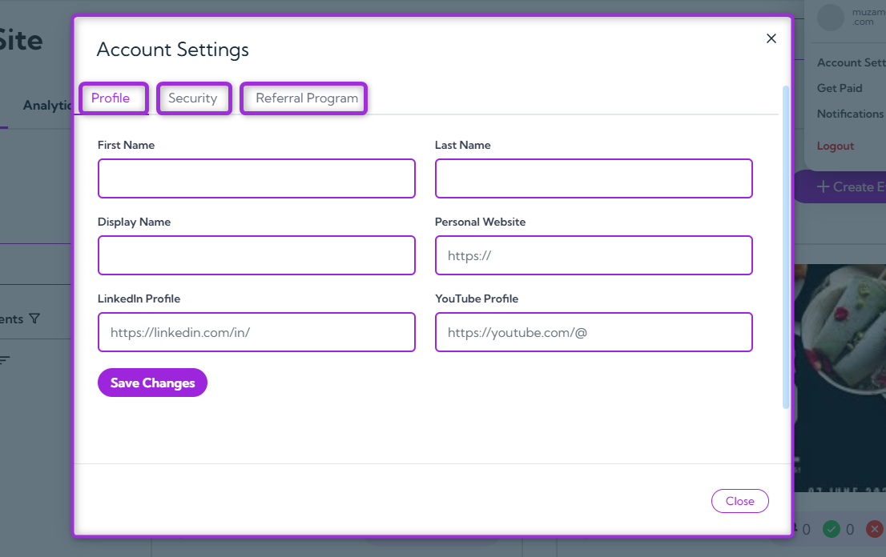
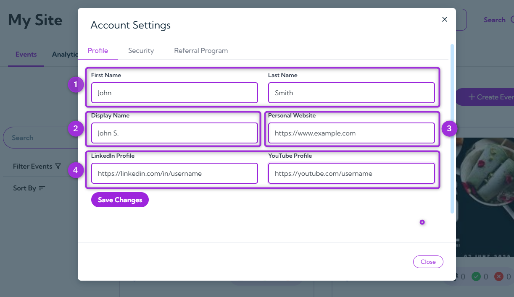
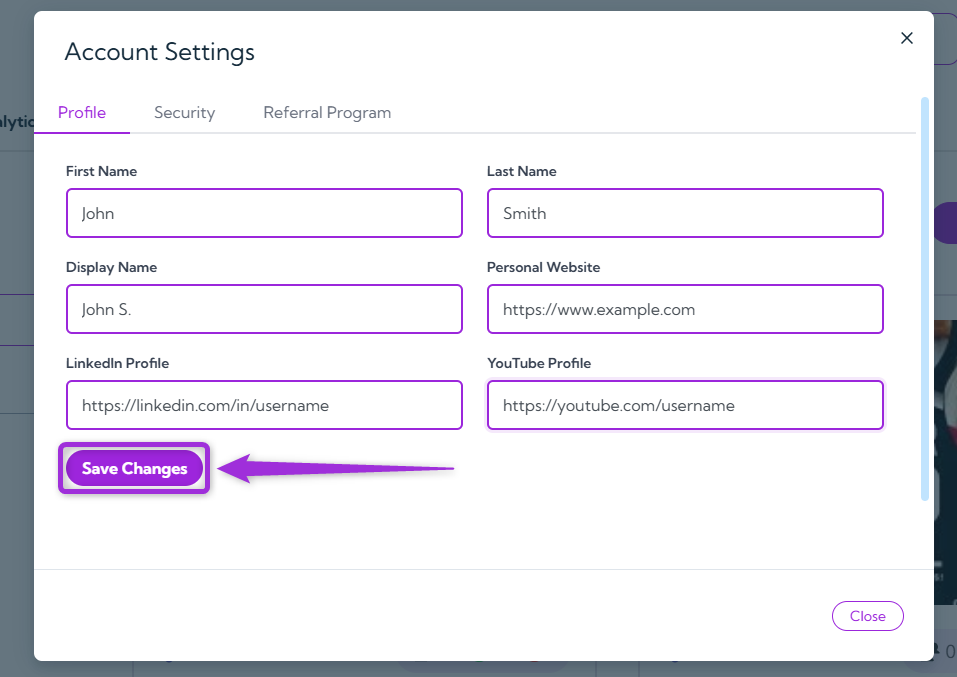
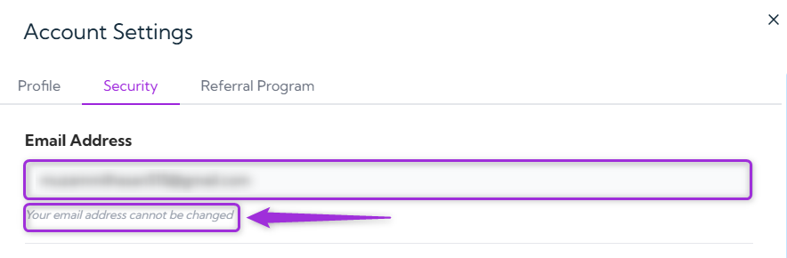

Manage your personal details, security settings, and referral options from one place. The **Account Settings** page helps you keep your Ticket Spot account up to date and secure. You can edit your name, display details, or social links, change your username, and manage your referral link—all within this section.

Let’s get started 🚀

## Navigation
To open your Account Settings, log in to your **Ticket Spot** account, click on your **Profile icon** in the top-right corner of the dashboard, and select **Account Settings** from the dropdown menu.

A modal window will appear showing three tabs — **Profile**, **Security**, and **Referral Program** — each helping you manage a different part of your account.

- **Profile** – Update your name, display information, and social links.  
- **Security** – Manage your username and account access.  
- **Referral Program** – View and share your referral link to invite others.

## Profile

The **Profile** tab allows you to manage your personal details, display name, website, and social links in one place. Keeping this information updated ensures your Ticket Spot profile and event pages always show accurate details.

| Ref. | Field        | Description                                                                                 | Example                           |
|------|--------------|---------------------------------------------------------------------------------------------|-----------------------------------|
| 1.   | **Name**         | Add or edit your first and last name. This appears in your account and on event-related pages.        | John Smith                        |
| 2.   | **Display Name** | The name shown publicly on your Ticket Spot account, visible to other users or attendees.     | John S.                           |
| 3.   | **Website**      | Include your personal or company website link to display on your profile.                     | `https://www.example.com`          |
| 4.   | **Social Links** | Add your professional social profiles to stay connected: |         • LinkedIn – `https://linkedin.com/in/username` • YouTube – `https://youtube.com/username`                          |

After updating your information, click **Save Changes** to apply your updates.

## Security
The Security section helps you keep your Ticket Spot account safe by managing your login credentials and updating your password whenever needed.

> **Note:** Your registered email address is not editable because it’s linked to your Ticket Spot account for verification and security purposes.

#### To update your password:

1. Enter your **new password** in the New Password field and re-enter it in the **Confirm New Password** field.

>**Tip:** Use a strong password that’s at least 8 characters long and includes a mix of letters, numbers, and special characters to keep your account secure.

2. Click on **Change Password** to save your new credentials.

You’ll receive an OTP (One-Time Password) at your registered email address. Enter the OTP to verify the change and click on **Submit Code**.

  

Once verified, your new password will be updated successfully.

## Referral Program

The **Referral Program** allows you to earn a 20% recurring commission for every new user who subscribes through your unique referral link.  
Your personal referral link is displayed on this page. Click **Copy** to share it with others via email, social media, or chat.

Anyone who signs up using your referral link will be linked to your account. You’ll **earn a 20% commission on their subscription each time they renew their plan**, not just on the first payment.