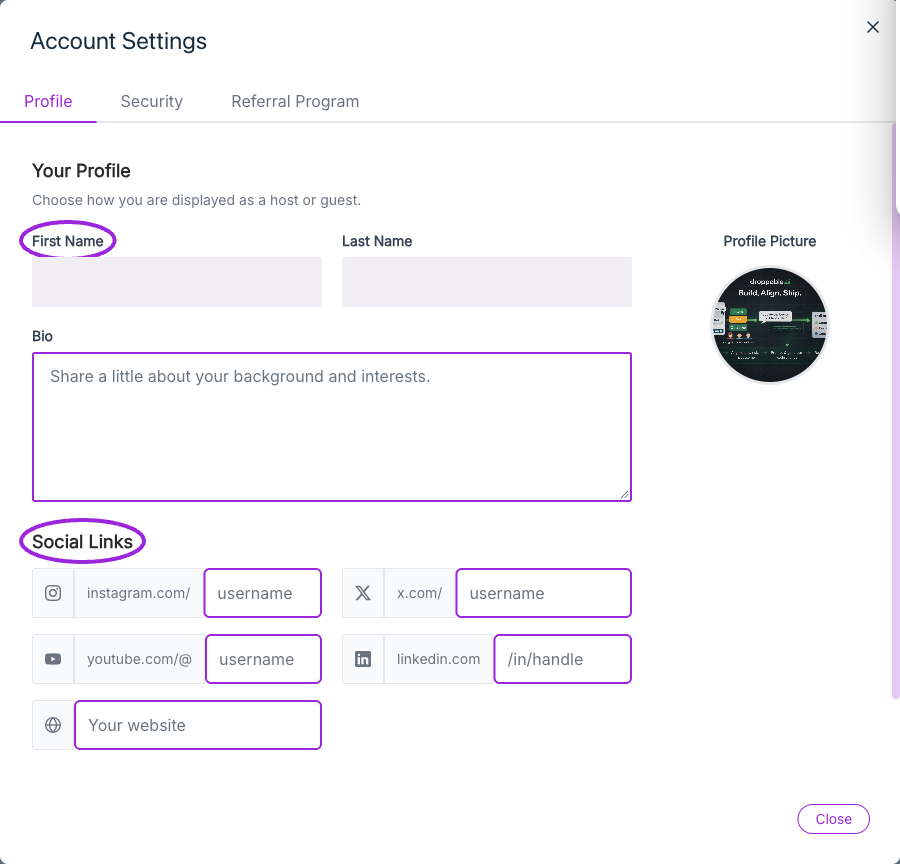
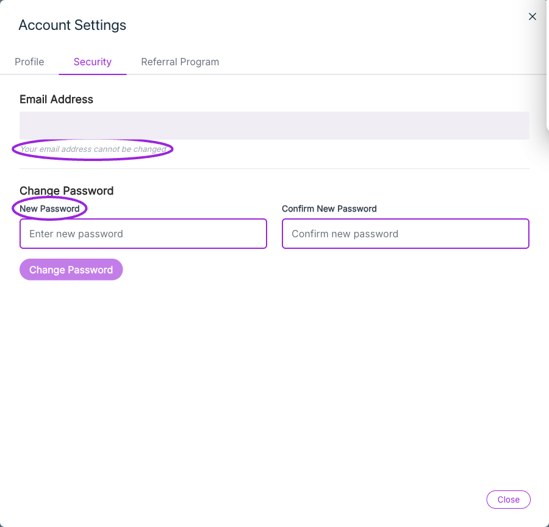
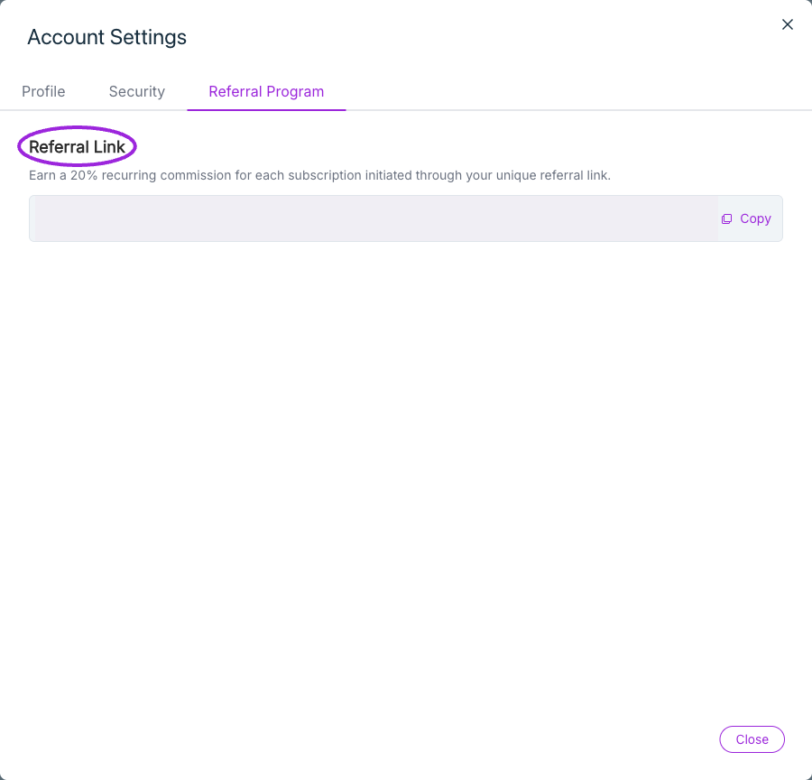

Open **Account → Account Setting** in the dashboard. The **Account Settings** window has **Profile**, **Security**, and **Referral Program** tabs.

## Profile

Choose how you appear as a host or guest, then select **Save Changes** at the bottom of the profile form. Scroll inside the form if the button is below the visible area.

| Field | What to enter |
|---|---|
| **First Name / Last Name** | Your name. |
| **Bio** | Background and interests to share on your profile. |
| **Social Links** | Instagram, X, YouTube, and LinkedIn profile information. Follow the prefix shown next to each input. |
| **Your website** | Your personal or business website. |
| **Profile Picture** | Select your picture to upload an avatar. |

<Frame caption="Account → Account Setting opens Profile. Update your first and last name, bio, social links, website, and profile picture, then select Save Changes. Personal values are concealed.">
  
</Frame>

## Security

Your registered **Email Address** is displayed here and cannot be changed in this form.

1. Enter **New Password** and **Confirm New Password** with the same value. The current form requires **more than eight characters**.
2. Select **Change Password**. Ticket Spot sends a verification code to your registered email.
3. Enter the six-digit code and select **Submit Code**. Use **Resend Code** if needed after its cooldown.
4. Wait for the success confirmation before using the new password.

<Frame caption="Security shows the account email and password-change fields. Enter matching passwords longer than eight characters, choose Change Password, and verify the six-digit email code. The email is concealed here; no password change was submitted.">
  
</Frame>

## Referral Program

Open **Referral Program** and select **Copy** next to your personal **Referral Link**. The screen describes a 20% recurring commission for subscriptions initiated through that link.

<Frame caption="Referral Program provides your personal referral link and explains the recurring commission. Copy your own link when sharing it.">
  
</Frame>

For organizer alerts and their separate delivery address, use [Notifications](./notifications). Attendee emails are configured in [Email communication](/event-management/email-communication).
