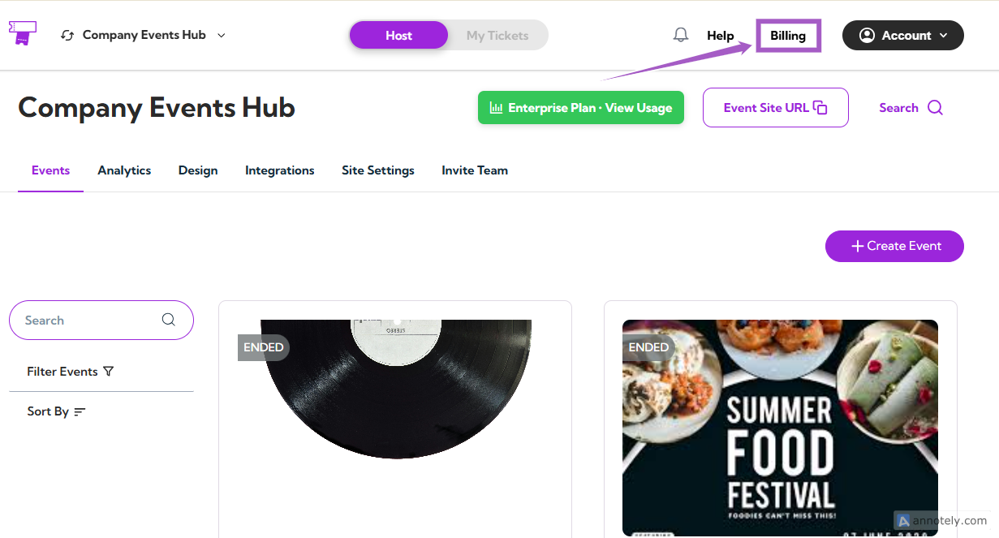
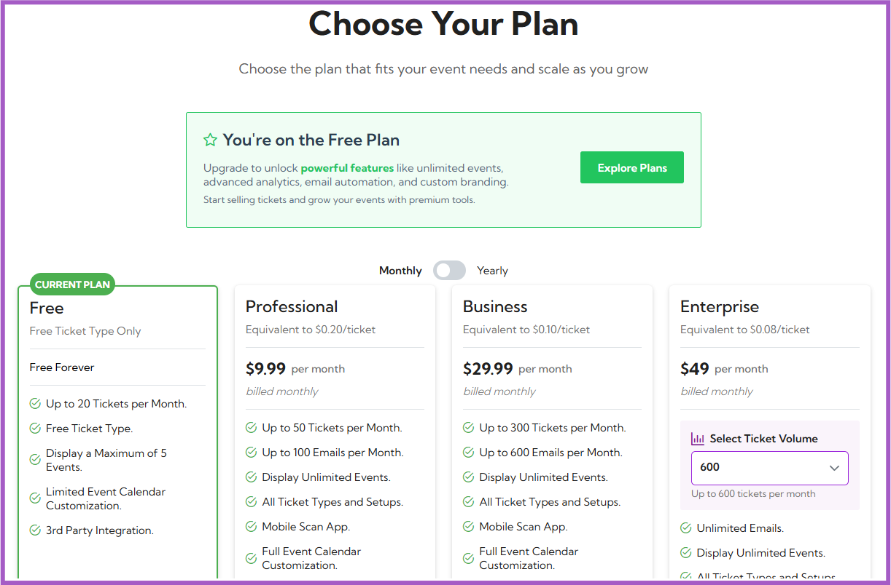
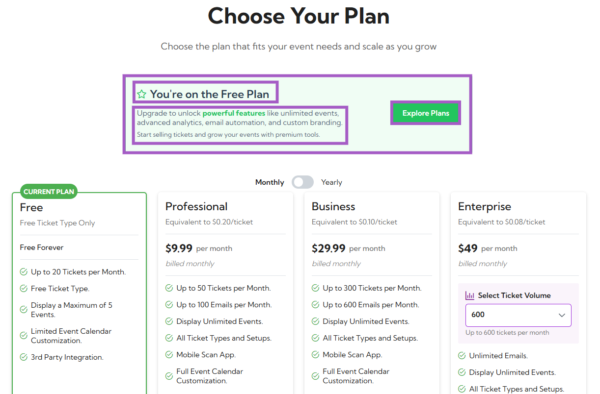
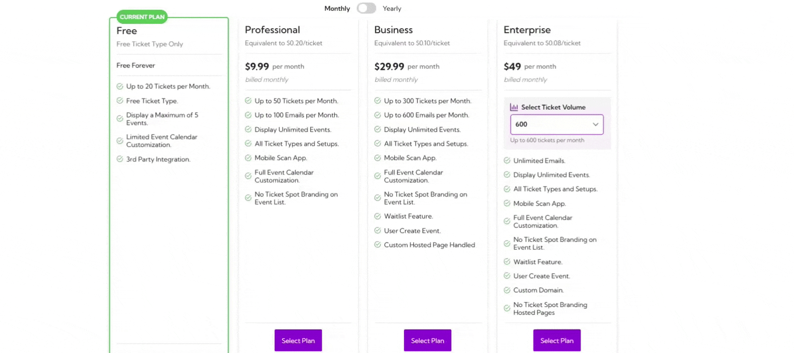
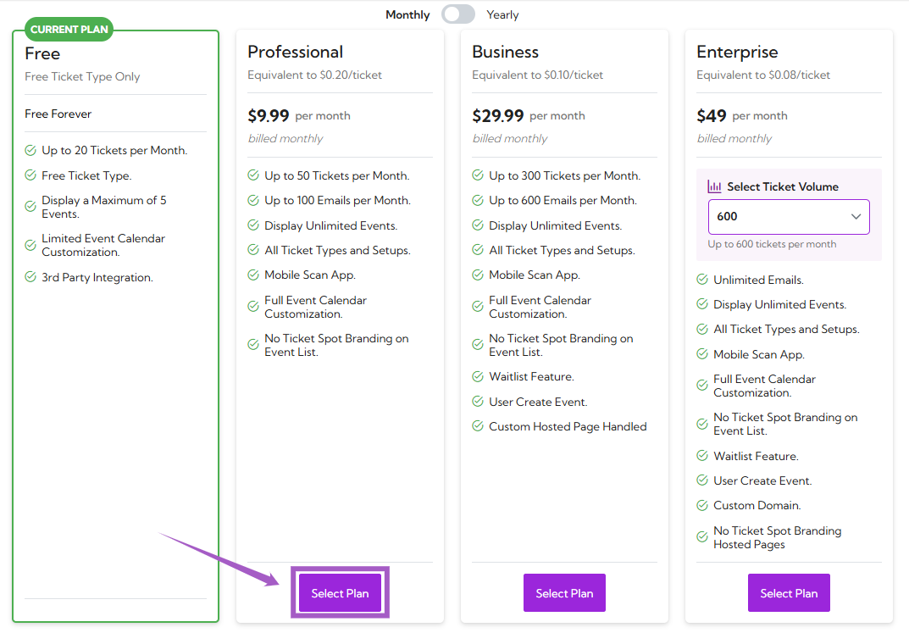
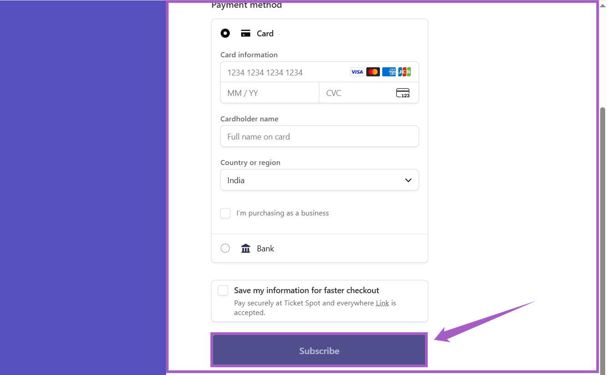
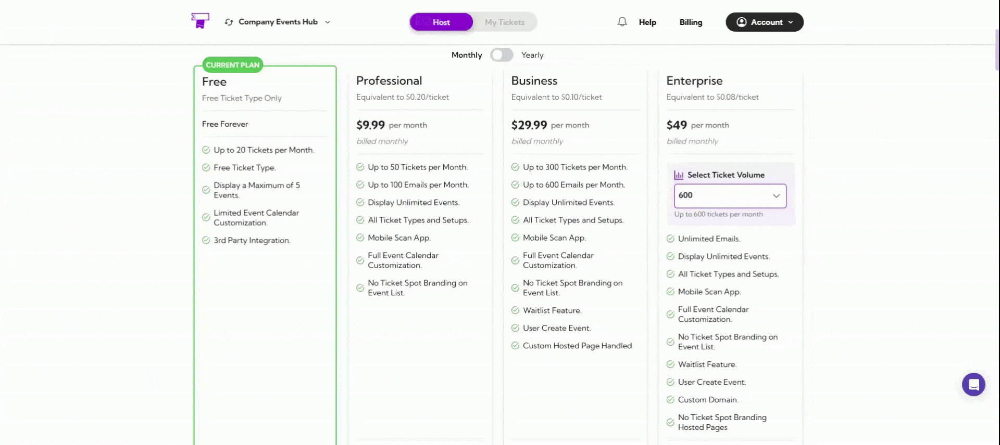

The **Billing** section helps you manage your current subscription plan, explore available upgrades, and monitor your event-related usage. You can easily switch between plans, view ticket limits, and access premium features as your event needs grow.

Let’s get started 🚀

## Navigation

Log in to your **Ticket Spot** account and click on **Billing** from the top navigation bar.

You’ll be redirected to the **Choose Your Plan** page — this is your billing dashboard, where you can view your current plan and all available upgrades.

## Understanding Billing Dashboard

### 1. Current Plan

At the top of the page, you’ll see your current plan details inside a green box.  
It includes:

- Your current plan name (e.g., **Free Plan**)
- A short description of your plan’s benefits
- A button labeled **Explore Plans**, which takes you to view all available upgrades

> **Example:** You’re on the Free Plan. Upgrade to unlock powerful features like unlimited events, advanced analytics, email automation, and custom branding.

### 2. Available Subscription Plans

You will see four plans displayed:

- Free  
- Professional  
- Business  
- Enterprise  

Each plan lists its features, ticket and email limits, and pricing.

You can toggle between **Monthly** and **Yearly** billing options using the switch at the top.

| Plan | Price (Monthly) | Ticket Limit | Email Limit | Key Features |
|------|------------------|---------------|--------------|---------------|
| **Free** | $0 (Free Forever) | Up to 20 tickets/month | N/A | Limited calendar customization, up to 5 events, free ticket type, 3rd party integration |
| **Professional** | $9.99/month | Up to 50 tickets/month | Up to 100 emails/month | Unlimited events, mobile scan app, full calendar customization |
| **Business** | $29.99/month | Up to 300 tickets/month | Up to 600 emails/month | Waitlist feature, user-created events, custom-hosted page |
| **Enterprise** | Starting at $49/month | Up to 600 tickets/month (configurable) | Unlimited emails | Custom domain, no branding, advanced customization |

## Upgrading a Plan

**Step 1:** Click on the **Select Plan** under your desired subscription.

**Step 2:** A **payment window** will open. Enter your billing details and click on the **Subscribe** button to confirm your purchase.

Once the payment is **successful**, your new plan will be **activated immediately** and displayed as your **current plan** on the Billing dashboard.

### Enterprise Plan Customization

If you’re selecting the **Enterprise** plan:

- Use the **Select Ticket Volume** dropdown to choose your monthly ticket capacity (e.g., 600, 1000, or more).
- Pricing will automatically update based on the number of tickets you select.

## Compare Plans and Features

Use this table to compare features available in each plan and choose the one that fits your event needs.

| Feature Category | Free | Professional | Business | Enterprise |
|------------------|------|---------------|-----------|-------------|
| **Event Customization** | Basic only | ✓ | ✓ | ✓ |
| **Add Event Category** | ✗ | ✓ | ✓ | ✓ |
| **Desktop & Mobile Layouts** | ✗ | ✓ | ✓ | ✓ |
| **AI Quick Start** | ✗ | ✓ | ✓ | ✓ |
| **User Create Event** | ✗ | ✗ | ✓ | ✓ |
| **Event Types** | RSVP only | ✓ | ✓ | ✓ |
| **Online / On-site / Hybrid Events** | ✗ | ✓ | ✓ | ✓ |
| **Private Events** | ✗ | ✗ | ✓ | ✓ |
| **Ticket Management** | Up to 20 tickets | Up to 50 | Up to 300 | Custom (600+) |
| **Add Descriptions & Images** | ✓ | ✓ | ✓ | ✓ |
| **Set Limits, Status & Sale Dates** | ✗ | ✓ | ✓ | ✓ |
| **Add Booking Fee** | ✗ | ✓ | ✓ | ✓ |
| **Waitlist Feature** | ✗ | ✗ | ✓ | ✓ |
| **Ticket Types** | Free Ticket Only | ✓ | ✓ | ✓ |
| **Paid / Time Slot / Pass Tickets** | ✗ | ✓ | ✓ | ✓ |
| **Pay-What-You-Want Tickets** | ✗ | ✗ | ✓ | ✓ |
| **Branding & White Label** | TicketSpot Branding | ✓ (partial) | ✓ | ✓ |
| **Remove TicketSpot Branding** | ✗ | ✗ | ✓ | ✓ |
| **Custom Brand Colors** | ✗ | ✓ | ✓ | ✓ |
| **Custom Domain** | ✗ | ✗ | ✗ | ✓ |
| **Analytics Dashboard** | ✗ | ✓ | ✓ | ✓ |
| **Check-in & Sales Analytics** | ✗ | ✓ | ✓ | ✓ |
| **Abandoned Cart Analytics** | ✗ | ✗ | ✓ | ✓ |
| **Integrations** | Limited | ✓ | ✓ | ✓ |
| **Zoom / Google Calendar** | ✗ | ✓ | ✓ | ✓ |
| **Mailchimp / Zapier** | ✗ | ✗ | ✓ | ✓ |
| **Registration Forms (RSVPs)** | ✗ | ✗ | ✓ | ✓ |
| **Custom Form Fields & Questions** | ✗ | ✗ | ✓ | ✓ |
| **Attendee Communication** | ✗ | Up to 100 | Up to 600 | Unlimited |
| **Auto Emails & CSV Exports** | ✗ | ✓ | ✓ | ✓ |
| **Discount Codes** | ✗ | ✓ | ✓ | ✓ |
| **Apply Promo Codes** | ✗ | ✓ | ✓ | ✓ |
| **Volume Discounts** | ✗ | ✗ | ✓ | ✓ |
| **Support** | 24/7 Email Support | ✓ | ✓ | ✓ |
| **Learning Spot Access** | ✓ | ✓ | ✓ | ✓ |
| **Private VIP Support** | ✗ | ✗ | ✓ | ✓ |

---

> **Tip:** Each **checkmark (✓)** shows the plan that includes the feature.  
If your current plan doesn’t include a feature you need, you can upgrade anytime from the **Billing** page.
