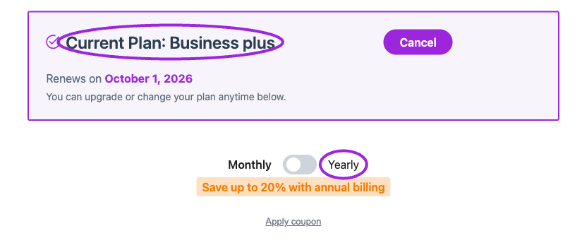
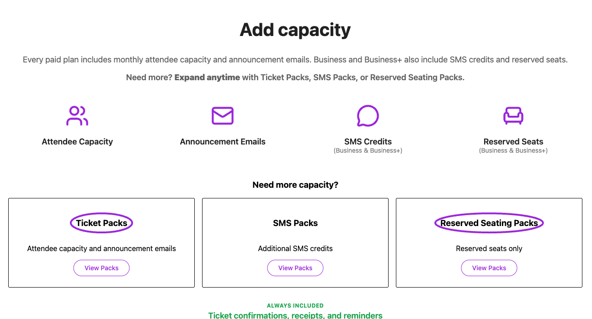
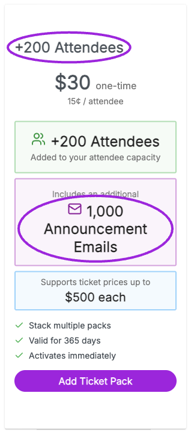
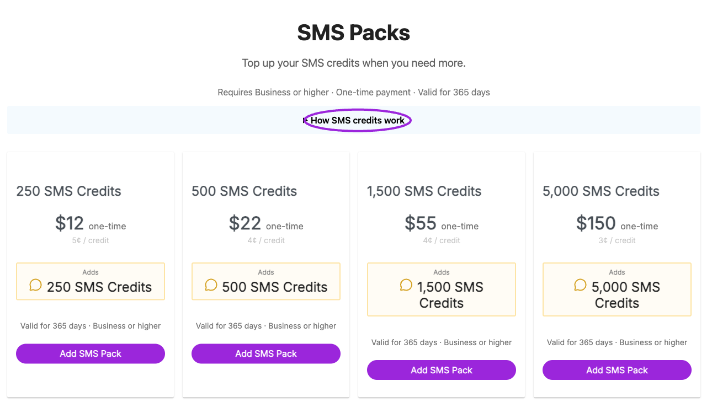
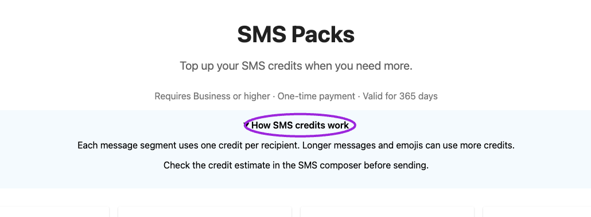
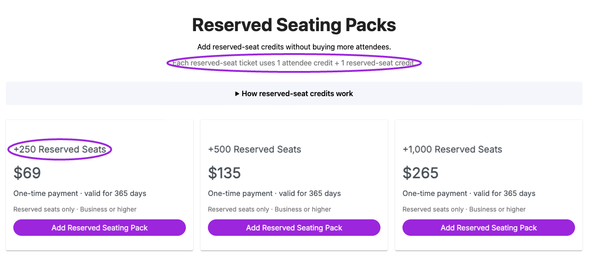
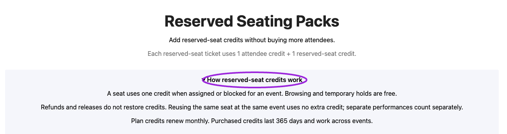

Choose a plan for the ticket volume and features your site needs. Your **Billing** screen shows the current subscription, available upgrades, and the price you will be charged.

## Plan overview

| Plan | Monthly subscription (USD) | Monthly ticket capacity | Email allowance | SMS allowance |
|---|---:|---:|---:|---:|
| Free | $0 | 20 | 100 | — |
| Professional | $29.99 | 500 | 2,500 | — |
| Business | $99 | 1,500 | 7,500 | 500 |
| Business+ | $149 | 2,500, with ticket packs available | 12,500 | 2,000 |
| Platform | Custom | Custom | Custom | Custom |

Annual billing is also available; review the total and billing period before subscribing. Platform pricing and capacity are arranged for the deployment and require an annual commitment. Existing platform-specific or legacy subscriptions may show different terms in their billing screen.

Basic [Brand identity](/branding-and-design/brand-design)—your logo and shared brand colors—is included on **every plan**. Advanced design controls, branding removal, custom domains, and other features have their own plan requirements. See the [complete feature comparison](/account/feature-reference).

## Choose or change a plan

1. Open **Billing** in the top navigation.
2. Review your current plan and usage.
3. Select the monthly or annual billing option and the plan you need.
4. Review the price, billing period, allowances, and confirmation before subscribing.
5. After checkout, return to Billing and verify the displayed plan and allowance.

For a platform-managed subscription, complete billing in the platform flow shown to you. Use the current checkout amount as the authority for what you will pay.

<Frame caption="Billing identifies the current plan and renewal date. Choose Monthly or Yearly to compare the displayed subscription terms before selecting a plan.">
  
</Frame>

## Capacity and ticket packs

Monthly account capacity is separate from the number of tickets available for an individual event. Increasing a ticket's quantity does not increase your subscription allowance. Check usage before opening a large sale, and use the ticket-pack options shown in Billing when you need additional capacity.

Email and SMS allowances are separate from ticket capacity. Review message usage before sending campaigns or enabling multiple reminders.

<Frame caption="Add capacity separates Ticket Packs, SMS Packs, and Reserved Seating Packs. Ticket confirmations, receipts, and reminders are listed as always included.">
  
</Frame>

| Pack | Adds | Check before buying |
|---|---|---|
| **Ticket Pack** | Attendee capacity and announcement emails. | Maximum supported ticket price, capacity, one-time price, and validity. Packs can be stacked and are valid for 365 days. |
| **SMS Pack** | SMS credits on Business or higher. | Credits, price, and 365-day validity. Each message segment uses one credit per recipient; long messages and emojis can use more. |
| **Reserved Seating Pack** | Reserved-seat credits on Business or higher. | Seats, price, and 365-day validity. Attendee capacity is separate. |

When packs are active, **Your Active Packs** shows remaining balances, the supported maximum ticket price, active packs, and the next expiry. Purchased reserved seats also show their remaining balance and expiration.

<Accordion title="Example Ticket Pack">
<Frame caption="A Ticket Pack adds attendee capacity and announcement emails. Review its maximum ticket price, validity, and one-time price before purchase; reserved seats use separate packs.">
  
</Frame>
</Accordion>

<Accordion title="SMS Packs and credit rules">
<Frame caption="SMS Packs top up messaging credits for Business or higher. Review the stated pack validity and use How SMS credits work for the message-segment rules.">
  
</Frame>
<Frame caption="Each SMS segment costs one credit per recipient. Longer text and emojis can increase the credit cost; check the composer’s estimate before sending.">
  
</Frame>
</Accordion>

## Payments, fees, and support

The subscription pays for Ticket Spot access. Payment-provider charges, any organizer-configured ticket fees, and marketplace commission are separate concepts; inspect the checkout breakdown and your provider account. See [payment setup](/account/get-paid) and [ticket fee controls](/event-management/ticket-setup).

Email support is available on all plans. Business+ includes priority support, and Platform includes a dedicated account manager. Contact [Ticket Spot support](mailto:support@ticketspotapp.com) for account-specific billing questions.

## Seating and extra volume

Business includes 250 reserved-seat credits per month; Business+ includes 500. Seating allowance is distinct from overall ticket capacity and the number of seats drawn on a chart. Paid plans offer ticket packs for additional volume; Business and Business+ also offer SMS packs and seating-credit options. Review the pack terms shown at purchase.

<Frame caption="Reserved Seating Packs add seat credits separately from attendee capacity. Each reserved-seat ticket uses one attendee credit and one reserved-seat credit.">
  
</Frame>

Each reserved-seat ticket needs attendee capacity and a reserved-seat credit. A seat consumes a credit when assigned or blocked for an event; browsing and temporary holds are free. Refunds and releases do not restore credits. Reusing the same seat at the same event uses no extra credit, while separate performances count separately. Plan credits renew monthly, and purchased credits last 365 days across events.

<Accordion title="Reserved-seat credit rules">
<Frame caption="Assigned or blocked seats consume credits; browsing and temporary holds do not. Refunds/releases do not restore credits. Reusing the same seat for the same event costs no extra credit; separate performances count separately.">
  
</Frame>
</Accordion>
