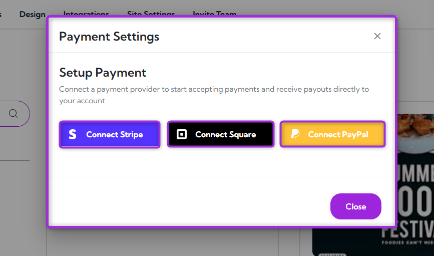
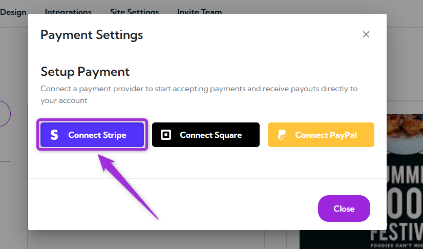

The **Get Paid** feature helps you connect a payment provider to start accepting payments for your events. Once connected, all ticket sales are processed securely, and the money you earn is automatically sent to your account — no manual transfers needed.

Let’s get started 🚀

## Connect a Payment Provider

1. Log in to your **Ticket Spot** account, click on your **Profile icon** in the top-right corner, and select **Get Paid** from the dropdown menu.

2. A modal window will open, allowing you to connect a payment provider — such as **Stripe**, **Square**, or **PayPal** to start receiving payments for your events.

3. Click **Connect Stripe** (or your preferred provider, such as **Square**, **PayPal**) and follow the on-screen instructions to complete the setup.

After setup, all payouts from your ticket sales will be automatically transferred to your connected account — and you’re all set to start getting paid.