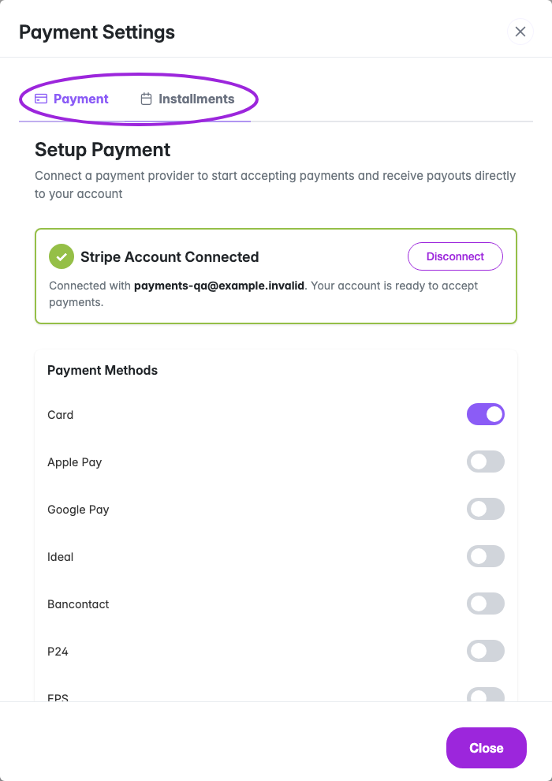

The **Get Paid** feature helps you connect a payment provider to start accepting payments for your events. Complete provider onboarding before selling paid tickets. The connected provider processes payments and controls payout eligibility and timing.

## Connect a Payment Provider

1. Log in to your **Ticket Spot** account, open **Account** in the top navigation, and select **Get Paid** from the dropdown menu.

2. Payment Settings opens on its **Payment** tab, allowing you to connect a payment provider — such as **Stripe**, **Square**, or **PayPal** to start receiving payments for your events.

3. Click **Connect Stripe** (or your preferred provider, such as **Square**, **PayPal**) and follow the on-screen instructions to complete the setup.

After setup, confirm the provider shows as connected and check a completed test purchase in both Ticket Spot and the provider dashboard. Review payout timing and any outstanding verification requirements in the provider account.

<Frame caption="Payment Settings separates provider connections in Payment from collection rules in Installments.">
  
</Frame>

## Connected-provider controls

<Frame caption="Get Paid shows the connected provider. For Square, choose the location used for payments; this Demo account is connected to its test location. Merchant details are concealed.">
  
</Frame>

The controls shown after connection depend on the provider and its account status:

| Provider | Controls in Ticket Spot |
|---|---|
| **Stripe** | **View Account**, connected or **Setup Required** status, and payment-method switches for Card, Apple Pay, Google Pay, Ideal, Bancontact, P24, EPS, and Twint. Select **Save Changes** after editing payment methods. |
| **Square** | Connected-account status and **Select Location**. A location change saves when selected. |
| **PayPal** | PayPal checkout, credit/debit-card fields, and Pay Later switches. Keep at least one method enabled, then select **Save Changes**. Where supported, review account readiness and refresh its status. Card fields require PayPal approval. Older connections may offer **Upgrade PayPal connection**. |

**Disconnect** removes the selected provider connection. Marketplace sites offer Stripe onboarding. A payment-method switch does not guarantee that method is available to every buyer; the provider also determines eligibility.

## Choose the correct payment workflow

- Website ticket checkout uses the provider configured for that integration. Available methods depend on the provider and account.
- Shopify product purchases use the [Shopify integration](/plugins/connect-shopify); configure Shopify payments in Shopify.
- Walk-up sales use the separate [Ticket Spot POS and Square handoff](/on-site/box-office-pos), or its cash workflow.
- [Installment tickets](/event-management/installment-payments) require Stripe card checkout. Business includes manual collection; Business Plus and Platform add automatic collection and optional retry days in **Payment Settings → Installments**.

Subscription charges, processor fees, organizer-configured service fees, and marketplace commissions are separate. Review the checkout breakdown and actual provider settlement rather than assuming the ticket's face value is the net payout.
