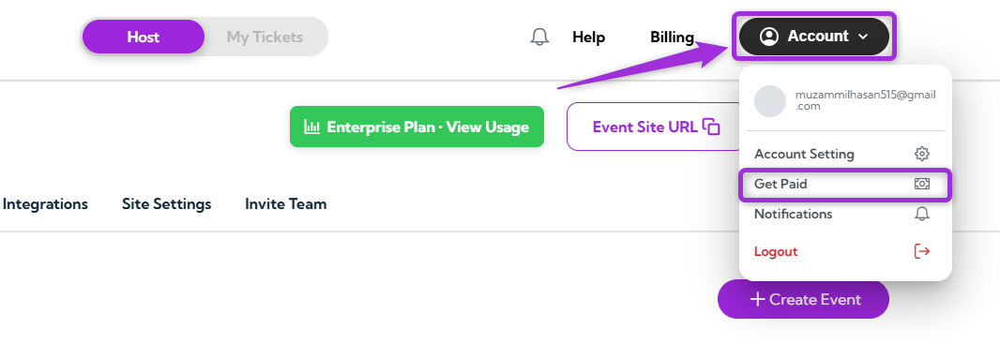
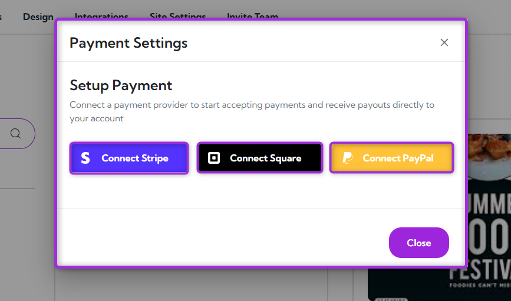
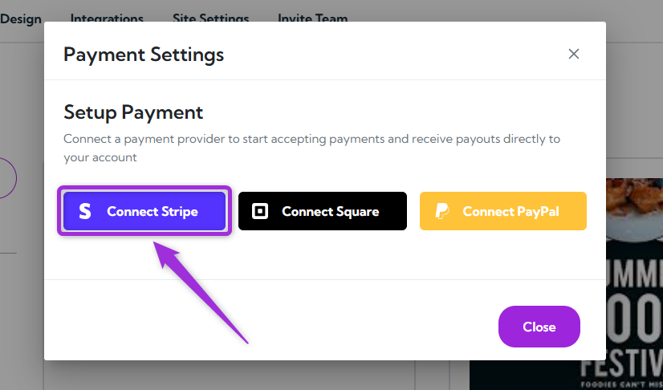

The **Get Paid** feature helps you connect a payment provider to start accepting payments for your events. Complete provider onboarding before selling paid tickets. The connected provider processes payments and controls payout eligibility and timing.

## Connect a Payment Provider

1. Log in to your **Ticket Spot** account, click on your **Profile icon** in the top-right corner, and select **Get Paid** from the dropdown menu.

2. A modal window will open, allowing you to connect a payment provider — such as **Stripe**, **Square**, or **PayPal** to start receiving payments for your events.

3. Click **Connect Stripe** (or your preferred provider, such as **Square**, **PayPal**) and follow the on-screen instructions to complete the setup.

After setup, confirm the provider shows as connected and check a completed test purchase in both Ticket Spot and the provider dashboard. Review payout timing and any outstanding verification requirements in the provider account.

## Choose the correct payment workflow

- Website ticket checkout uses the provider configured for that integration. Available methods depend on the provider and account.
- Shopify product purchases use the [Shopify integration](/plugins/connect-shopify); configure Shopify payments in Shopify.
- Walk-up sales use the separate [Ticket Spot POS and Square handoff](/on-site/box-office-pos), or its cash workflow.
- [Installment tickets](/event-management/installment-payments) require Stripe card checkout and organizer collection of later payments.

Subscription charges, processor fees, organizer-configured service fees, and marketplace commissions are separate. Review the checkout breakdown and actual provider settlement rather than assuming the ticket's face value is the net payout.
