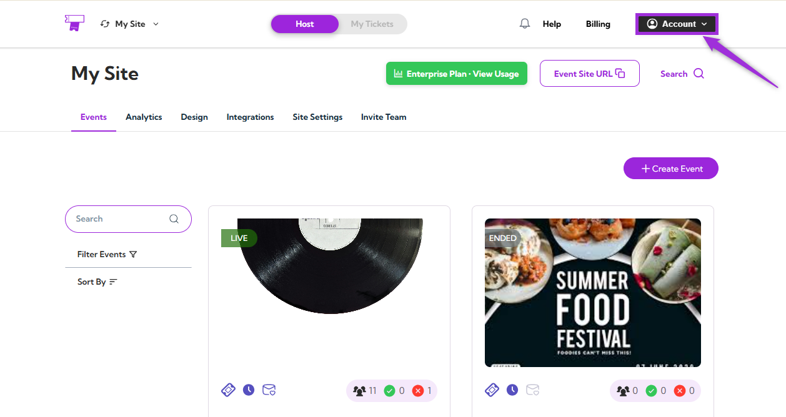
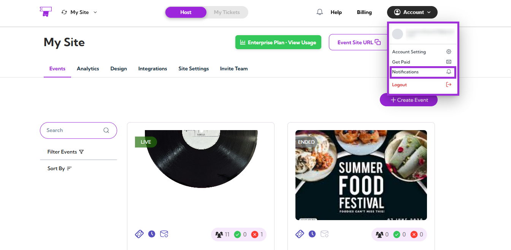
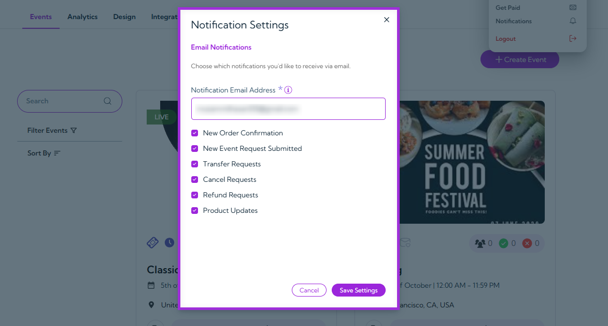
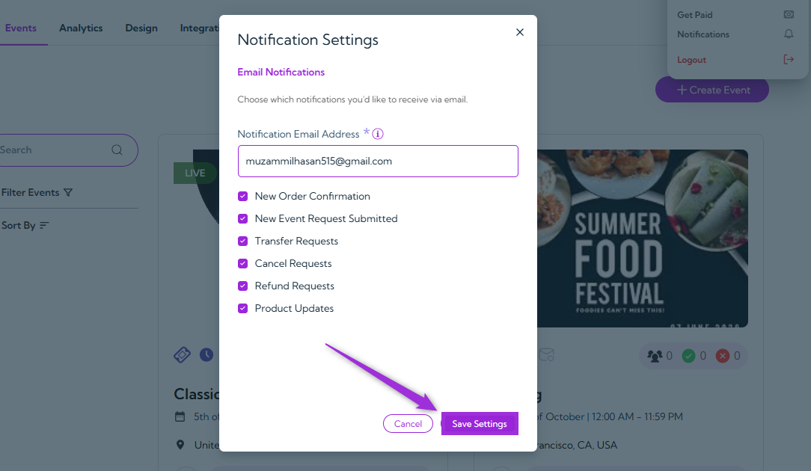

The **Notification Settings** section lets you manage which types of email notifications you want to receive from Ticket Spot. You can add your preferred email address and choose to get alerts for new orders, event requests, transfers, refunds, and product updates — ensuring you stay informed about all key activities related to your account.

Let’s get started 🚀

**Step 1**: Log in to your **Ticket Spot** account and click on the **Account** icon located at the top-right corner of the screen.

**Step 2**: A dropdown menu will appear — click on **Notifications** to open your notification settings.

A **Notification Settings** modal window will appear, displaying all available email notification options.

The table below shows each available notification option and its purpose:

| No | Option                      | Description                                                                                     |
|----|-----------------------------|-------------------------------------------------------------------------------------------------|
| 1. | **Notification Email Address**  | Enter the email address where all selected notifications will be sent.                          |
| 2. | **New Order Confirmation**      | Check the box to receive an email whenever a new order is successfully placed.                 |
| 3. | **New Event Request Submitted** | Check the box to get notified when someone submits a new event request for approval.           |
| 4. | **Transfer Requests**           | Check the box to receive alerts when attendees request to transfer their tickets.              |
| 5. | **Cancel Requests**             | Check the box to be notified when an attendee requests to cancel an order or event.            |
| 6. | **Refund Requests**             | Check the box to receive updates whenever a refund request is submitted.                       |
| 7. | **Product Updates**             | Check the box to stay informed about new Ticket Spot features, improvements, and announcements.|

**Step 3**: After selecting your preferences, click on the **Save Settings** button to apply your changes.

