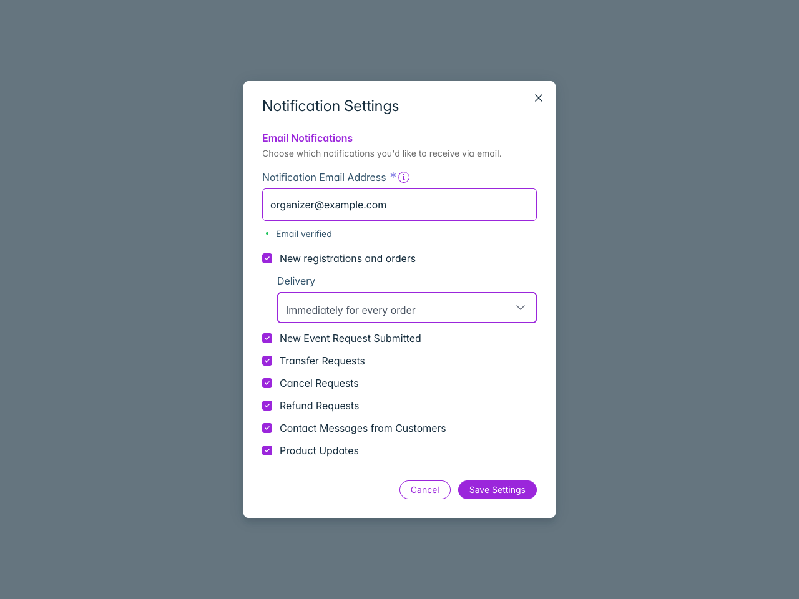
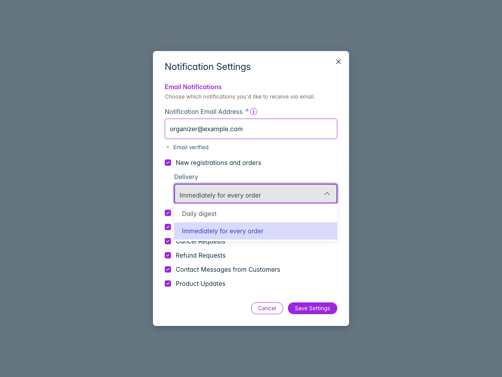
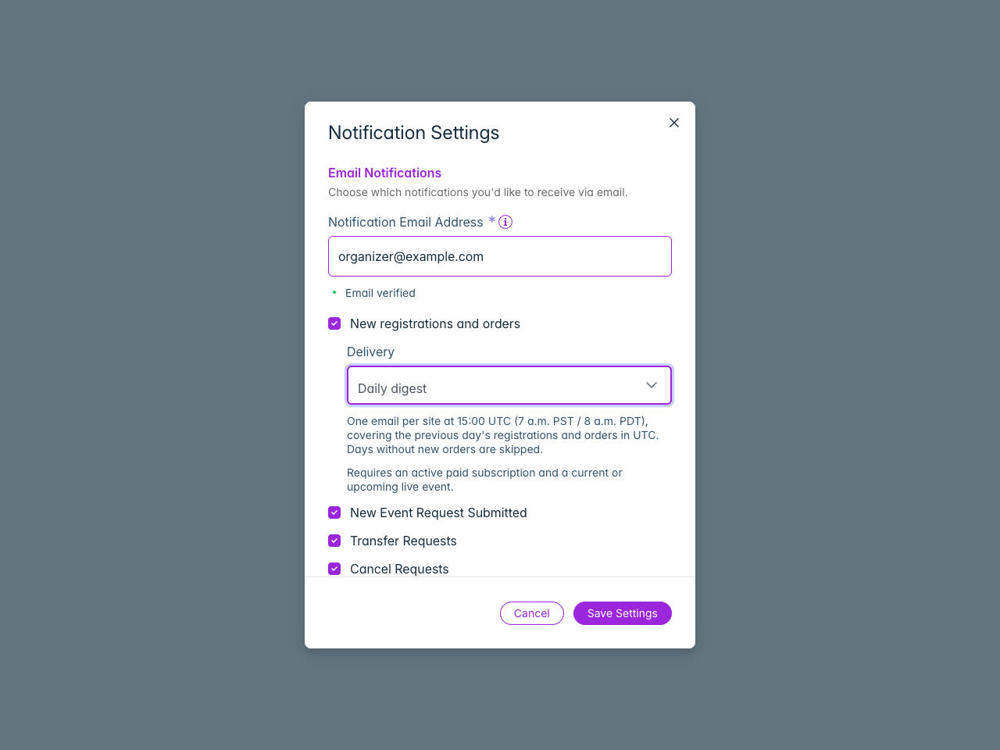
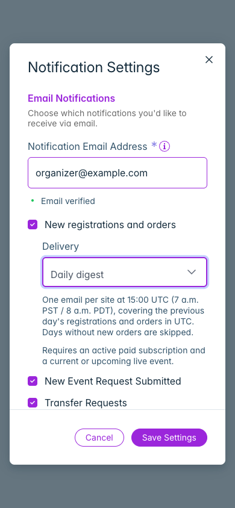

Open **Account → Notifications** to choose the email alerts sent to you as an organizer. These preferences are separate from the [messages sent to attendees](/event-management/email-communication).

## Delivery address and verification

Enter your **Notification Email Address**. When the address is verified, the form shows **Email verified**. An unverified address has a **Verify Email** action; changing the address requires verification again when you save.

Complete the email verification flow when prompted. If you leave the delivery address empty, the settings help text indicates that your account email is used.

<Frame caption="Notification settings with a verified sample organizer address. Choose Save Settings to apply your changes.">
  
</Frame>

## Registration and order delivery

Enable **New registrations and orders**, then choose a **Delivery** option:

| Delivery | What you receive |
|---|---|
| **Daily digest** | One summary per site at 15:00 UTC (7 a.m. PST), covering the previous UTC calendar day's registrations and orders. Days without new orders are skipped. |
| **Immediately for every order** | An organizer email for each new order or registration. |

New accounts default to **Daily digest**. No timezone selection is needed. Existing accounts keep immediate delivery until you change it. Turn off **New registrations and orders** to stop both kinds of organizer order email.

<Frame caption="The Delivery menu offers both daily digests and immediate order notifications. Screenshots use a sample account in a local preview of the dashboard component.">
  
</Frame>

### Daily digest schedule

Choose **Daily digest**, then choose **Save Settings**. Everyone uses the same daily schedule: **15:00 UTC**, covering the previous calendar day in UTC. Delivery normally occurs on the next five-minute scheduler run at or after that time; retries can arrive later.

| Local time | Daily send time |
|---|---|
| Pacific | 7 a.m. PST / 8 a.m. PDT |
| Eastern | 10 a.m. EST / 11 a.m. EDT |
| United Kingdom | 3 p.m. GMT / 4 p.m. BST |

The UTC time stays fixed throughout the year. Saved timezone preferences from an earlier version no longer change the schedule for new digests.

<Frame caption="Daily delivery shows the fixed send time, without a timezone selector.">
  
</Frame>

<Accordion title="Notification settings on a phone">
  <Frame caption="The settings form scrolls while Save Settings and Cancel stay visible.">
    
  </Frame>
</Accordion>

### Which sites receive daily digests?

A site needs an **active paid subscription** and at least one **live current or upcoming event**. A live event with its date still to be determined also qualifies. Free plans, free trials, event packs, disabled sites, demo events, drafts, cancelled events, and deleted events do not qualify.

Eligibility is checked when new registrations are queued and again before a digest is sent. If all your live events have ended before delivery, or your paid subscription is no longer active, the digest is skipped. Registrations made while the site is ineligible are not held for a later digest. Immediate delivery is available separately.

The digest groups orders by event and shows ticket types, group ticket purchases, add-ons with their selected time slots, and memberships purchased. Group ticket quantities count group purchases; attendee counts include each member of the group. Memberships appear under the checkout event, including membership-only orders. It also includes collected amounts and order values by currency, outstanding installment balances, capacity information where available, recent orders, and dashboard links. Shared-cart payment totals count once across events. Item prices can differ from order totals because of discounts, taxes, and fees. Each eligible organizer receives their own digest for events they can access. Turning notifications off or losing access prevents pending digest delivery.

These settings control **organizer alerts**. They do not delay attendee confirmation emails or change your [attendee email campaigns](/event-management/email-communication).

## Available notifications

| Preference | Alert |
|---|---|
| **New registrations and orders** | New registrations and orders, delivered daily or immediately according to your selection. |
| **New Event Request Submitted** | Events submitted for organizer review. |
| **Transfer Requests** | Attendee transfer requests. |
| **Cancel Requests** | Attendee cancellation requests. |
| **Refund Requests** | Attendee refund requests. |
| **Contact Messages from Customers** | Messages customers send to the host. |
| **Product Updates** | Ticket Spot product updates and announcements. |

Select the alerts you want, then choose **Save Settings**. **Cancel** closes the form without applying those edits.
