The **Abandoned Cart Analytics** dashboard shows you how many customers began the checkout process but didn’t finish their purchase. It helps you track abandoned sessions, see which ones can be recovered, and review when and where users dropped off during checkout.

Let’s get started 🚀

## Navigation

**Step 1:** Log in to your **Ticket Spot** account and click the **Analytics** tab from the top navigation bar.

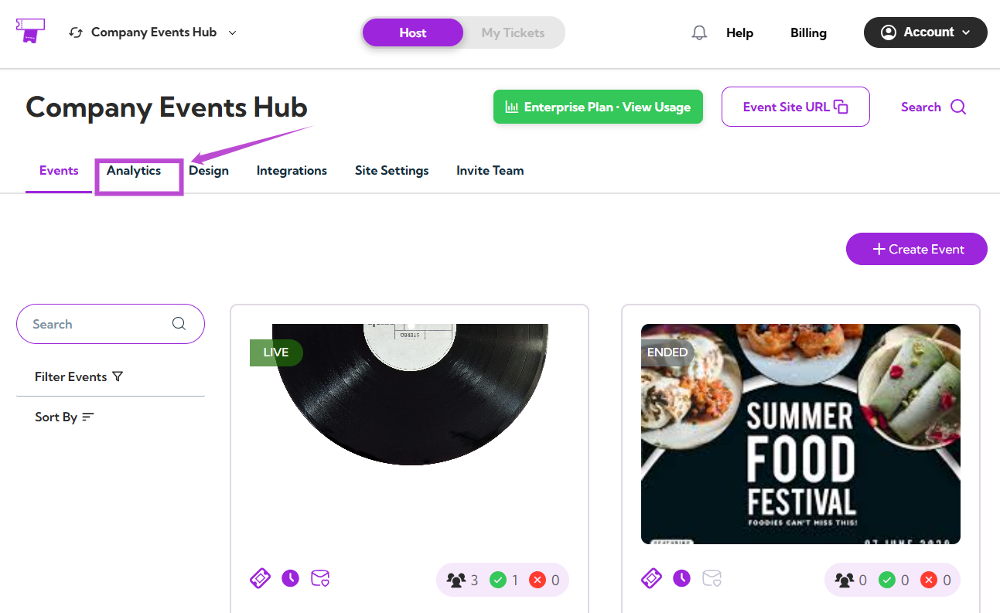

**Step 2:** Click on the **Analytics Type dropdown** and select **Abandoned Cart Analytics**.

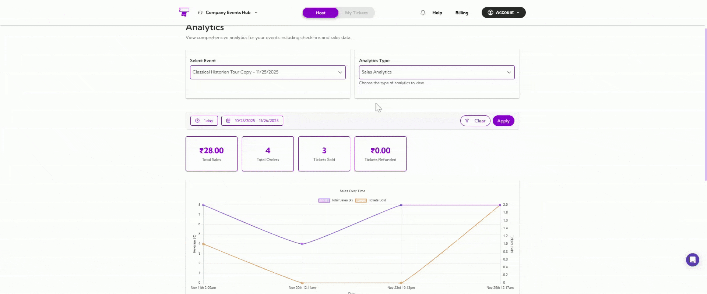

Your dashboard will instantly update to show all cart abandonment insights.

## Select Event

Use the **Select Event** dropdown to choose the event you want to analyze.

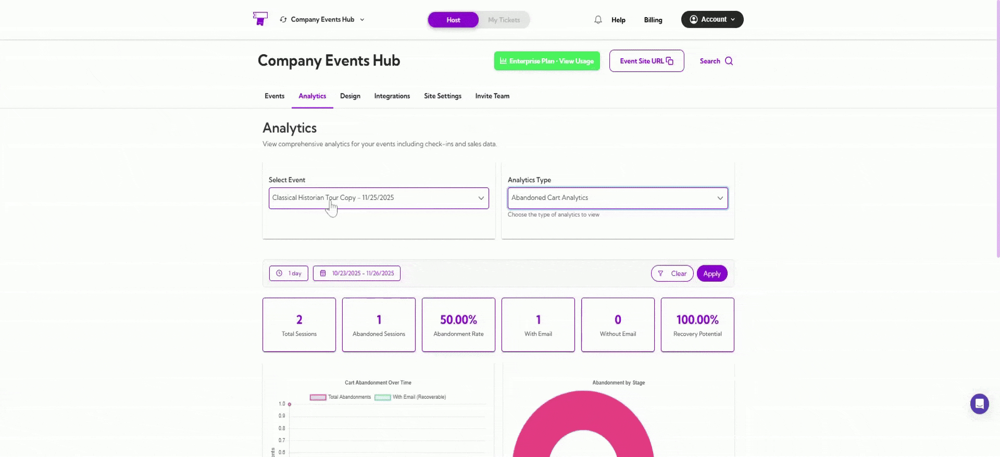

Once selected, all metrics, graphs, and tables will reflect abandoned sessions for that specific event.

## Date Filters

You can filter analytics by preset ranges like **1 day**, **7 days**, or **1 year**, or choose a **custom date range** using the calendar. 

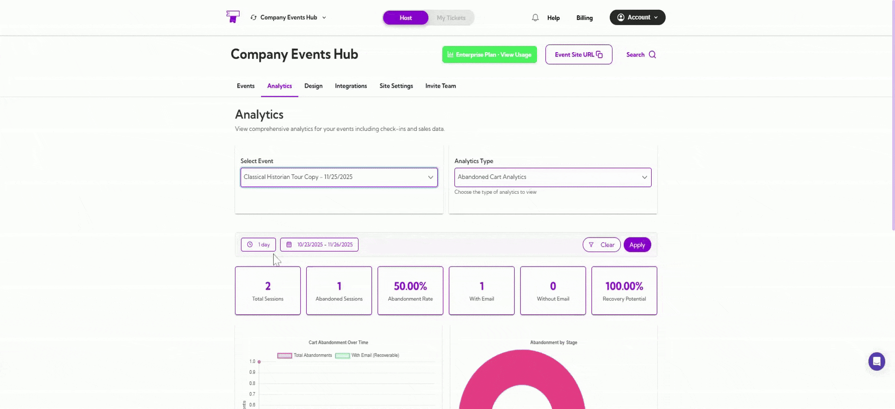

The dashboard updates automatically based on your selected timeframe.

## Summary Metrics

These metrics give you a quick snapshot of your event’s cart abandonment activity.

| Ref No. | Metric Name           | Description                                                       |
|--------|-----------------------|-------------------------------------------------------------------|
| 1.     | **Total Sessions**        | Total checkout sessions started.                                  |
| 2.     | **Abandoned Sessions**    | Number of sessions where checkout was not completed.              |
| 3.     | **Abandonment Rate (%)**  | Percentage of sessions that ended without a purchase.             |
| 4.     | **With Email**            | Abandoned sessions where the user provided an email (recoverable). |
| 5.     | **Without Email**         | Sessions abandoned before email was entered (non-recoverable).    |
| 6.     | **Recovery Potential (%)** | Percentage of abandoned sessions that can be recovered via email. |

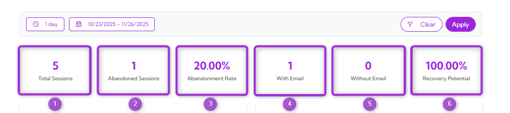

## Cart Abandonment Over Time

This graph shows when cart abandonments happened during your selected date range.  

- The **pink line** shows the total number of abandonment events.  
- The **blue line** shows recoverable abandonments where the customer entered an email.

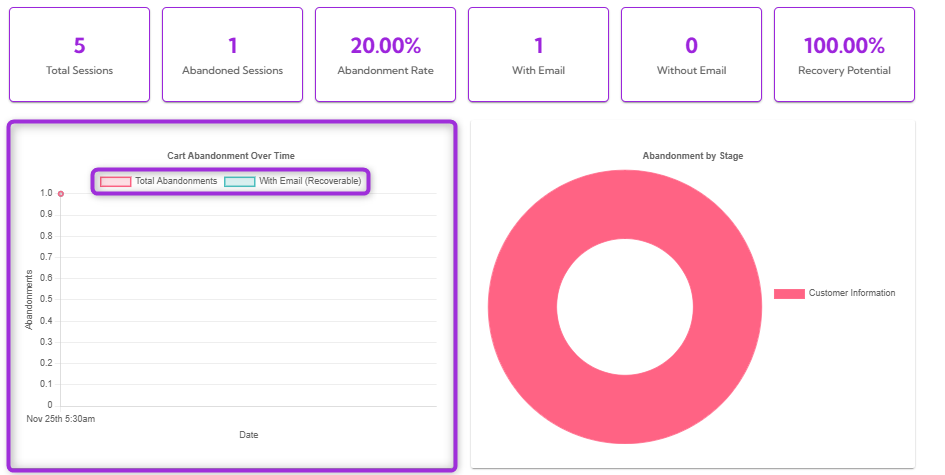

This helps you see patterns, spikes, and the overall timing of abandoned sessions.

## Abandonment by Stage

This donut chart shows which step of the checkout process customers abandoned. For example, all abandonments happened at the **Customer Information** stage.  

This helps you quickly identify where users drop off so you can improve that part of the checkout flow.

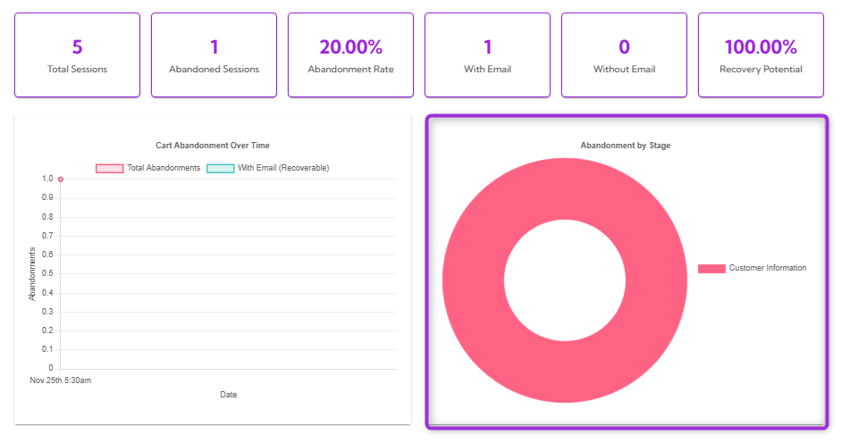

## Recovery Opportunities

The **Recovery Opportunities** section lists all abandoned checkout sessions where customers entered an email address. These sessions are recoverable, meaning you can contact the customer to complete their purchase. 

This table helps you see who abandoned their cart, when they left, and whether follow-up emails have been sent.

| Ref No. | Fields            | Description                                           |
|--------|-------------------|-------------------------------------------------------|
| 1.     | **Name**              | The customer's name was captured during checkout.     |
| 2.     | **Email**             | The email address entered by the customer.            |
| 3.     | **Stage Abandoned**   | The step at which the customer dropped off.           |
| 4.     | **Abandonment Time**  | The exact time the abandonment occurred.              |
| 5.     | **Email Status**      | Shows whether the recovery email is Pending, Sent, or Failed. |

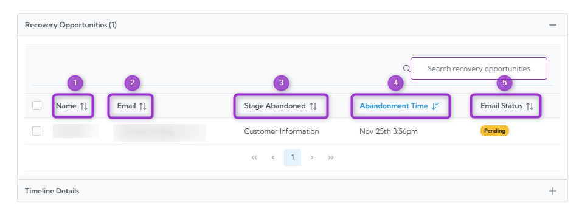

To take action on an abandoned cart, simply check the box next to the customer’s name in the Recovery Opportunities table. The available actions will appear.

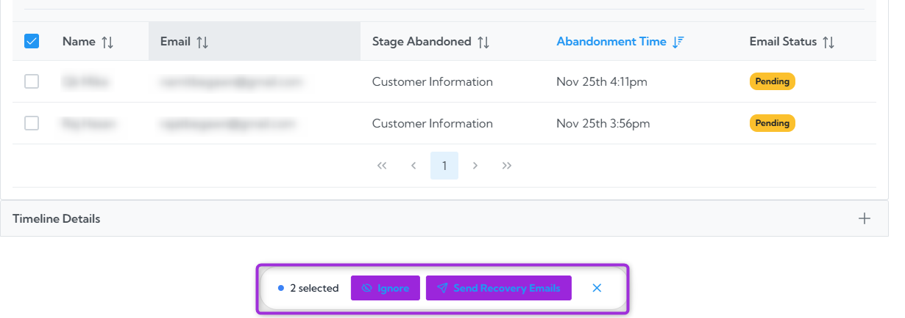

### Ignore

Use Ignore when you do not want to send a recovery email to the selected customer. This simply marks the entry so you can skip it.

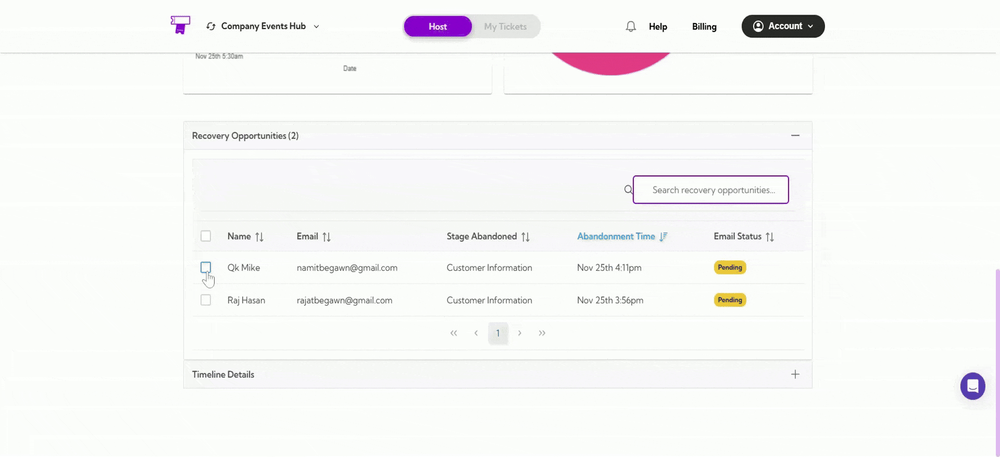

### Send Recovery Emails

Use Send Recovery Emails to contact the customer and remind them to complete their purchase. This helps recover abandoned carts and increase your event revenue.

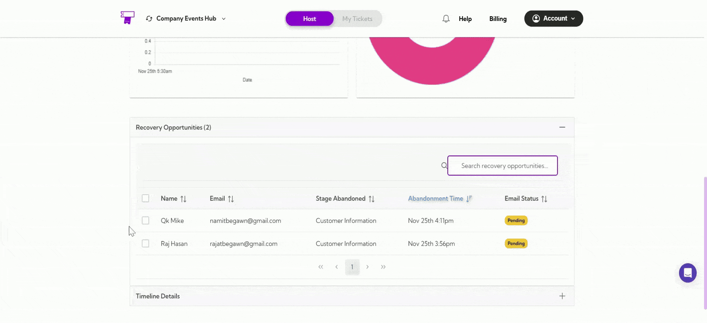

## Timeline Details

The Timeline Details section provides a breakdown of all abandonment events by date. This helps you understand when users are leaving the checkout flow and how often abandonment occurs over time.

At the top, you’ll see a quick summary showing:

- **Total Timeline Entries** – number of unique dates with abandonment activity  
- **Total Abandonments** – total number of abandoned sessions  
- **With Email** – how many of those abandonments included an email (recoverable)  
- **Average Daily** – the average number of abandonments per day  

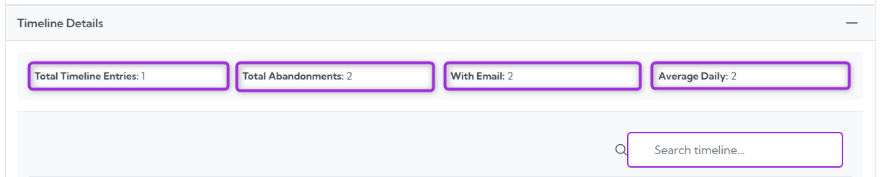

Below the summary, the table lists each date with detailed metrics:

| Ref No. | Fields             | Description                                                    |
|--------|--------------------|----------------------------------------------------------------|
| 1.     | **Date**               | The date on which the abandonment occurred.                    |
| 2.     | **Total Abandonments** | The number of abandonments recorded on that day.               |
| 3.     | **With Email**         | How many abandonments included an email address.               |
| 4.     | **Recovery Potential** | Shows the likelihood of recovering the abandoned cart (e.g., high). |

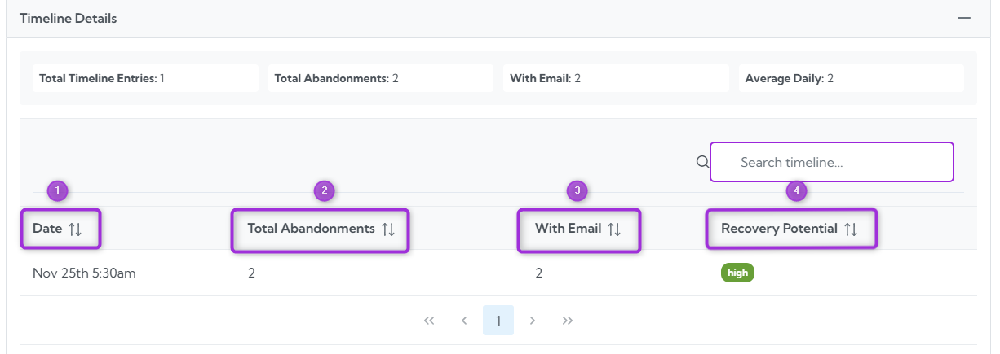

This section helps you track daily abandonment trends and identify days with higher recovery potential.
