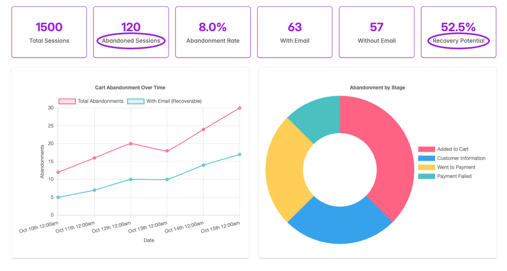
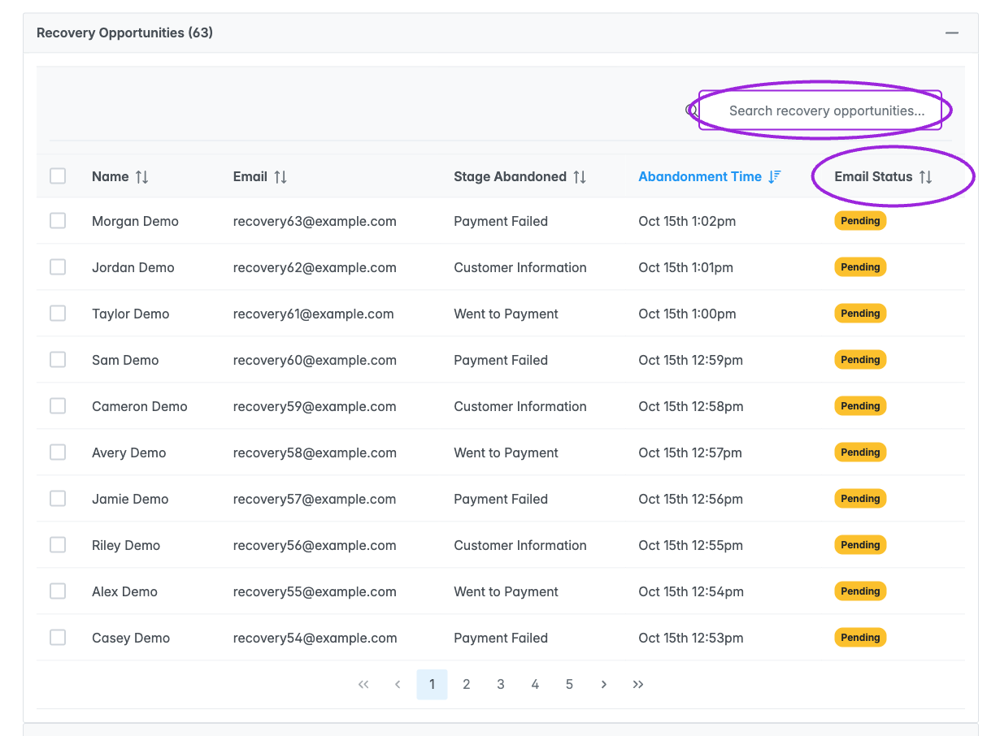
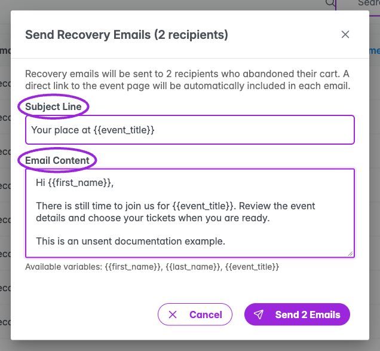
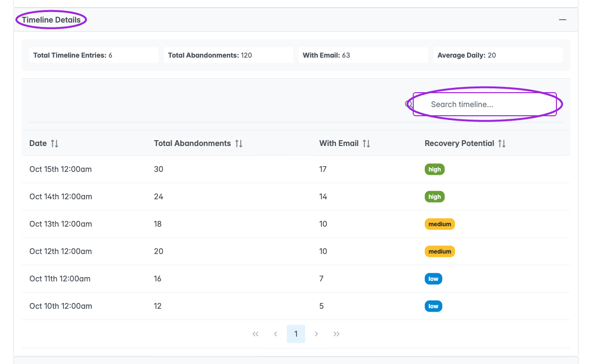
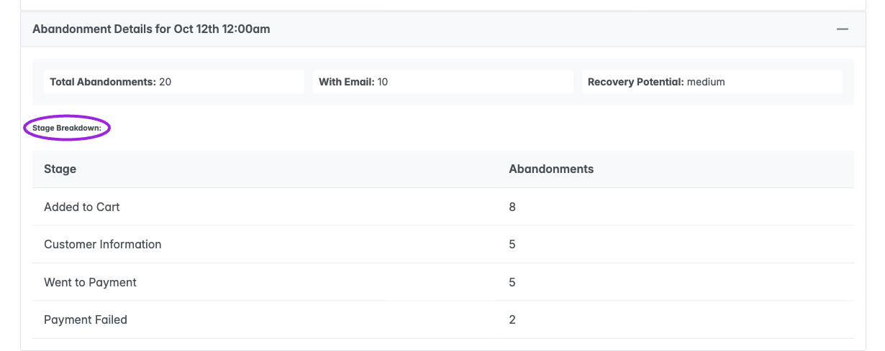

Open **Analytics**, select an event or occurrence, and choose **Abandoned Carts**. Set **Range** and **Group by** for the period you want to inspect. Screenshots use illustrative data; no recovery messages were sent for them.

## Summary and charts

The six summary cards show **Total Sessions**, **Abandoned Sessions**, **Abandonment Rate**, **With Email**, **Without Email**, and **Recovery Potential**.

**Recovery Potential** is the percentage of abandoned sessions with an email address. It is not a measured recovery-success rate. The timeline compares total abandonments with the subset that has email, while the stage chart shows where sessions stopped.

<Frame caption="Illustrative analytics data. Compare abandonment totals, email availability, timeline activity, and stages.">
  
</Frame>

Recorded stages can include **Added to Cart**, **Continued Shopping**, **Went to Payment**, **Removed a Ticket**, **Ticket Selection**, **Ticket Details**, **Customer Information**, **Payment Failed**, **Payment Attempted**, and **Event View**, depending on the captured journey. Not every view or ticket selection is automatically an abandoned checkout.

Saved-cart journeys require **30 minutes of inactivity** before being considered abandoned. A completed payment excludes a journey, and removing the last cart item excludes an empty saved cart. The report also checks for later attendee records to avoid offering recovery to people who subsequently completed registration. Cart abandonment and seat-hold expiration are separate rules.

## Recovery Opportunities

Expand the panel to see contact name, email, stage abandoned, abandonment time, and email status. Search the returned opportunities by name, email, or stage; sort the columns and use ten-row pages. The API can return up to 100 opportunities for the on-screen list even when the total is larger.

<Frame caption="Illustrative analytics data. Recovery Opportunities lists contacts, stage, timing, and email status.">
  
</Frame>

Select one or more pending opportunities to reveal the action bar. **Email Sent** rows cannot be selected again through this list. The header checkbox selects eligible opportunities in the loaded result set, which can span multiple table pages; check the selected count before acting.

- **Ignore** removes the selected contacts from the recovery workflow and updates the list. It does not send an email.
- **Send Recovery Emails** opens a composition dialog; opening it does not send the messages.
- The close control clears the selection.

<Frame caption="Illustrative analytics data. Select pending opportunities to reveal Ignore and Send Recovery Emails.">
  
</Frame>

## Prepare a recovery email

Review the recipient count, enter **Subject Line** and **Email Content**, then use **Send N Emails** only when you are ready to send immediately. Both fields are required. **Cancel** closes the dialog without sending.

The content supports `{{first_name}}`, `{{last_name}}`, and `{{event_title}}`. Ticket Spot automatically includes a link to the event page; the dialog does not promise to restore the recipient’s exact previous cart.

<Frame caption="Illustrative analytics data. Review recipients and compose the recovery email before sending.">
  
</Frame>

## Timeline Details and drill-down

Expand **Timeline Details** to see timestamp, total abandonments, email availability, and the recovery-potential label for each bucket. The panel also displays the entry count and summary figures. Its **Average Daily** label divides total abandonments by returned buckets, so when grouping is not daily, interpret it as an average per bucket.

Search and sort the timeline or page through its twenty-row pages. The timeline and opportunity search fields currently share a search value: clear a search before switching tables if results disappear unexpectedly.

Click a plotted timeline point to reveal **Abandonment Details** for that bucket. Expand it to inspect totals, recovery potential, and the **Stage Breakdown**.

<Frame caption="Illustrative analytics data. Timeline Details and a selected chart point provide a closer view of the abandonment stages.">
  
</Frame>

<Frame caption="Illustrative analytics data. A selected timeline point exposes a stage breakdown.">
  
</Frame>

## Export

The top **Export CSV** exports recoverable opportunities in the selected event/range, including contact and stage information, abandonment time, completed steps, cart reference where available, and recovery-email history. The export is not narrowed by the on-screen search or checkbox selection and can include more than the 100 opportunities shown on screen.
