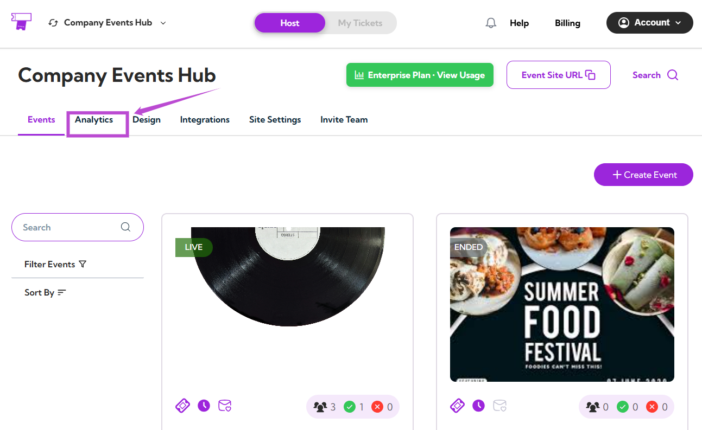
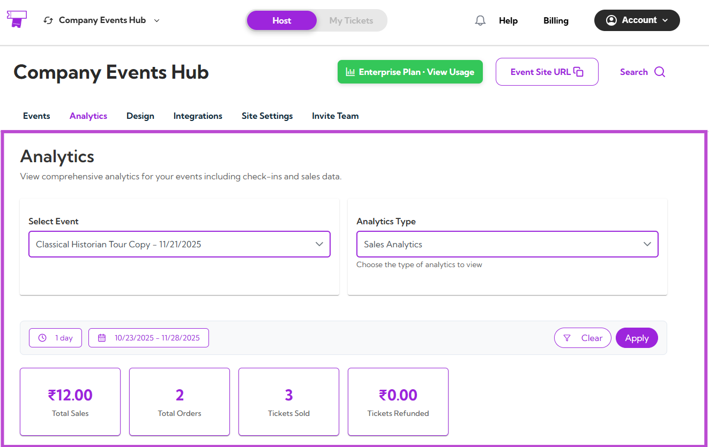
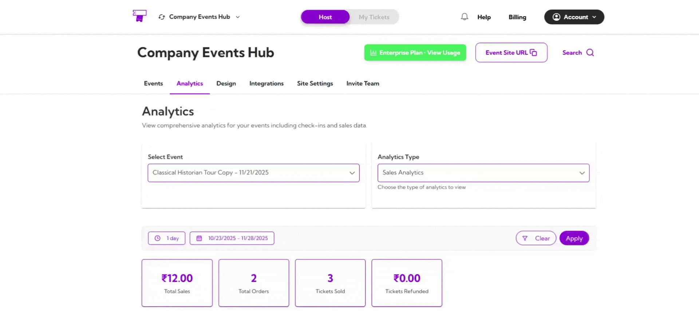
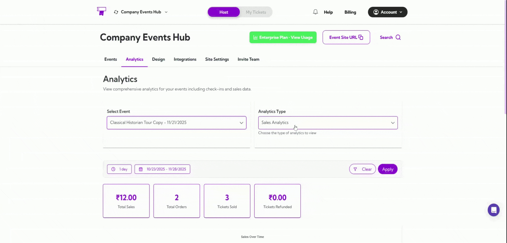
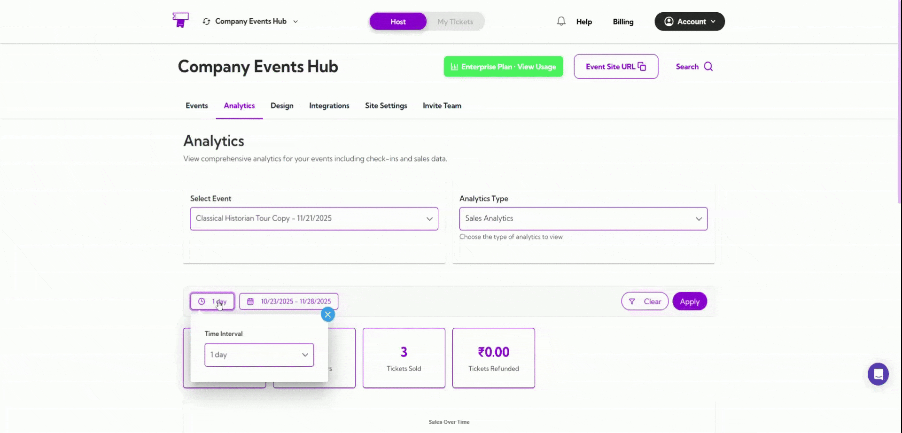
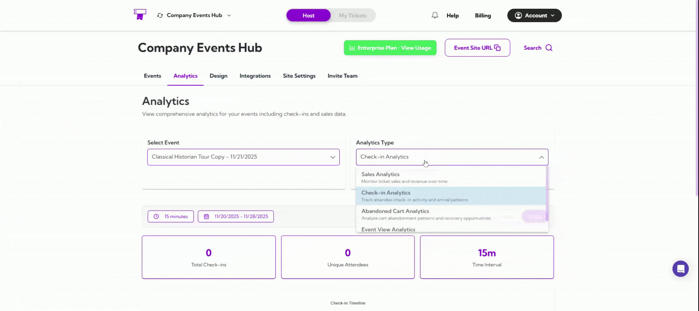

Your **Analytics Dashboard** gives you a complete, real-time view of how your event is performing. Whether you're tracking sales, monitoring check-ins, reviewing abandoned carts, or analyzing event views, this section helps you understand everything at a glance.

Let’s get started 🚀

## Navigation

**Step 1**: Log in to your **TicketSpot** account and click the **Analytics** tab from the top navigation bar.

 
**Step 2**: You’ll be taken to the **Analytics Dashboard**, where you can view all analytics.

## Analytics Dashboard

The Analytics Dashboard gives you a clear overview of your event performance. From here, you can:

- Select the event  
- Choose the analytics type  
- Apply date filters  
- View key metrics  
- Explore graphs and activity insights  

### Event Filter

Choose the event you want to analyze from the **Select Event** dropdown.

### Analytics Type

Switch between different analytics categories:

- **Sales Analytics**  
- **Check-in Analytics**  
- **Abandoned Cart Analytics**  
- **Event View Analytics**

### Date Filters

You can filter analytics using preset ranges such as **1 day**, **7 days**, or **1 year** — or choose a **custom date range**.

The dashboard updates instantly based on your selected timeframe.

## What You’ll See

Depending on the analytics type selected, the dashboard will display:

**Summary Metrics**  
Quick, high-level numbers like views, orders, tickets, conversions, or sales.

**Performance Graph**  
A visual chart showing activity trends across your chosen date range.

**Activity Table**  
A detailed table showing dates, IDs, counts, and other event-related insights.

