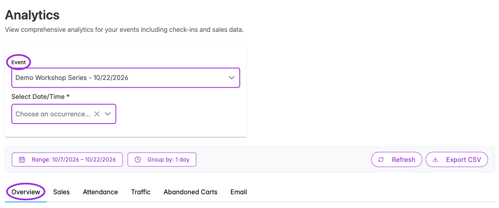
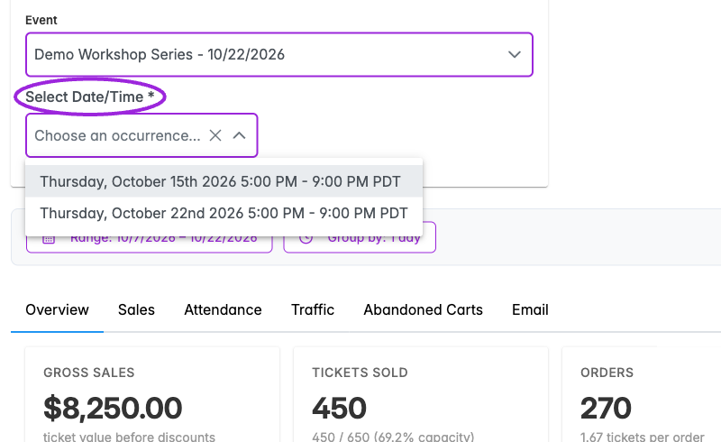
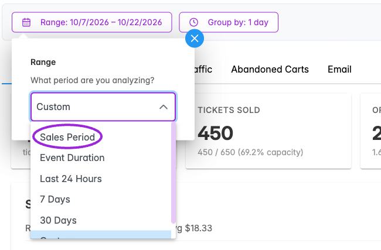
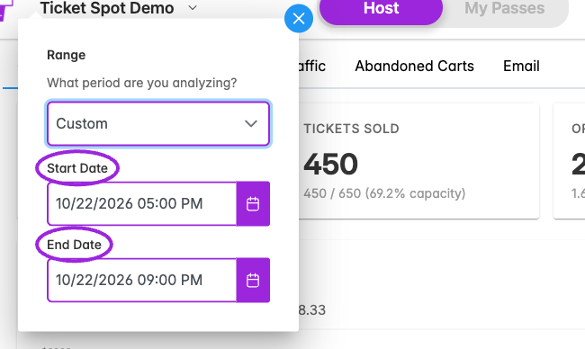
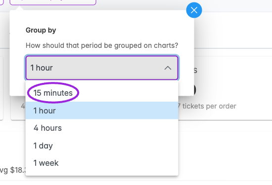
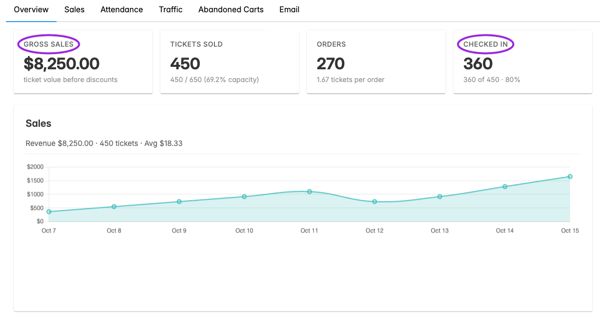
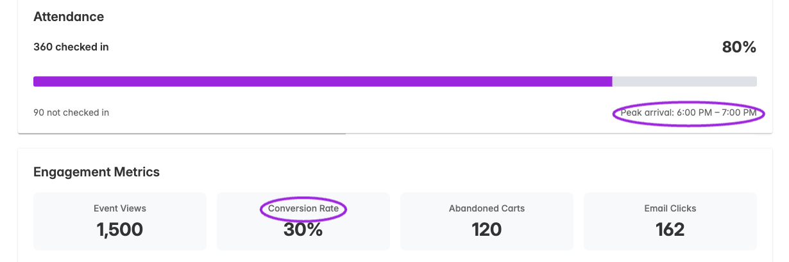

Open **Analytics** in the dashboard navigation. Analytics requires a **Business plan or higher** and access to the event. Choose an **Event**, then choose a date or time slot when analyzing an individual occurrence of a series.

<Note>The screenshots in these Analytics guides use illustrative data in the real Ticket Spot interface. The examples are not actual event results.</Note>

<Frame caption="Illustrative analytics data. Select an event and optional occurrence, then choose a report tab.">
  
</Frame>

## Choose a report

| Tab | What it shows |
| --- | --- |
| **Overview** | Headline sales, ticket and order counts, attendance, and engagement. |
| [Sales](/analytics/sales-analytics) | Revenue trends, financial breakdown, ticket-type sales, and the View Orders shortcut. |
| [Attendance](/analytics/check-in-analytics) | Unique arrivals, repeat scans, ticket-type attendance, and checked-in attendees. |
| [Traffic](/analytics/event-view-analytics) | Event-page views, conversion activity, visitor geography, and location comparisons. |
| [Abandoned Carts](/analytics/abandoned-cart-analytics) | Abandonment stages, timelines, recoverable contacts, and recovery-email preparation. |
| [Email](/analytics/email-analytics) | Delivery and engagement, message types, scheduled reminders, failures, and activity logs. |

## Event and occurrence filters

Search the event dropdown by name. Events are grouped by status. Selecting a series exposes the occurrence selector; leaving the occurrence unselected analyzes the parent/series context. Select a specific occurrence to narrow the report. Time-based events may expose separate date and time-slot choices.

<Frame caption="Illustrative analytics data. Select a date and time for an individual series occurrence.">
  
</Frame>

The selected event, occurrence, report, grouping, and explicit dates are stored in the dashboard URL. A colleague opening that link still needs access to the same site and event. Check the displayed range after changing events because the dashboard can select a new default period.

## Range and Group by

**Range** determines the period to analyze. **Group by** determines the size of chart buckets where that report supports a timeline.

| Range | Meaning |
| --- | --- |
| **Sales Period** | Sales defaults to the first recorded order through the event end. The server resolves the dates and displays them beside the range label. |
| **Event Duration** | Use the event’s start and end. Select this preset explicitly when that is the period you need. |
| **Last 24 Hours** | The previous 24 hours through now. |
| **7 Days** / **30 Days** | The previous seven or thirty days through now. |
| **Custom** | Enter separate start and end dates and times. |

When an event is first selected, ended events default to their event dates; upcoming events use creation through now, limited to the previous 30 days, or the previous 24 hours if creation time is unavailable. The initial label can still say **Event Duration**, so inspect the actual dates when the period matters. Sales can choose **Sales Period** instead. Leaving Sales after that range resolves preserves its dates as a custom range for the next report.

<Frame caption="Illustrative analytics data. The range menu offers sales-period, event-duration, recent-period, and custom choices.">
  
</Frame>

<Frame caption="Illustrative analytics data. Custom range has separate Start Date and End Date controls with time selection.">
  
</Frame>

If Custom is selected but the date fields are missing after changing reports, select another preset and then choose Custom again.

**Group by** offers **15 minutes, 1 hour, 4 hours, 1 day, and 1 week**. The dashboard can change the suggested grouping when you select a range or tab. Sales may use wider buckets for a long range. Traffic is a geographic comparison, so grouping does not create a time-series chart there.

<Frame caption="Illustrative analytics data. Choose the chart grouping interval.">
  
</Frame>

## Read Overview

The four headline cards are **Gross Sales**, **Tickets Sold**, **Orders**, and **Checked In**. Ticket capacity, tickets per order, and the unique attendance percentage appear beneath the relevant values.

<Frame caption="Illustrative analytics data. Headline metrics and the sales trend summarize the selected event.">
  
</Frame>

The **Sales** chart shows gross sales by period. Hover over a point to see its sales amount and order count. An order may contain several tickets. **Attendance** shows unique check-ins, the attendance percentage, people not checked in/no-shows, and the peak arrival window when data is available.

**Engagement Metrics** shows event views, conversion rate, abandoned carts, and email clicks. Missing activity can display a dash. Overview’s conversion uses tickets sold divided by event views; Traffic uses completed tracked sessions and its own denominator. The two percentages can differ.

<Frame caption="Illustrative analytics data. Attendance and engagement provide context beyond revenue.">
  
</Frame>

## Refresh and export

**Refresh** requests an analytics rollup rebuild; it is not a guarantee that every panel changes immediately. Allow processing time, then reopen or reselect the report if values remain unchanged.

**Export CSV** applies to the current report and its selected event/occurrence and range. Overview has no export and displays an informational message if you use the button there. Read the individual guide for table-filter and export limitations, particularly Attendance and Email.

For the attendee-management dashboard’s separate financial cards, ticket filters, seating charts, and exports, see [Managing attendees](/attendee-management/managing-attendees) and [Exports](/attendee-management/export-attendees-and-check-in-data).
