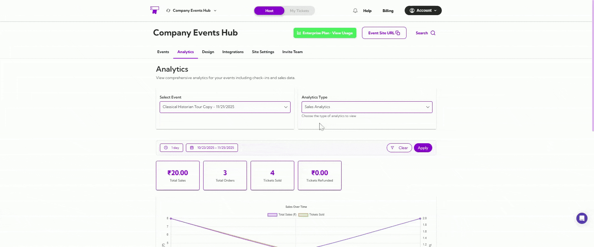
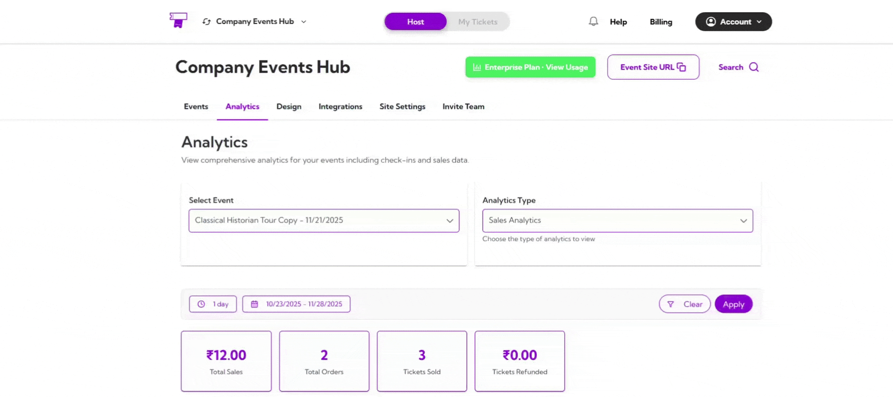
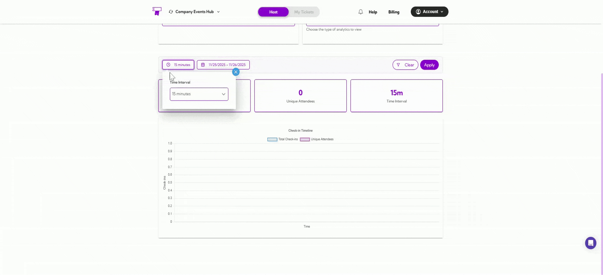
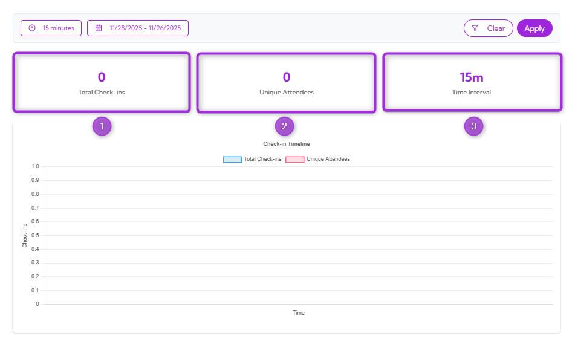
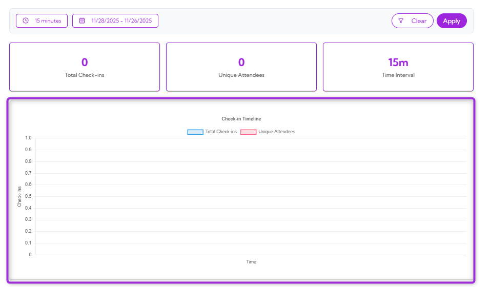

The **Check-in Analytics** dashboard gives you a clear, real-time view of how attendees are checking into your event. You can track total check-ins, unique attendees, and quickly understand check-in activity trends over time.

Let’s get started 🚀

## Navigation

**Step 1:** Log in to your **TicketSpot** account and click the **Analytics** tab from the top navigation bar.

**Step 2:** Click on the **Analytics Type drop-down** menu and select the **Check-in Analytics** type.

Your dashboard instantly updates to show all check-in-related insights.

## Select Event

Use the **Select Event** dropdown to choose the event you want to analyze.

Once selected, all charts and metrics on the page will update to reflect that specific event’s check-ins.

## Date Filters

You can filter analytics by preset date ranges like **1 day**, **7 days**, or **1 year**, or choose a **custom date** range.

After applying the filters, the dashboard updates automatically based on the selected time window.

## Summary Metrics

These metrics give you an instant snapshot of your event’s check-in activity, offering a quick overview of overall attendance.

| Ref No. | Metric Name      | Description                                           |
|--------|-------------------|-------------------------------------------------------|
| 1.     | **Total Check-ins**   | Shows the total number of check-ins recorded.         |
| 2.     | **Unique Attendees**  | Indicates how many individual attendees checked in.   |
| 3.     | **Time Interval**     | Displays the selected check-in interval (e.g., 15m).  |

## Check-in Timeline Graph

The **Check-in Timeline** graph displays how check-ins occurred over time within your selected date and interval.

The graph includes:

- A line for **Total Check-ins**  
- A line for **Unique Attendees**  

This graph helps you see when most people checked in, when it was slow, and whether check-ins were steady or suddenly increased.
