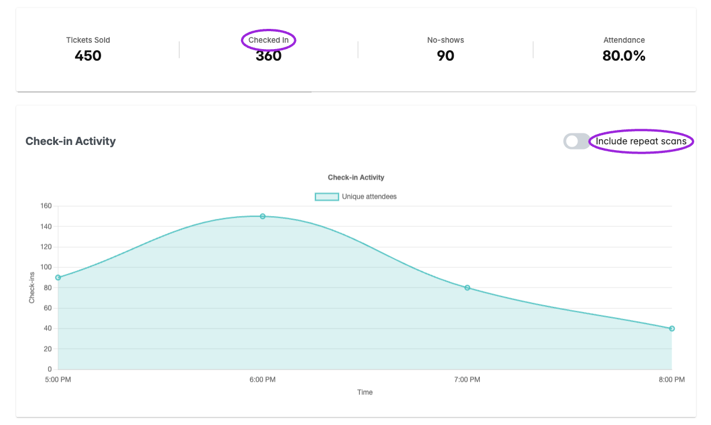
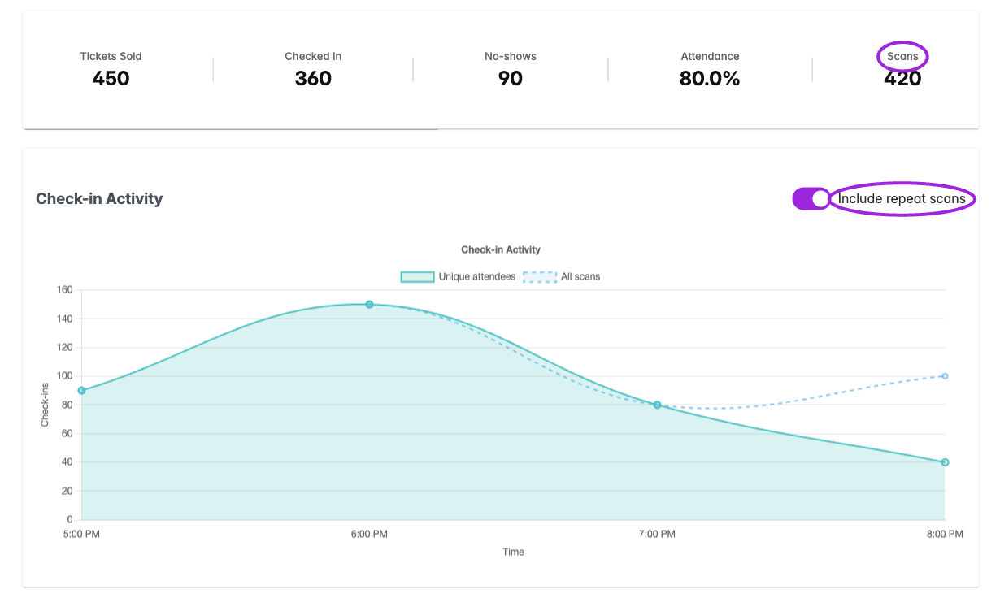
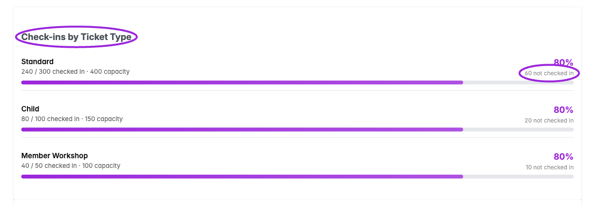
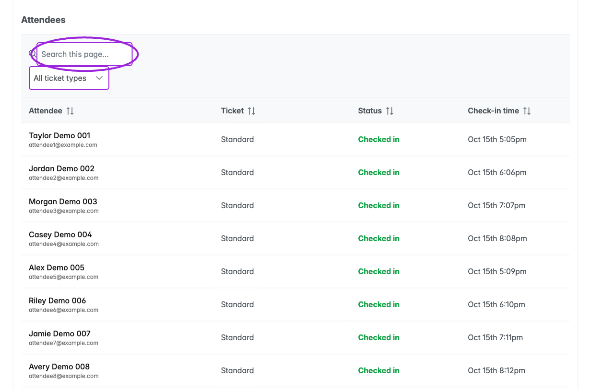
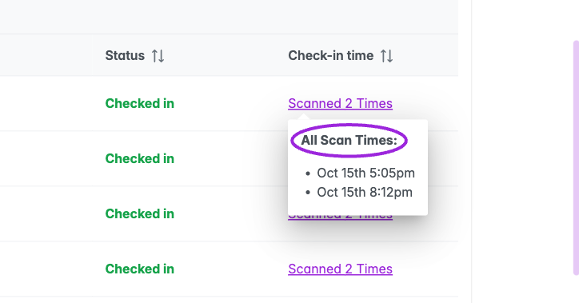

Open **Analytics**, select an event or occurrence, and choose **Attendance**. Choose a range that includes the expected arrivals. Screenshots use illustrative data.

## Attendance totals and activity

The summary shows **Tickets Sold**, **Checked In**, **No-shows**, and **Attendance**. Checked In and attendance percentage use unique attendees; scanning someone again must not count as another attendee. For an upcoming or ongoing event, people who have not checked in may still arrive later.

<Frame caption="Illustrative analytics data. Attendance totals and Check-in Activity distinguish people from scans.">
  
</Frame>

Turn on **Include repeat scans** to inspect repeat scanning. A separate **Scans** total appears, and the timeline includes the repeated activity. The sold count, unique checked-in count, no-shows, and attendance percentage remain based on unique attendance.

<Frame caption="Illustrative analytics data. Include repeat scans adds scan activity without increasing unique attendance.">
  
</Frame>

Use **Group by** to inspect the arrival pattern at an appropriate interval. Hover over the timeline for bucket values.

## Check-ins by Ticket Type

Each ticket type shows checked-in versus sold, configured capacity, percentage checked in, and the number not checked in. This helps compare arrival progress across ticket types.

<Frame caption="Illustrative analytics data. Compare attendance and remaining arrivals by ticket type.">
  
</Frame>

## Attendees table

The table contains people with check-in activity. It is not a list of everyone who bought a ticket. To find people who never checked in, use the event’s [Attendees dashboard](/attendee-management/managing-attendees).

**Search this page…** matches the loaded page’s name, email, or ticket type. **All ticket types** narrows that loaded page as well; it does not search every server page. Pagination loads another page, with **25, 50, or 100** rows per page. The columns are **Attendee**, **Ticket**, **Status**, and **Check-in time**.

<Frame caption="Illustrative analytics data. Search and ticket-type filtering apply to the loaded attendee page.">
  
</Frame>

With repeat scans enabled, choose **Scanned N Times** to open **All Scan Times** for that attendee. Otherwise the table displays the check-in timestamp.

<Frame caption="Illustrative analytics data. Open the repeat-scan count to inspect every recorded scan time.">
  
</Frame>

## Export

The top **Export CSV** currently requests unique attendance regardless of the repeat-scan toggle. It does not carry the table search or ticket-type selection.

<Warning>In the reviewed build, this Attendance export calls a summary endpoint that does not generate CSV. The downloaded file may contain JSON even though its name ends in .csv. Use the attendee dashboard’s [check-in export](/attendee-management/export-attendees-and-check-in-data) for a usable check-in file while this issue is corrected.</Warning>
