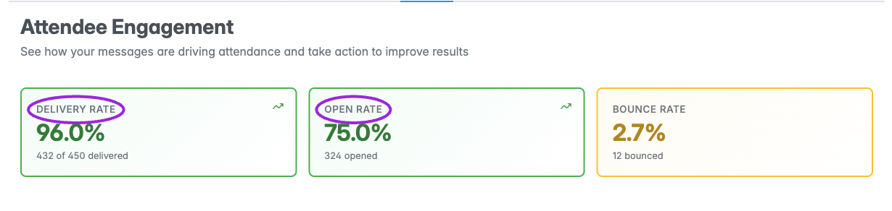
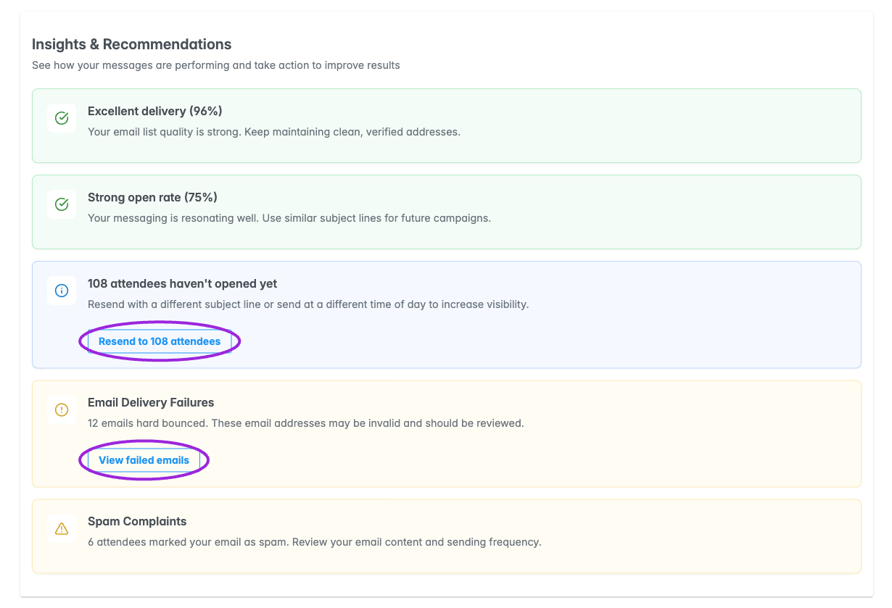
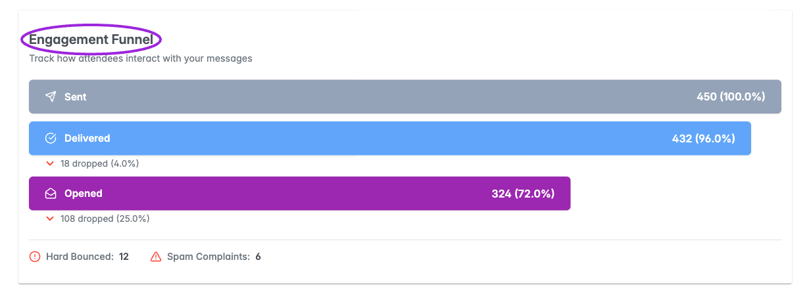
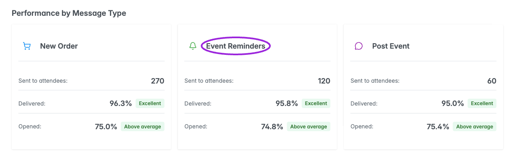
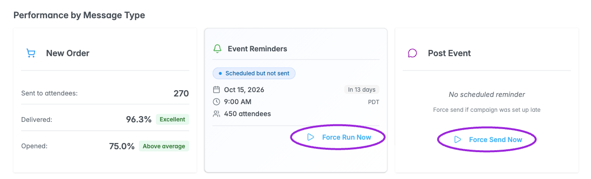
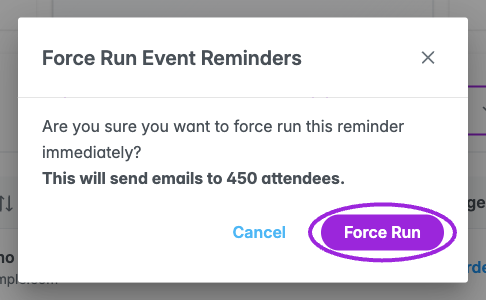
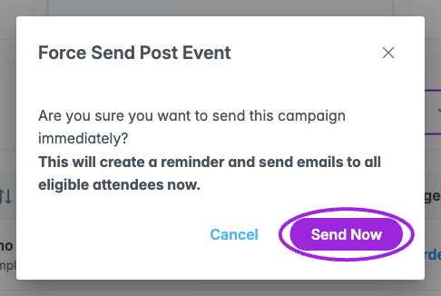
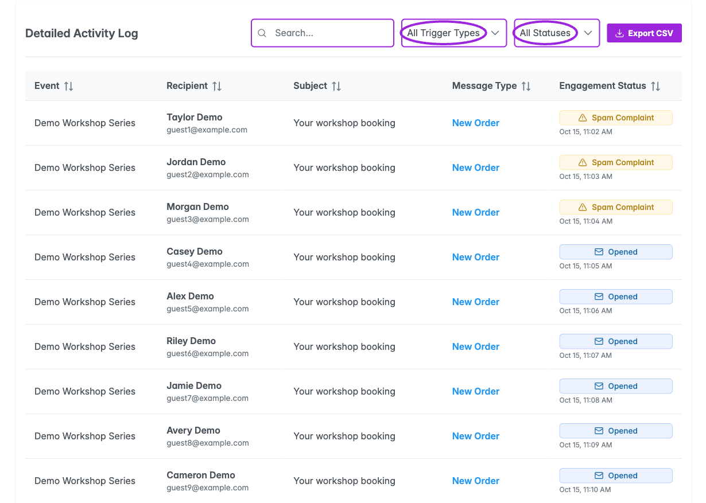
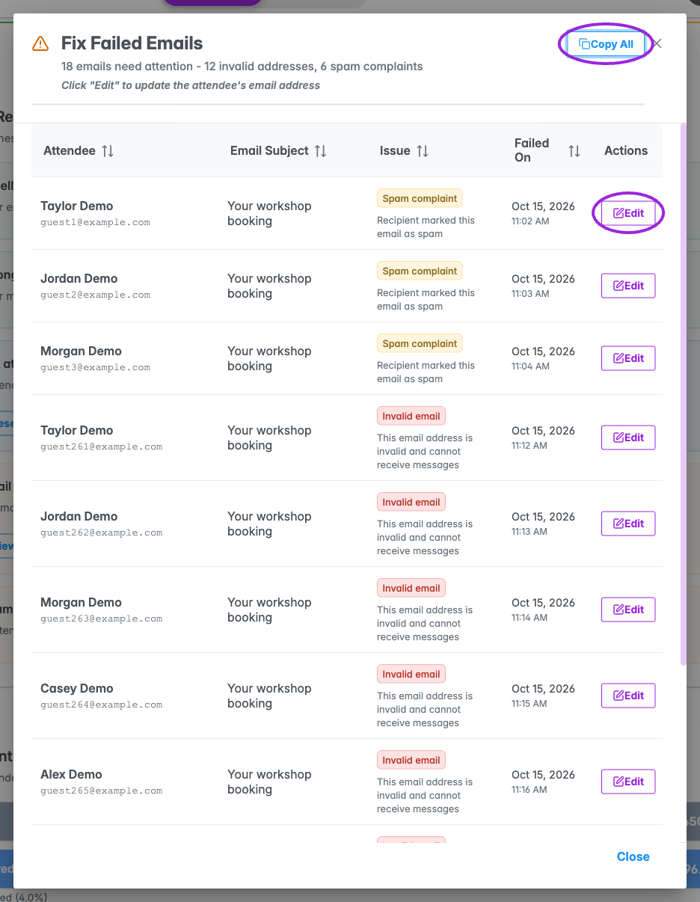

Open **Analytics**, choose an event or occurrence, and select **Email**. The report heading is **Attendee Engagement**. Set the range before comparing results. Screenshots use illustrative data; no messages were sent or reminders run for this documentation.

## Delivery and engagement

The top cards show **Delivery Rate**, **Open Rate**, and **Bounce Rate**. Delivery rate is delivered divided by sent; open rate is opened divided by delivered; bounce rate is hard bounces divided by sent. Counts represent tracked attendee engagement, and the overall totals deduplicate attendees across message types rather than simply adding every type’s count.

<Frame caption="Illustrative analytics data. Attendee Engagement shows delivery, opens, bounces, and recommendations.">
  
</Frame>

**Insights & Recommendations** can highlight delivery failures, unopened messages, strong or weak open rates, and spam complaints. **View failed emails** opens a review dialog. A **Resend** shortcut leads toward campaign management; it does not send directly from the insight card. Review the campaign and recipients before sending. If that shortcut does not open the expected page in your installation, use the event’s **Email Communication** section.

<Frame caption="Illustrative analytics data. Insights highlight unopened messages and failed delivery.">
  
</Frame>

The **Engagement Funnel** follows **Sent → Delivered → Opened** and shows drop-offs. Funnel percentages are relative to sent, so its Opened percentage can differ from the Open Rate card, which uses delivered as its denominator.

<Frame caption="Illustrative analytics data. The engagement funnel shows delivery and open drop-offs.">
  
</Frame>

## Performance by Message Type

The three message-type cards are **New Order**, **Event Reminders**, and **Post Event**. Each can show sent/delivered/opened statistics or a scheduled-reminder state. A pending or scheduled reminder takes precedence over earlier statistics for that type.

<Frame caption="Illustrative analytics data. Compare new-order, event-reminder, and post-event message performance.">
  
</Frame>

A scheduled card shows its date, time, timezone, estimated attendee count, and state, including overdue or completed/sent information when applicable.

<Frame caption="Illustrative analytics data. Scheduled reminders show their timing, timezone, and attendee count.">
  
</Frame>

**Force Run Now** opens a confirmation for an existing scheduled reminder. Confirming runs that reminder immediately. **Force Send Now**, shown where there is no scheduled reminder/activity for the reminder or post-event type, opens a separate confirmation that creates a reminder and sends the campaign to eligible attendees. These actions send real email when confirmed; they are not preview controls.

<Frame caption="Illustrative analytics data. Review the Force Run confirmation before running a scheduled reminder.">
  
</Frame>

<Frame caption="Illustrative analytics data. Force Send confirms immediate delivery to eligible attendees.">
  
</Frame>

## Detailed Activity Log

Search by attendee name, email, subject, or event title. Filter **All Trigger Types** to New Order, Event Reminder, or Post Event, and filter **All Statuses** to Sent, Delivered, Opened, Hard Bounce, or Spam Complaint. The filters narrow the returned activity records; they do not recalculate the summary cards.

Columns show **Event**, **Recipient**, **Subject**, **Message Type**, and **Engagement Status**, including the latest status timestamp. Sort the columns and use the twenty-row pagination. The visible status menu does not contain a separate Clicked option.

<Frame caption="Illustrative analytics data. Search, filter, sort, and export the detailed email activity log.">
  
</Frame>

## Review failed emails

Choose **View failed emails** or the failed-delivery insight action. **Fix Failed Emails** lists hard bounces and spam complaints with the latest recorded date/time. Use **Copy All** or the per-row copy control to copy addresses. **Edit** opens the attendee record where you can correct an address when appropriate; it does not resend the failed email.

<Frame caption="Illustrative analytics data. Review failed addresses and spam complaints before changing attendee records or messaging again.">
  
</Frame>

## Export and empty states

The activity table’s **Export CSV** sends the selected **message type** and the report’s range. It does **not** apply the table’s search or status filter. The top **Export CSV** exports the event/range without the table’s message-type selection. Neither export is limited to the visible twenty-row page.

The CSV includes event, recipient, subject, campaign/message type, latest status and time, plus available sent, delivered, opened, clicked, bounced, and spam-complaint timestamps. A report without activity can return an empty result. If messages are scheduled but not sent, scheduled cards can still appear while engagement is empty.

For delivery setup and translated subject/content defaults, see [Email Communication](/event-management/email-communication) and [Multilingual communications](/branding-and-design/multilingual-communications).
