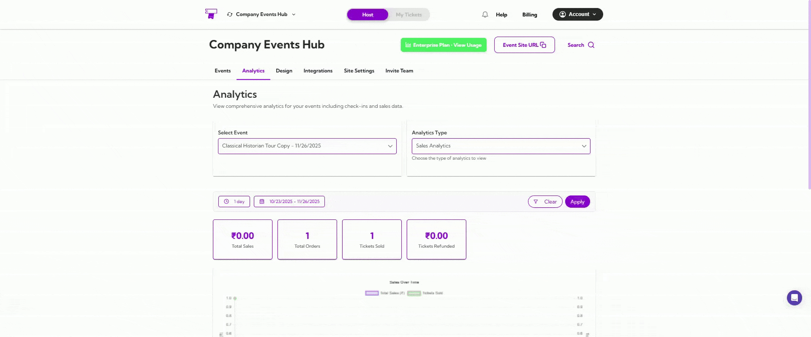
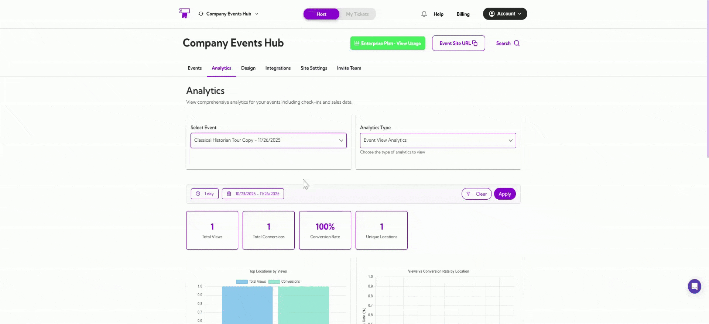
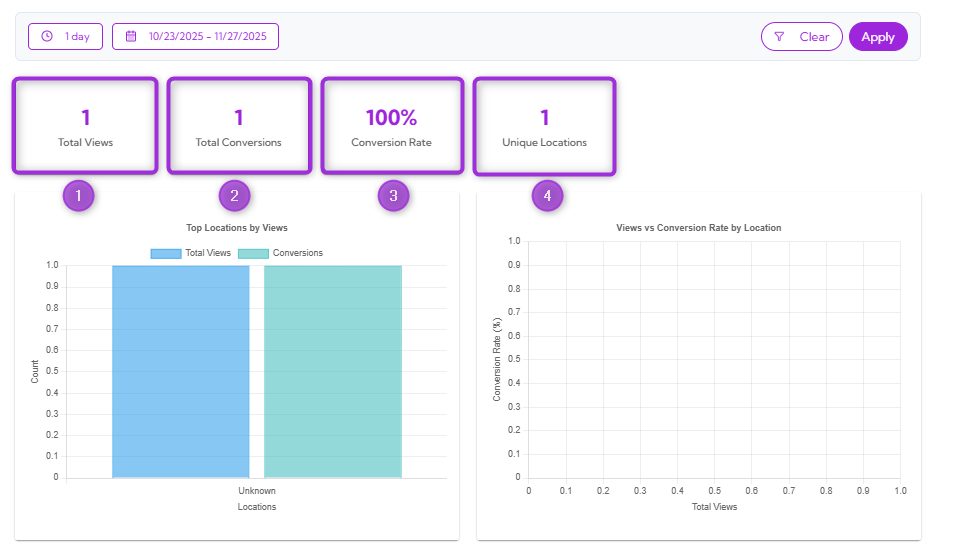
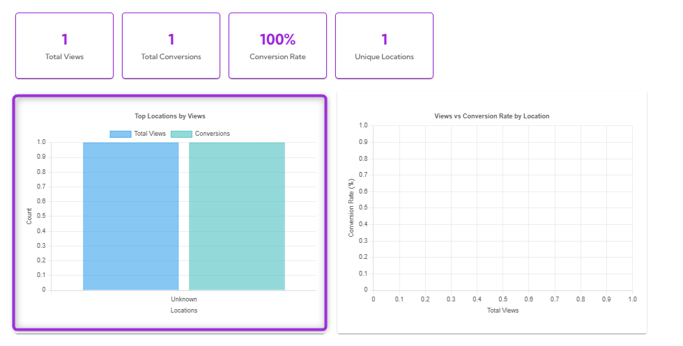
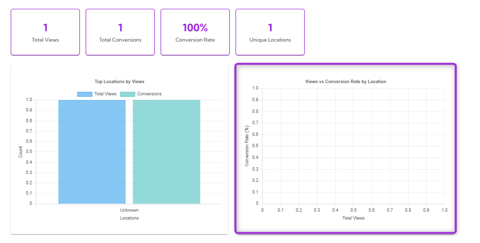
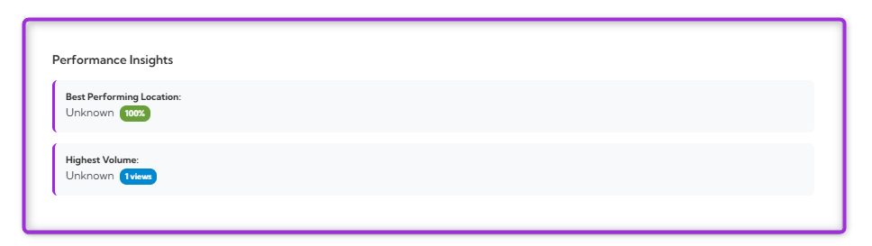
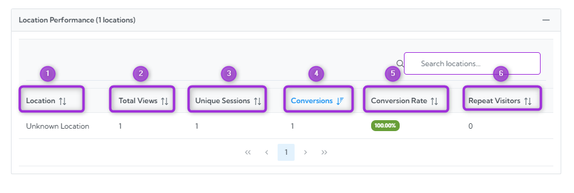

The **Event View Analytics** dashboard helps you understand how people are viewing your event page. You can track total views, conversions, and visitor locations and see how different locations perform over time.

Let’s get started 🚀

## Navigation

**Step 1:** Log in to your **Ticket Spot** account and click the **Analytics** tab from the top navigation bar.

**Step 2:** Click on the **Analytics Type drop-down** menu and select **Event View Analytics**.

Your dashboard will instantly update to show all event view–related insights.

## Select Event

Use the **Select Event** dropdown to choose the event you want to analyze.

Once selected, all metrics, graphs, and tables will update based on that event’s view activity.

## Date Filters

You can filter your analytics by preset ranges like **1 day**, **7 days**, or **1 year**, or choose a **custom date range** using the calendar.

The dashboard updates automatically based on your chosen timeframe.

## Summary Metrics

Get a quick snapshot of your event's view performance.

| Ref No. | Metric Name        | Description                                              |
|--------|---------------------|----------------------------------------------------------|
| 1.     | **Total Views**         | Shows how many times your event page was viewed.        |
| 2.     | **Total Conversions**   | Displays the number of viewers who converted (e.g., purchased or registered). |
| 3.     | **Conversion Rate**     | Shows the percentage of viewers who converted.          |
| 4.     | **Unique Locations**    | Indicates how many unique viewer locations were detected. |

## Location Insights Graphs

This section helps you understand how different locations interact with your event page. You can see which regions bring the most views and how those views convert into actions.

### Top Locations by Views

This bar chart shows which locations generate the most views and conversions for your event. The **blue bars** represent total views, while the **green bars** show conversions.  

This helps you quickly spot where your audience is coming from and which regions are performing best.

### Views vs Conversion Rate by Location
This chart shows how viewer volume compares to conversion performance across different locations.

It helps you identify:

- Locations with high views  
- Locations with strong conversion rates  
- Regions that may need more promotion  

## Performance Insights
The Performance Insights section highlights:

- **Best Performing Location** — the location with the highest conversion rate.  
- **Highest Volume** — the location with the most total views.  

These insights help you instantly understand your top-performing audience segments.

## Location Performance Table

Explore detailed performance data for every viewer location.

| Ref No. | Field             | Description                                     |
|--------|-------------------|-------------------------------------------------|
| 1.     | **Location**          | The viewer’s detected location.                 |
| 2.     | **Total Views**       | Total number of views from that location.       |
| 3.     | **Unique Sessions**   | Indicates unique view sessions.                 |
| 4.     | **Conversions**       | Total conversions from that location.           |
| 5.     | **Conversion Rate (%)** | Percentage of viewers who converted.         |
| 6.     | **Repeat Visitors**   | Number of repeat visitors.                      |

That’s all for Event View Analytics — use these insights to understand your audience better and improve your event’s performance.
