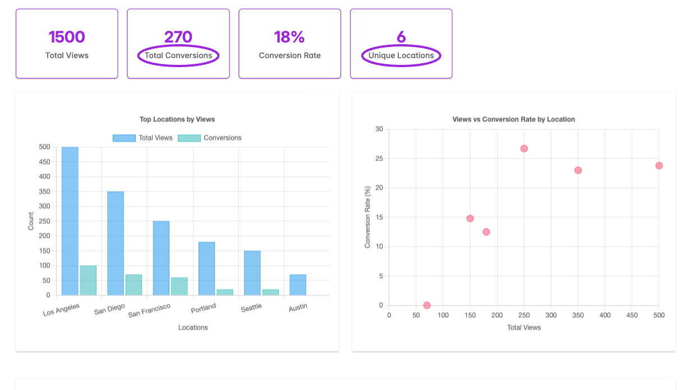
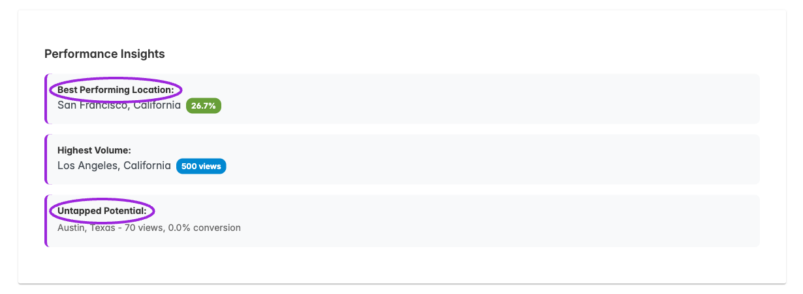
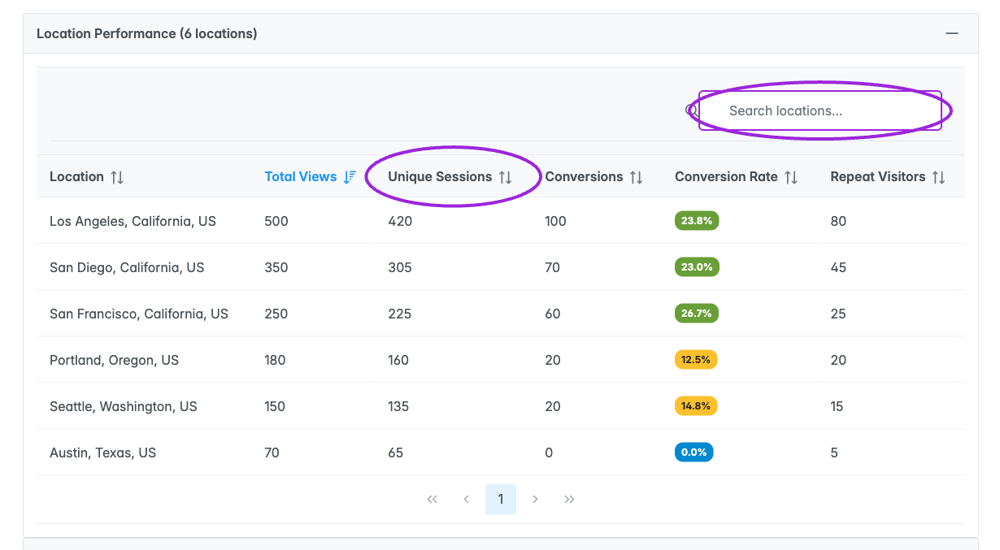
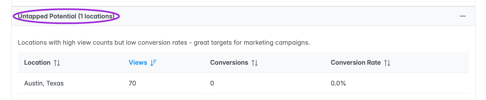

Open **Analytics**, select an event or occurrence, and choose **Traffic**. Use **Range** to set the analysis period. The screenshots use illustrative data.

## Metrics and charts

| Metric | Meaning |
| --- | --- |
| **Total Views** | Recorded event-view activity in the selected period. Repeat views can increase this number. |
| **Total Conversions** | Distinct tracked sessions with a successful payment/registration completion. |
| **Conversion Rate** | Converting sessions divided by total event views. |
| **Unique Locations** | Distinct visitor locations in the report. |

<Frame caption="Illustrative analytics data. Traffic compares views, conversions, conversion rate, and visitor locations.">
  
</Frame>

The charts compare views and conversions for leading locations, and conversion rates by location. Hover to inspect a value; use a chart legend to show or hide its series where available. These are geographic comparisons rather than a chronological traffic timeline.

## Performance Insights

**Best Performing Location** highlights a location with strong conversion, **Highest Volume** identifies the most views, and **Untapped Potential** points to locations with meaningful traffic but conversion below the overall comparison rate. Use these as prompts for investigation rather than proof of what caused a sale.

<Frame caption="Illustrative analytics data. Performance Insights highlights location comparisons.">
  
</Frame>

## Location Performance

Expand or collapse the panel. **Search locations…** searches the returned location data. Sort the columns and use the table’s pagination to compare:

- **Location:** visitor city, region, and country, or **Unknown Location** when unavailable.
- **Total Views:** all recorded views attributed to the location.
- **Unique Sessions:** distinct tracked browser sessions there.
- **Conversions:** sessions with a successful tracked completion.
- **Conversion Rate:** conversions divided by **unique sessions** for that location.
- **Repeat Visitors:** sessions that recorded more than one view in that location.

<Frame caption="Illustrative analytics data. Search and sort the location table, including unique sessions and repeat visitors.">
  
</Frame>

Location conversion percentages use a different denominator from the overall Traffic percentage. Overview’s conversion also uses a different measure—tickets sold divided by views—so the three comparisons need not match. Session counts do not establish the number of distinct people, and these locations are visitor geography, not seating sections or check-in entrances.

When present, the **Untapped Potential** table lists the lower-converting locations with their views, conversions, and conversion rate. It can be expanded, collapsed, sorted, and paged separately.

<Frame caption="Illustrative analytics data. Expand Untapped Potential to inspect lower-converting locations.">
  
</Frame>

## Export

Use the top **Export CSV** for location, city, region, country, views, unique sessions, conversions, conversion rate, and repeat-visitor fields in the chosen event/range. Table search and sorting do not narrow that export. A report with no activity can produce an empty result in the current build.
