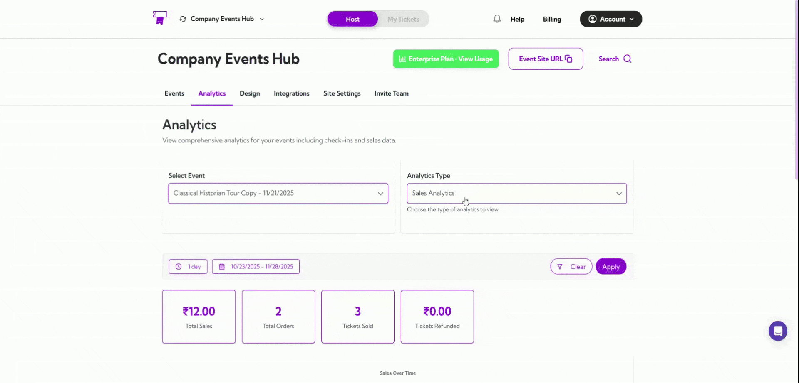
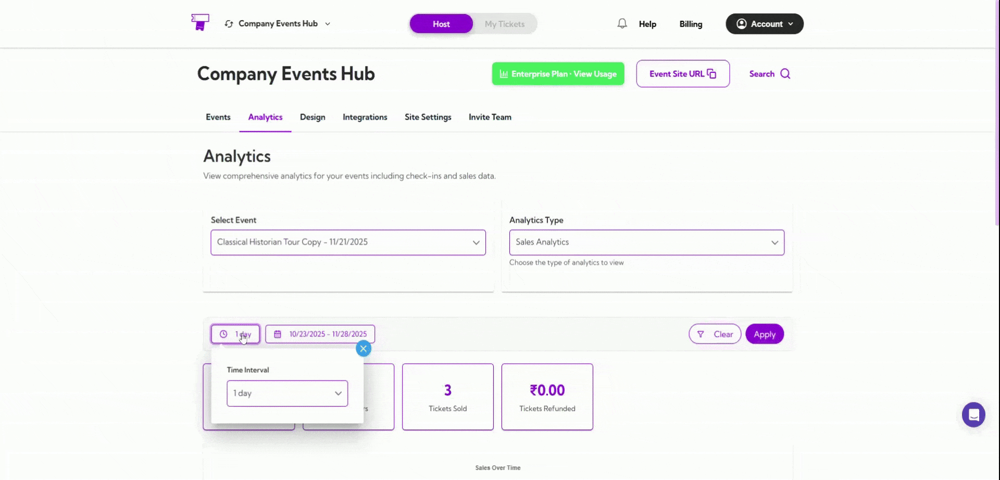
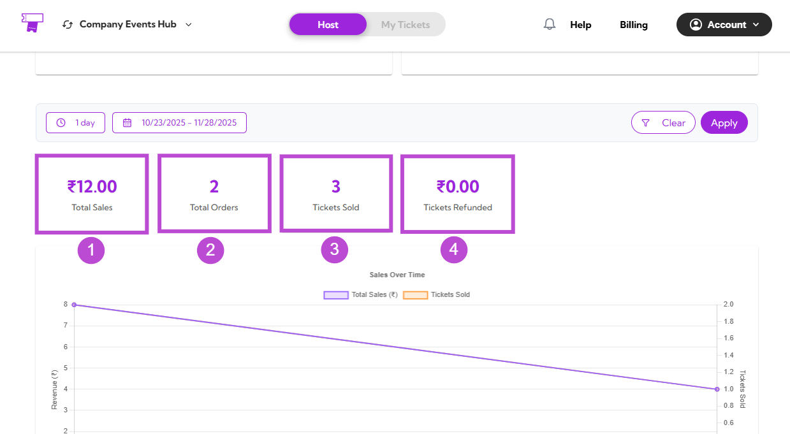
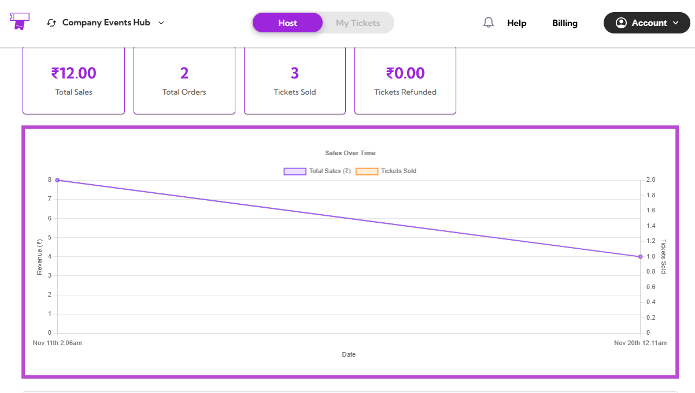
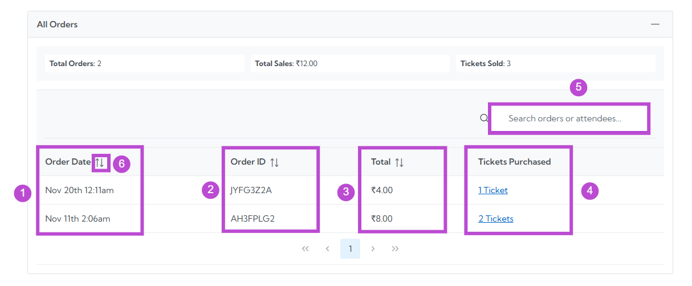

The **Sales Analytics** dashboard helps you understand how your event is performing in terms of revenue, orders, and ticket sales. This page provides clear insights through metrics, graphs, and detailed order data.

Let’s get started 🚀

## Navigation

**Step 1:** Log in to your **TicketSpot** account and click the **Analytics** tab from the top navigation bar.

**Step 2:** Click on the **Analytics Type drop-down** menu and select the **Sales Analytics** type.

Your dashboard will instantly update to show all sales-related insights.

## Select Event

Use the Select Event dropdown to choose the event you want to analyze.

Once selected, all the metrics, graphs, and tables on the page will reflect the sales activity for that specific event.

## Date Filters

You can filter analytics by preset date ranges like **1 day**, **7 days**, or **1 year**, or choose a **custom date** range.

The dashboard updates instantly based on your selected timeframe.

## Summary Metrics

Get a quick snapshot of the most important sales highlights for your event.

| Ref No. | Metric Name        | Description                            |
|--------|---------------------|----------------------------------------|
| 1.     | **₹ Total Sales**      | Shows the total revenue generated.     |
| 2.     | **Total Orders**        | Displays the total number of orders placed. |
| 3.     | **Tickets Sold**        | Indicates how many tickets were purchased. |
| 4.     | **₹ Tickets Refunded**  | Shows the total amount refunded (if any). |

## Sales Trend Graph

The **Sales Trend Graph** shows how your sales have progressed over the selected date range.

This visual includes:

- A line representing **Total Sales (₹)**
- A line representing **Tickets Sold**

The graph helps you understand revenue flow, peak sales periods, and overall activity patterns over time.

## All Orders

Explore detailed information for each order placed within the selected date range.

| Ref No. | Field / Feature     | Description                                      |
|--------|----------------------|--------------------------------------------------|
| 1.      | **Order Date**           | Shows the date on which the order was created.   |
| 2.      | **Order ID**             | Displays the unique identifier assigned to each order. |
| 3.      | **Total (₹)**            | Indicates the total amount paid for the order.   |
| 4.      | **Tickets Purchased**    | Shows the number of tickets purchased, displayed as a clickable link. |
| 5.      | **Search**               | Allows you to search for specific orders or attendee details. |
| 6.      | **Sorting**              | Lets you reorder the table by clicking the sort icons on the column headers. |

