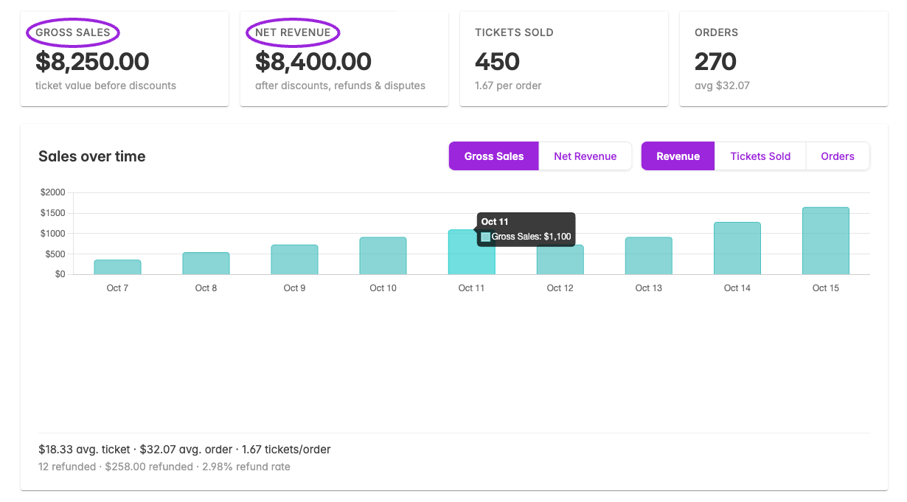
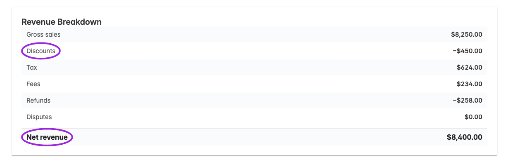
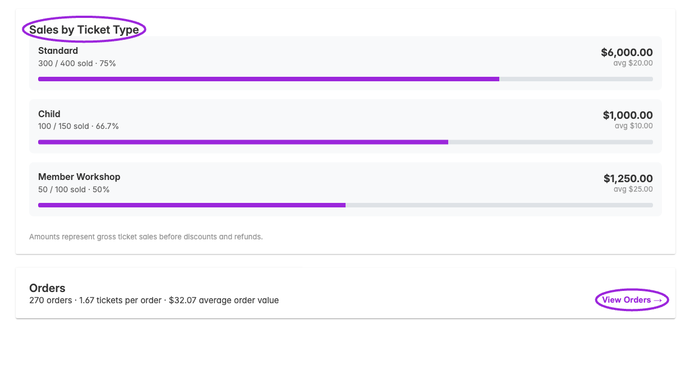

Ticket sales analytics shows how many tickets and orders an event has sold and how gross sales become net revenue. Open **Analytics**, select the event or occurrence, and choose **Sales**. See [shared filters](/analytics/analytics-overview#range-and-group-by) for range and grouping controls. Screenshots use illustrative data.

## Headline metrics

| Card | Meaning |
| --- | --- |
| **Gross Sales** | Ticket value before discounts. |
| **Net Revenue** | Total charged after discounts, including tax and fees, less refunds and disputes. This is not a bank payout or profit figure. |
| **Tickets Sold** | Sold ticket count, with tickets per order beneath it. |
| **Orders** | Order count, with average order value beneath it. |

**Sales Period** normally covers the first order through the event end. Use **Custom** to compare a specific campaign or sales period. The resolved dates appear beside the range button.

<Frame caption="Illustrative analytics data. The Sales tab shows gross sales, net revenue, tickets, orders, and a selectable trend.">
  
</Frame>

## Sales over time

Use **Revenue**, **Tickets Sold**, or **Orders** to choose the chart measure. Within Revenue, switch between **Gross Sales** and **Net Revenue**. Hover over a bar or point for the bucket’s value. The chart automatically uses bars for shorter series and a line when there are more than 14 buckets.

The line below the chart shows average ticket value, average order value, and tickets per order. When refunds exist, another line shows refunded tickets, refunded money, and refund rate. **Refund rate is the refunded amount as a share of money charged**, not the percentage of tickets refunded.

## Revenue Breakdown

The breakdown explains the difference between the headline monetary figures:

**Gross sales − discounts + tax + fees − refunds − disputes = net revenue.**

<Frame caption="Illustrative analytics data. Revenue Breakdown lists discounts, tax, fees, refunds, and disputes.">
  
</Frame>

## Sales by Ticket Type

Each ticket type shows its sold count, capacity where configured, percentage sold, ticket amount, and average ticket price. Unlimited/unconfigured capacity has no meaningful percentage bar. A type above its configured capacity is labeled **Over capacity**.

When more than eight types are available, use **Show all** and **Show top 8**. The report may limit the breakdown to the 50 best-selling types and says so when truncated. A preparation message means the ticket breakdown is still being built; it does not make the other panels unavailable.

Ticket-type amounts come from ticket records, while the headline financial amounts come from orders. Cart-level adjustments can prevent the per-type amounts from adding up to the financial cards.

<Frame caption="Illustrative analytics data. Ticket-type sales are followed by an Orders summary and the View Orders shortcut.">
  
</Frame>

## View orders and export

**View Orders →** opens this event’s **Attendees** page. Open an attendee/order there to inspect its tickets, payment details, seating, or permitted actions. Sales Analytics no longer contains the older expandable order table.

The top **Export CSV** downloads sales rows for the selected event/occurrence and range. With Sales Period, it uses the resolved start and end dates. Rows include order/date/status, attendee and ticket details, prices, discounts, tax, fees, seat label, scan count, promo code, and order financial totals. An order with multiple attendees produces multiple rows: do not sum repeated order-level totals as if each row were a separate order.
