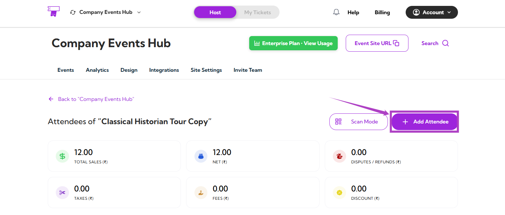
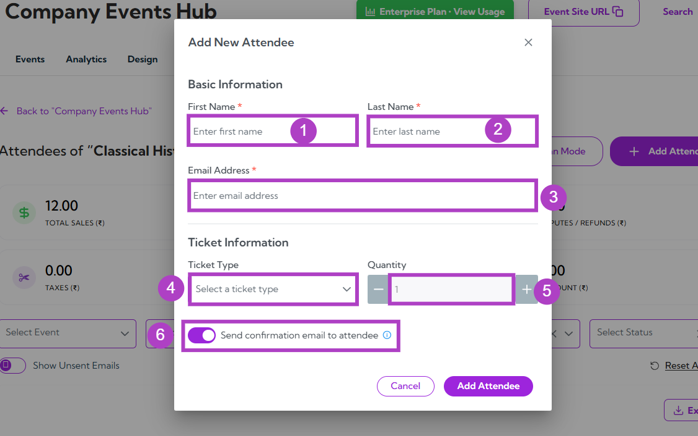
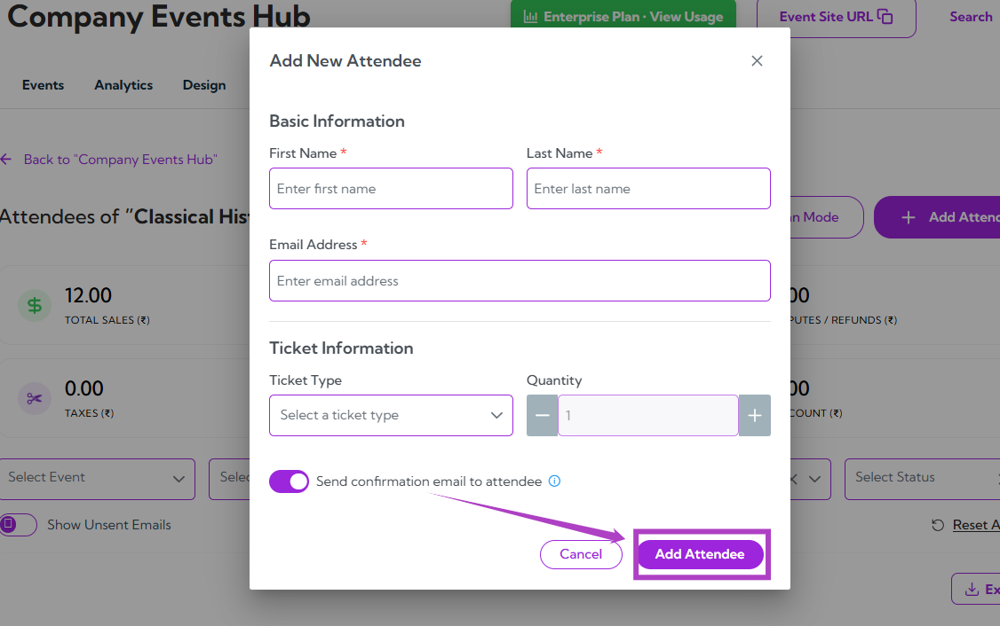

You can **manually add attendees** to any event in **Ticket Spot** whenever you need to register someone yourself—whether they signed up offline, were added by your team, or require a custom ticket entry. This guide walks you through each step of the process so you can quickly enter attendee details and keep your event list up to date.

Let’s get started 🚀

**Step 1**: Log in to your Ticket Spot account, then click the Attendee icon next to the event where you want to add attendees.

**Step 2**: Click **Manage Attendees** to open the attendee dashboard for that event.

**Step 3**: After clicking on the **Manage Attendees** button, you will be taken to the Attendees page for that event. Here, click the **Add Attendee** button on the top-right to manually add a new attendee.

**Step 4**: A modal window titled **“Add New Attendee”** will appear. Fill in the following details:

| Ref. | Field | Description |
|-----|--------|-------------|
| 1. | **First Name** | Enter the attendee’s first name. This field is required. |
| 2. | **Last Name** | Enter the attendee’s last name. This field is required. |
| 3. | **Email Address** | Enter a valid email address for the attendee. Required for sending tickets. |
| 4. | **Ticket Type** | Select the ticket type from the dropdown. |
| 5. | **Quantity** | Choose how many tickets to assign (default is 1). |
| 6. | **Send confirmation email to attendee** | Toggle ON/OFF to automatically send a confirmation email. |

**Step 5**: Once you fill in all the required details, click on the **Add Attendee** button to save the information and add the attendee to the event.

