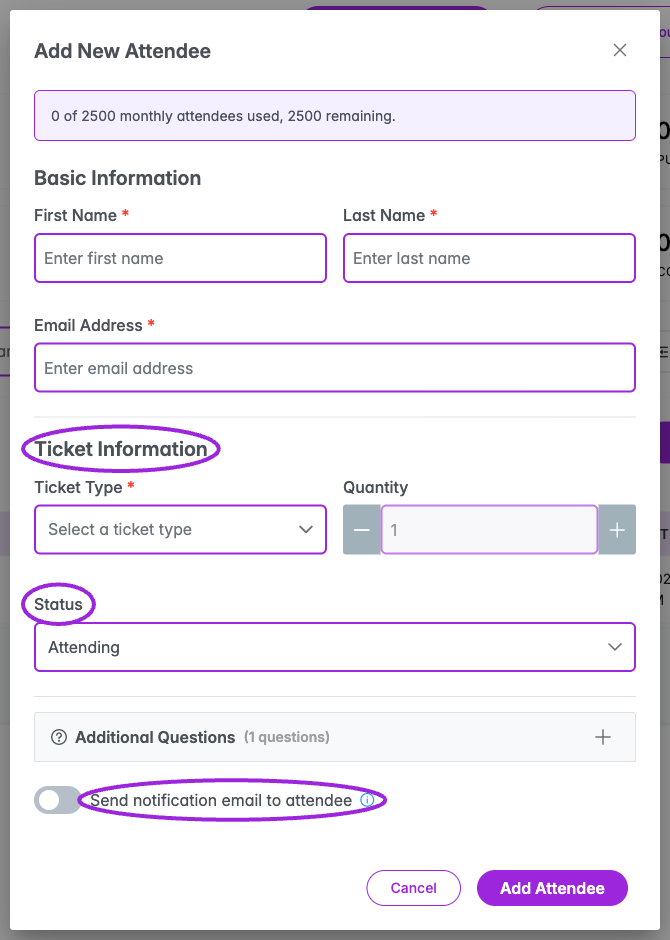
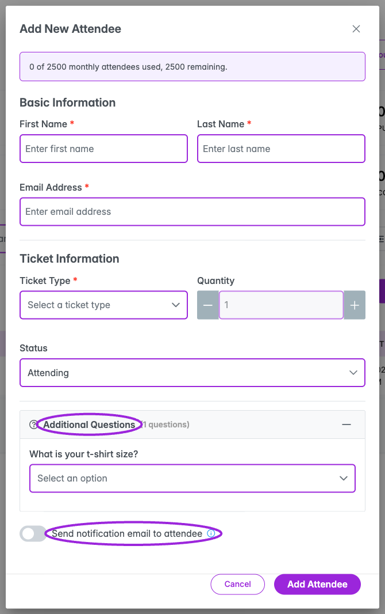

Open the event's **Attendees** page and choose **Add Attendee**. The **Add New Attendee** dialog creates a registration using the details you provide.

<Frame caption="Manual registration includes ticket quantity, status, and an optional notification. The notification is off in this unsaved example.">
  
</Frame>

1. For a series, choose the **Event Occurrence**. Select the date and, for a time-based event, the time slot. The form requires a specific occurrence; the series itself is not a bookable date.
2. Enter the required **First Name**, **Last Name**, and valid **Email Address**.
3. Choose **Ticket Type**, then set **Quantity**. Tickets load for the selected occurrence. Quantity becomes available after choosing a ticket.
4. Set **Status**: **Attending**, **Checked In**, **Not Attending**, **Pending**, or **Waitlist**. The default is **Attending**.
5. Expand **Additional Questions** and complete any required registration questions.
6. Choose whether to enable **Send notification email to attendee**. It is on by default and sends the email appropriate to the selected status, such as a waitlist confirmation or pending-approval email.
7. Choose **Add Attendee**, wait for the success message, and check the resulting attendee records. **Cancel** closes the form without adding anyone.

<Frame caption="Expand Additional Questions to enter the event's registration answers.">
  
</Frame>

## Quantity and allowance

The dialog shows the site's monthly attendee usage and remaining allowance. The quantity limit takes that allowance into account, with an upper limit of 365 ticket units per submission. A group ticket can create several attendees per unit, so its allowed quantity may be lower. Review the **attendees per ticket** message when it appears.

If the quantity is above the available allowance, reduce it or review the site's [billing and plan allowance](../account/billing-and-plans). A group ticket whose composition exceeds the remaining allowance cannot be added through the form.

## Seating and payment

For a reserved-seating event, use the [attendee seating view](../seating-charts/seat-selection#assign-seats-to-existing-attendees) to review and assign actual seats after checking the new registrations.

This form does not ask for a card payment. Adding a paid ticket manually is not proof that money has been collected. Review the associated order and payment record as part of your offline-registration process.

For later changes, see [Managing Attendees](./managing-attendees) and [Viewing Attendee Details](./viewing-attendee-details).
