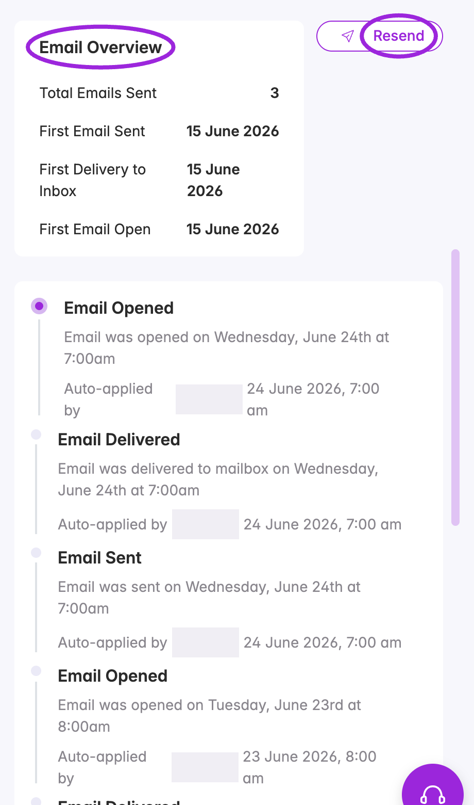
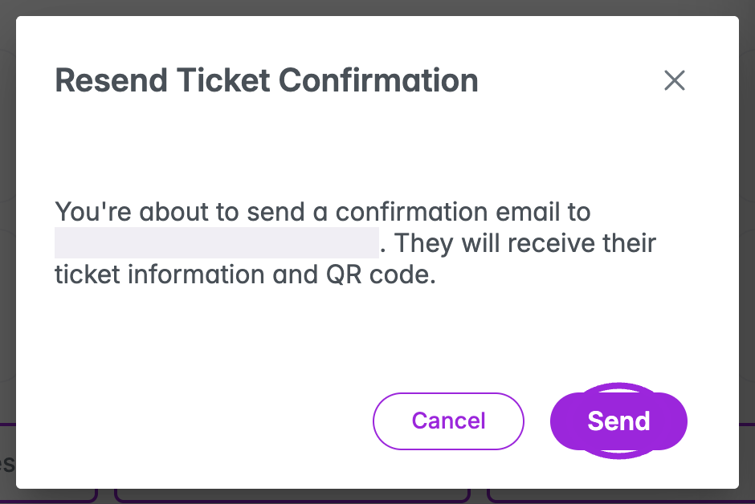
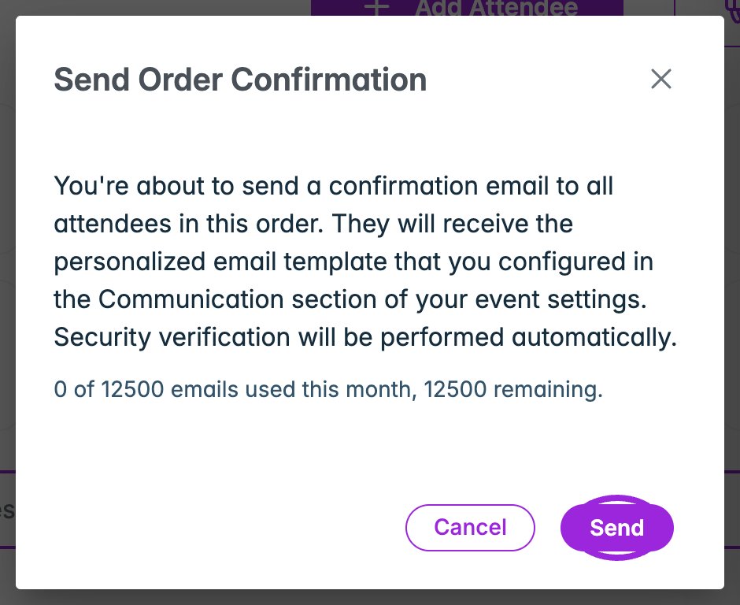
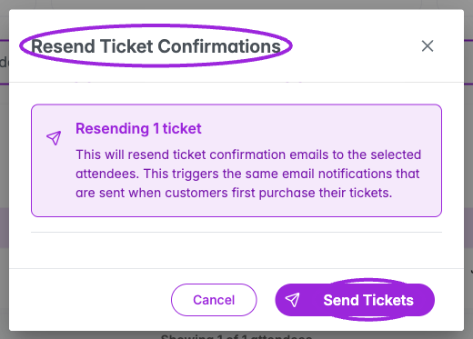
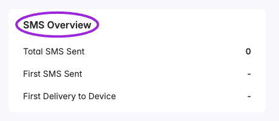

Open an event's **Attendees** page and check **Ticket Sent** in the attendee list. Click an email or SMS indicator to open that attendee's corresponding delivery tab. You can also select **View Attendee**, then **Email** or **SMS**.

## Read the list's delivery indicators

| Indicator | Meaning |
| --- | --- |
| **Sent** | A send was recorded; a delivery confirmation has not been recorded in this indicator. |
| **Delivered** | A delivery was recorded. Open the relevant tab for the timeline. |
| **Failed** | A delivery failure was recorded. Hover for an available failure reason, then inspect the history. |
| **Not sent** | No email/SMS status is available for the row. Check the individual tabs for context. |
| **No number** | There is no attendee phone number for SMS. |
| **Opted out** | The attendee opted out of SMS. Respect this choice when planning messages. |

Use **More filters → Email not sent / SMS not sent** to find registrations needing review. Delivery indicators summarize the recorded state; they are not an audit of every message.

## Email overview and activity

The **Email** tab shows **Total Emails Sent**, **First Email Sent**, **First Delivery to Inbox**, and **First Email Open**. A dash means that date has not been recorded.

<Frame caption="Review recorded email delivery events before resending a confirmation. Personal information is concealed.">
  
</Frame>

Scroll through the timeline to read individual activity titles, descriptions, timestamps, and the responsible account or system. A delivered email does not establish that the attendee read it; an absent open date does not establish that they never opened it.

### Resend from the attendee's Email tab

1. Check the attendee's email under **Contact Information** and correct it if needed.
2. Open **Email → Resend**.
3. In **Resend Ticket Confirmation**, review the displayed recipient and ticket/QR-code message.
4. Choose **Send** to submit, or **Cancel** to leave without sending. Wait for security verification if the button says **Loading…**.
5. Review the send result and return to the delivery history to check subsequent delivery events.

<Frame caption="Review the recipient before sending another ticket confirmation. This dialog was captured without sending a message.">
  
</Frame>

The confirmation is associated with the linked order. Review the order's attendees and communication settings when several tickets share a booking; do not assume selecting one record creates a custom message addressed only to that person.

### Email tickets for an order

Open **View Order → Email Tickets**. **Send Order Confirmation** explicitly applies to **all attendees in that order** and uses the personalized template configured in the event's Communication settings. Review the order's attendee cards first, then choose **Send**, or **Cancel** to close without sending.

<Frame caption="Email Tickets resends the configured order confirmation to the order's attendees. No email was sent for this capture.">
  
</Frame>

The action can be disabled when the email allowance is exhausted. See [Billing and Plans](../account/billing-and-plans) and [Email Communication](../event-management/email-communication) for allowances and template setup.

### Send tickets from the bulk toolbar

Select attendee checkboxes, choose **Send Tickets**, and review **Resend Ticket Confirmations** and its count before submitting **Send Tickets**. The header checkbox only selects currently loaded rows; changing filters clears the selection.

<Frame caption="Review the selected count before resending ticket confirmations.">
  
</Frame>

Sending is grouped by booking and triggers the original order-confirmation communication. Review shared orders before using this action for a subset of their attendees. Check the result notification and individual delivery histories after sending; an accepted send and a delivered message are separate events.

## SMS overview and activity

The **SMS** tab shows **Total SMS Sent**, **First SMS Sent**, and **First Delivery to Device**. **First Failure** appears when a failure is recorded. The timeline contains recorded SMS activities and timestamps.

<Frame caption="The SMS tab reports recorded sends and delivery. A zero count or dash indicates no recorded activity for this Demo attendee.">
  
</Frame>

This is a read-only delivery view; it has no SMS resend button. For missing texts, check the attendee's phone, any **Opted out** or **Failed** indicator, the failure reason when available, and the event's [SMS Communication](../event-management/sms-communication) configuration and allowance.

## Send a separate announcement

Use **Send Announcement → Create Announcement** on the Attendee Dashboard for a new message. Choose the event/occurrence, **Email**, **SMS**, or **Email + SMS**, and the recipient-status groups. Write the channel-specific content, review available credits, and choose any ticket actions or PDF attachments for the email. Review the recipients before the final **Send Announcement**. Follow the [announcement instructions and screenshots](../event-management/email-communication#send-message) for the complete form.

## Troubleshoot a missing ticket confirmation

1. Find the attendee and check their email/phone and booked event.
2. Inspect the correct channel's timeline and any failure reason. A dash means no date is recorded, not proof of a successful or failed delivery.
3. Check the event's communication configuration, account allowance, and recipient's spam folder or SMS opt-out state as appropriate.
4. Correct contact information if necessary. Then use the relevant confirmation action and review its recipient scope.
5. Recheck the timeline after sending. Contact support with the order reference and recorded failure if the issue persists.

Use [Activity Log](./viewing-attendee-details#activity-log) for attendee edits and status changes; email/SMS delivery history is separate and cannot be edited.
