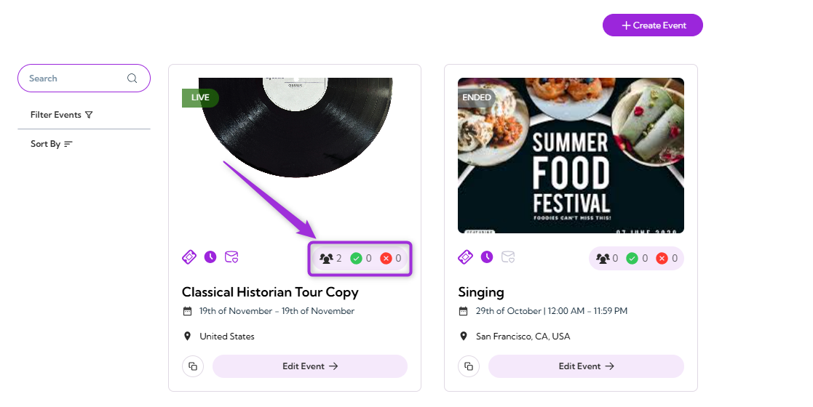
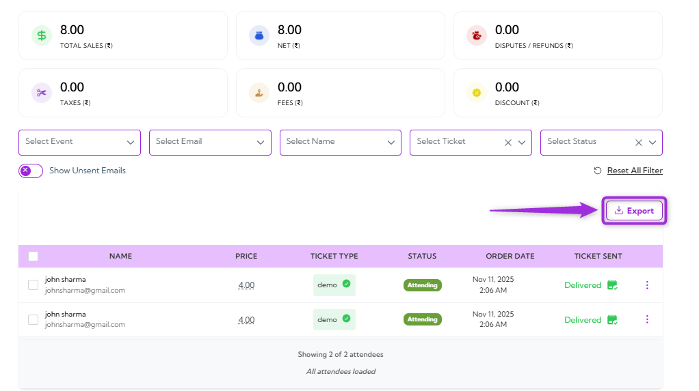
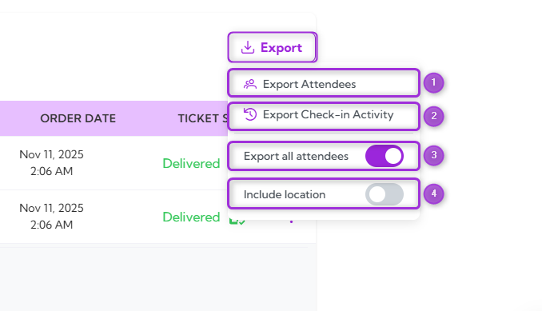

When you **export attendee** data, you get a complete record of registrations, attendance, and event activity. This gives you clear visibility into who joined and how they interacted and helps with verification, reporting, order checking, and maintaining accurate event documentation.

Once generated, the export downloads automatically. You can review it, store it, or import it into your CRM or analytics tools to support post-event follow-ups and streamline your internal workflows.

Let’s get started 🚀

**Step 1**: Log in to your Ticket Spot account, then click the Attendee icon next to the event you want to export attendee data for.

**Step 2**: Click on **Manage Attendees** to open the attendee dashboard for that event.

The detailed **Attendees Dashboard** will appear, showing the full list of attendees for the selected event.

**Step 3**: Click the **Export** button at the bottom right of the Attendees Dashboard.

**Step 4**: A dropdown menu will appear, showing the following export types and fields (as listed in the table below):

| Ref. | Field | Description | Example (When Toggle Is ON) |
|------|--------|-------------|------------------------------|
| 1. | **Export Attendees Data** | Downloads attendee information for the selected event. | Generates a file with all attendee details currently visible in the dashboard. |
| 2. | **Export Check-In Activity** | Downloads detailed check-in activity records. | Includes each check-in action with timestamps and operator details. |
| 3. | **Export All Attendees** | Toggles between exporting only filtered attendees or exporting everyone. | When ON, all attendees are exported, even if filters are applied (e.g., “VIP only”). |
| 4. | **Include Location** | Adds location-related details to the exported file (if multiple check-in points exist). | When ON, the export includes the check-in station or entry point used by each attendee. |

**Export Attendees Data**: Downloads the full attendee list for the event, including registration details, ticket type, and attendance status.

**Export Check-In Activity**: Downloads detailed check-in records, including timestamps, check-in method, operator, and location (if enabled).

>**Note:** A **CSV** file is automatically downloaded and saved to the device’s default download location.
