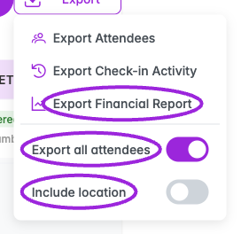
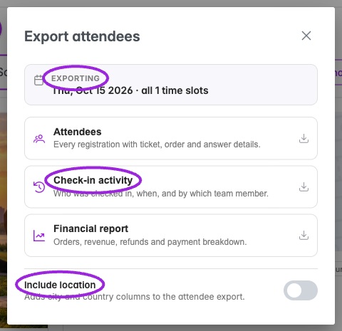

Open your event's **Attendees** page and choose **Export** above the attendee table. The menu offers three CSV reports.

<Frame caption="Choose an attendee, check-in, or financial CSV. The two switches apply to Export Attendees.">
  
</Frame>

| Report | What it contains | Scope |
| --- | --- | --- |
| **Export Attendees** | Registration and contact details, ticket and attendance status, question answers, seat label, ticket amounts, and scan information. Membership and add-on fields are included where applicable. | Selected rows, all attendees, or active filters, as explained below. |
| **Export Check-in Activity** | Attendee and ticket details, the recorded check-in timestamp, and the account that performed the action when available. | The event currently open. Row selection and attendee filters do not narrow this report. |
| **Export Financial Report** | Order-level totals, discounts, fees, taxes, refunds, disputes, net totals, currency, and available payment-reference information. | The event or series currently open. Row selection and attendee filters do not narrow this report. |

## Export from an event card

On **Events**, open the card's **More actions → Export attendees**. The dialog offers **Attendees**, **Check-in activity**, and **Financial report**, with **Include location** for the attendee CSV.

<Frame caption="Read Exporting before choosing a report. A series card starts with its next upcoming date.">
  
</Frame>

For a series, the card automatically chooses its next upcoming occurrence. If none is available or the lookup fails, it falls back to the series. It does not reuse attendee-page filters or row selections. To choose another date, open that occurrence's attendee page and export there. For check-in or financial details from a timed-entry slot, open the particular slot; the date-level card caption does not guarantee that these reports combine every time slot.

## Export selected, filtered, or all attendees

The attendee export follows this order:

1. **Selected rows:** tick the checkboxes beside the people you need. **Export Attendees** exports those selections, even if **Export all attendees** is on.
2. **Everyone:** clear the row selection and leave **Export all attendees** on. Active filters do not limit the export.
3. **Filtered results:** clear the row selection, apply your filters, and switch **Export all attendees** off. Then choose **Export Attendees**. The export uses the current filters, including status, ticket, payment, and question-answer filters.

<Note>
**Export all attendees** is on when you first open the page. Turn it off if you intend to export filtered results. Selecting the header checkbox selects the attendees loaded in the table; use the export switch to export everyone without loading every row.
</Note>

For the available filters, see [Managing Attendees](./managing-attendees#search-and-filter-attendees).

## Include location

Turn on **Include location** to add the visitor's **city, region, and country** to the attendee CSV when that information is available from their tracked visit. These fields may be blank. This switch does not add check-in stations or entry gates and does not change the check-in or financial report.

## Dates, seats, and scans

The attendee CSV includes separate event start and end dates, times, and the event timezone. It also includes a **seat label**, scan code, scan count, and first/last scan timestamps when recorded. Question answers and available add-on information appear as additional columns.

For an event series, the attendee and financial exports can include its occurrences. The check-in activity export currently uses the event that is open; open the particular occurrence's attendee page when you need its check-in history.

## Download and reconcile

Choose the report and wait for the download. The filename includes the event title, report type, and export time. Your browser saves it according to your download settings.

Use the attendee CSV for a registration list and the financial CSV for order reconciliation. An order can contain several attendees, so the reports have different row counts and measures. **Net total** in the financial CSV is the order's gross total less recorded refunds and disputes; it is not a payment-provider payout statement.

An event with no recorded check-ins has no check-in activity rows. Available fields also depend on your team role and the information recorded for the booking.
