**Managing attendees** helps event teams keep accurate and up-to-date records by updating each person's status as they arrive, cancel, or make changes to their participation. The system allows actions such as marking attendees as present, setting them as not attending, or resetting their status when needed. Each update is recorded with a timestamp, creating a clear history of attendance activity for tracking and reporting.

Let’s get started 🚀

**Step 1**: Log in to your **Ticket Spot** account, then click the **Attendee icon** next to the event where check-ins need to be managed.

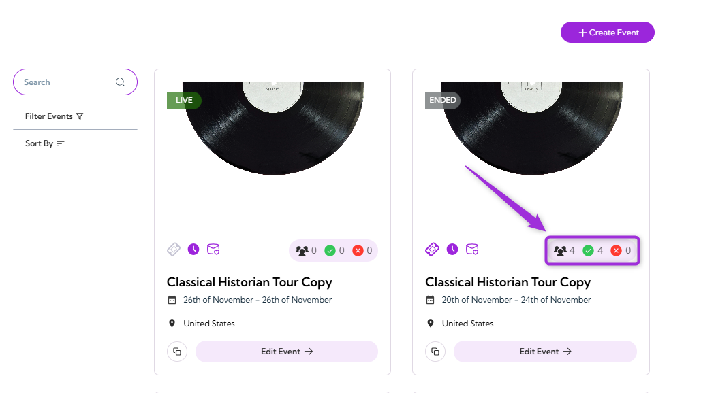

**Step 2**:Click on **Attendee Management** to open the attendee dashboard for that event.

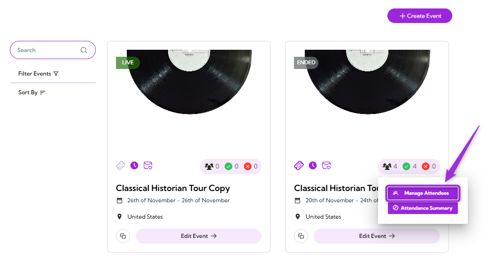

The detailed Attendees Dashboard will appear, showing the full list of attendees for the selected event.

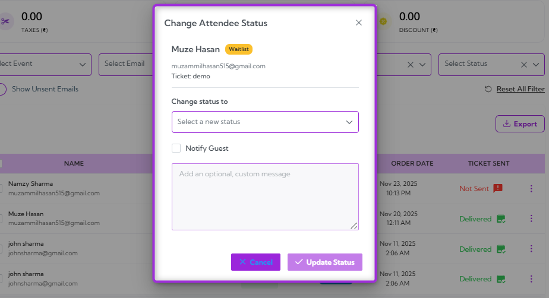

# Managing Attendee Status

Managing attendee status helps keep event attendance accurate by updating whether each attendee is checked in, not checked in, or not attending.  

1. Click on the **Status** (e.g., Checked-in, waiting) next to the attendee whose status you want to update.

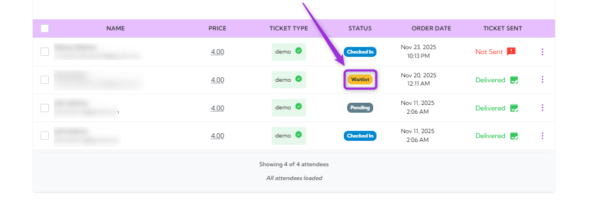

2. A modal window will appear, showing the attendee’s current status and options to select a new status.

3. Select the **Change status to** dropdown and select the new status you want to assign to the attendee (e.g., Attending, Checked In, Not Attending, or Pending).

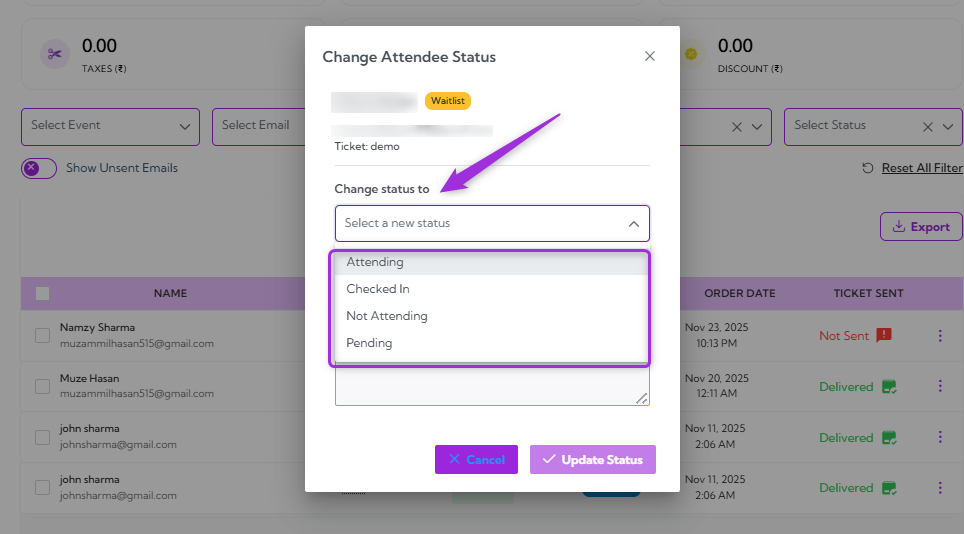

4. You can also enable **Notify Guest** and enter a custom message to inform the attendee about the status update.

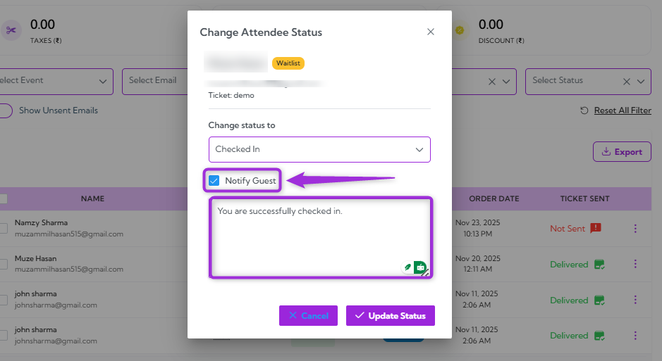

5. Click on the **Update Status** button to apply the change.

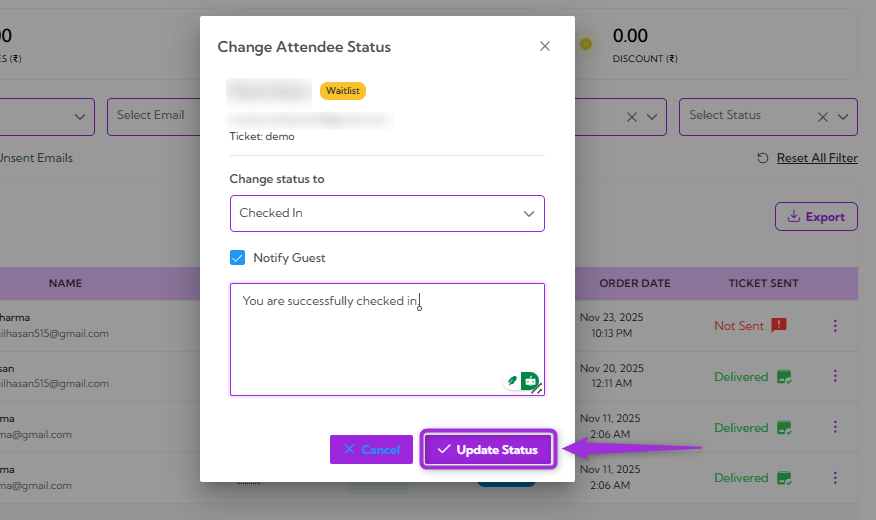

The attendee’s status will refresh immediately in the attendee list (e.g., Waiting to Checked-In).

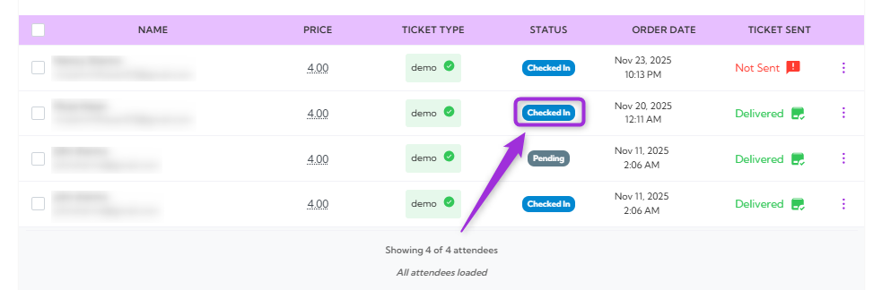

# Using Bulk Actions

Bulk Actions make it easy to update multiple attendees at once. In addition to changing statuses, this feature also allows sending tickets to selected attendees, saving time when managing large groups.

1. Select the attendees using the **checkbox** beside their names. Multiple attendees can be selected at once to update their status in bulk.

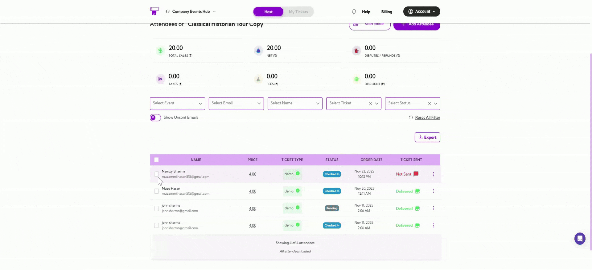
 
2. Choose the bulk action you want to perform. You can update **statuses**, **send tickets**, or **delete** multiple attendees at once.

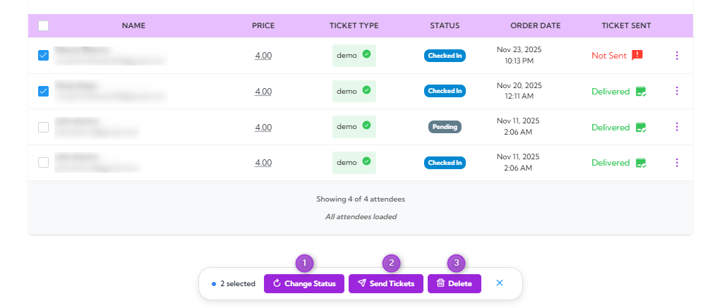

### Change Status for Multiple Attendees

Use this option to apply a new status—such as Checked In, Not Attending, or Reset Status—to all selected attendees at once. Helpful for managing groups or making quick updates.

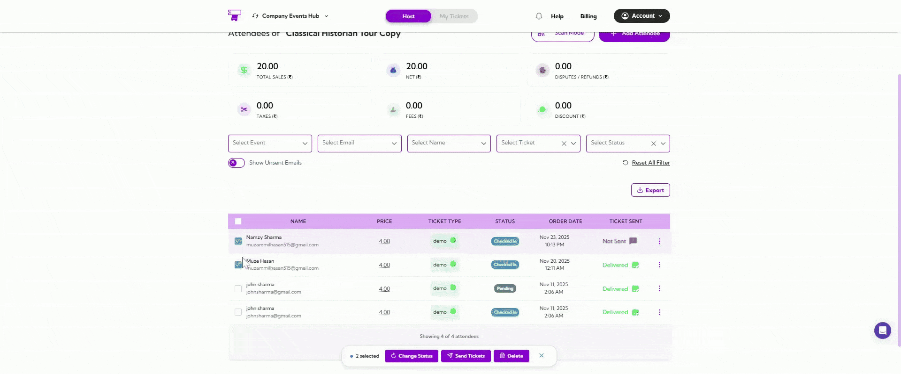

### Send Tickets to Multiple Attendees

Use this option to resend tickets to all selected attendees. Useful when attendees didn’t receive their ticket email or need it resent before the event.

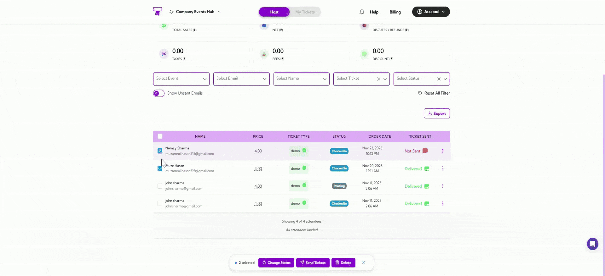

### Delete Multiple Attendees

Use this option to remove selected attendees from the event. This is typically used to clean up duplicate entries or remove cancelled registrations.

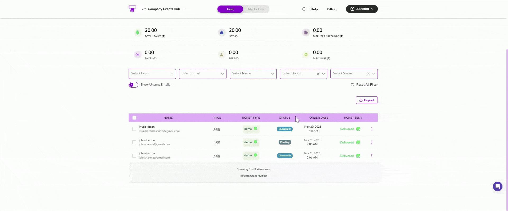

## Attendee Quick Actions

Each attendee row includes a quick-action menu that provides fast access to commonly used functions. These actions help event teams quickly view attendee details, manage orders, print tickets, or remove an attendee when needed.

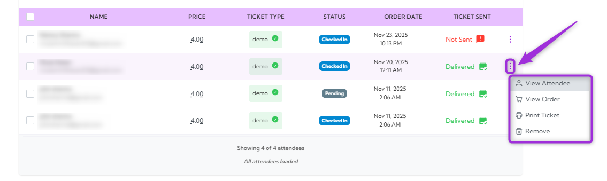

### View Attendee

Opens the attendee’s full information panel, showing contact details, ticket type, check-in status, registration questions, internal notes, and email delivery history. This view provides a complete profile of the attendee and allows you to review or update their information as needed.

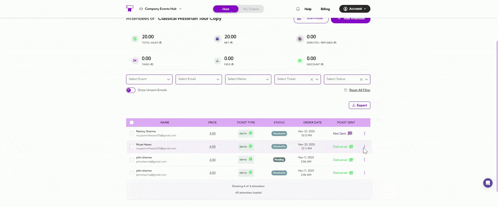

For a detailed breakdown, visit the → **[Viewing Attendee Details](../attendee-management/viewing-attendee-details)**.

### View Order

Opens the Order Information panel, showing key details like order ID, purchase date, and sales summary.  

You can also take actions such as **View Event**, **Email Tickets**, **Cancel & Refund**, and **Transfer to Another Event**, and manage attendees with options like **Change Ticket Type**.

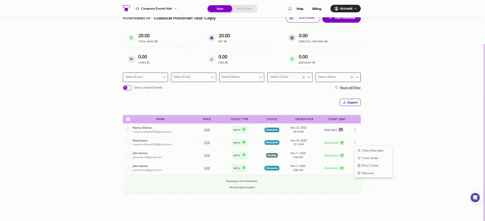

For a detailed breakdown, visit the → **[Attendee Portal](../attendee-portal/)**.

### Print Ticket

Generates a printable version of the attendee’s ticket. Useful for on-site printing or when an attendee needs a physical ticket.

- **A4 Full Page** – Generates a standard full-page printable ticket.  
- **Badge** – Opens the badge designer to create a custom attendance badge.

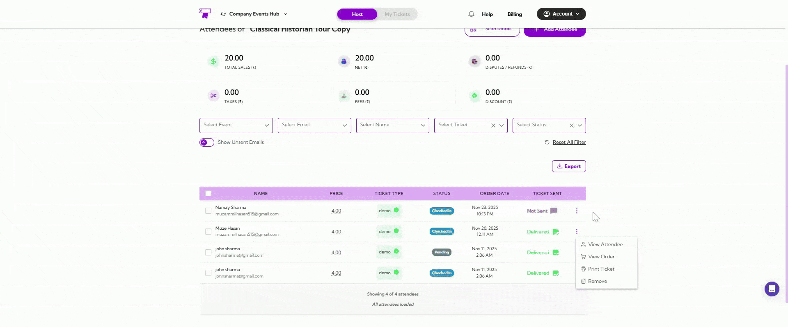

### Remove

Removes the attendee from the event list. This is typically used to delete duplicate entries, handle cancellations, or clean up test or incorrect records.

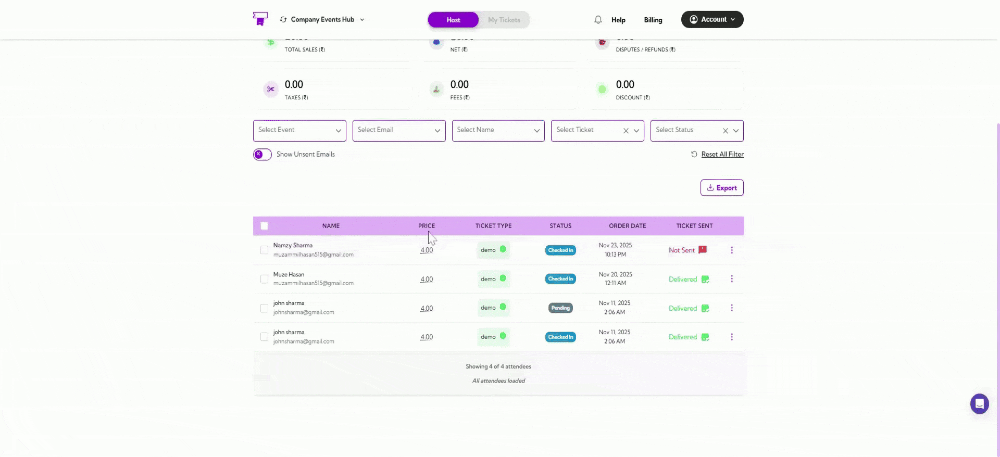

This ensures attendee records remain accurate and easy to manage throughout the event.
