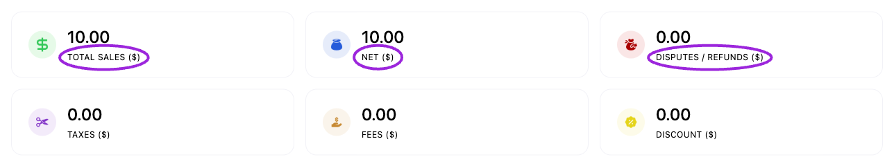
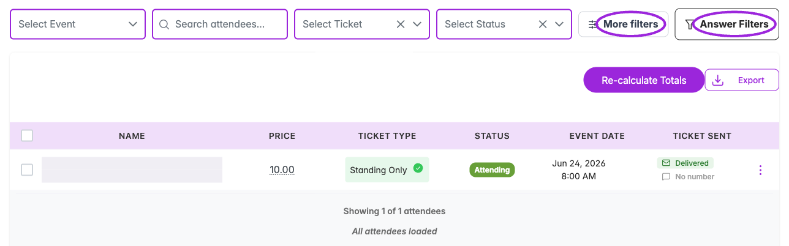
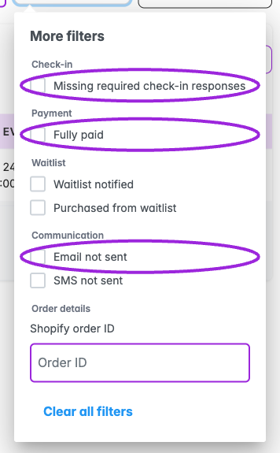
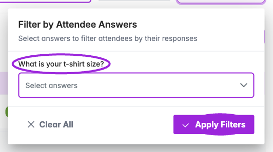
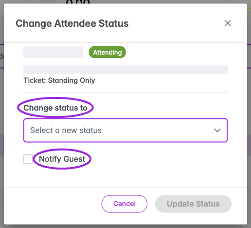
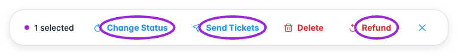
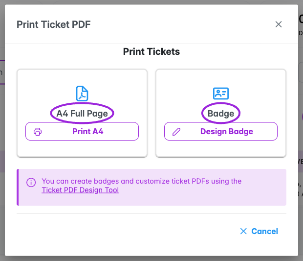

Open **Events**, find the event, and open its **Attendees** page. This page combines financial statistics, the attendee list, registration filters, and event-day tools. Available actions depend on your team role and event setup.

## Dashboard statistics

The six cards summarize the current attendee results. Changing the attendee filters refreshes the statistics as well as the list.

<Frame caption="The attendee dashboard shows six financial statistics in the event's currency.">
  
</Frame>

| Card | What to review |
| --- | --- |
| **Total Sales** | Sales amount recorded for the current results. |
| **Net** | Recorded net amount for those results. |
| **Disputes / Refunds** | Combined recorded disputed and refunded amounts. |
| **Taxes** | Recorded tax amount. |
| **Fees** | Recorded fee amount. |
| **Discount** | Recorded discount amount. |

These are financial cards, not counts of arrivals. Use the **Checked In** status filter and the result count to review checked-in attendees. Use [Analytics](../analytics/analytics-overview) for broader reporting. Financial cards are hidden from Support Manager accounts.

## Search and filter attendees

<Frame caption="Search and combine filters above the list. Attendee identity is concealed in this example.">
  
</Frame>

| Control | How to use it |
| --- | --- |
| **Select Event** | Choose event dates or occurrences available in this view. Search and load more choices when needed. |
| **Search attendees…** | Type at least two characters of a name or email, then choose a matching suggestion. Clear the search to remove this restriction. |
| **Select Ticket** | Limit the list to selected ticket types. |
| **Select Status** | Find Attending, Checked In, Not Attending, Pending, or Waitlist registrations. |
| **More filters** | Add the operational filters below. |
| **Answer Filters** | Filter by answers to questions with predefined choices. |

### More filters

<Frame caption="Additional filters cover check-in responses, payment, waitlist conversion, communication, and order details.">
  
</Frame>

- **Missing required check-in responses:** find attendees whose required check-in questions still need answers.
- **Fully paid:** restrict results by payment completion.
- **Waitlist notified** and **Purchased from waitlist:** find invitees and waitlist conversions.
- **Email not sent** and **SMS not sent:** find records matching the corresponding communication condition.
- **Shopify order ID:** find attendees associated with a specific Shopify order, when this option is available.

Remove active filter chips individually, or use **Clear all filters** in this panel to reset the filters. Check the result count after the list finishes loading.

### Question-answer filters

Open **Answer Filters**, select one or more answers for the questions you want to match, then choose **Apply Filters**. Use **Clear All** to clear the answer selections. These controls are available for dropdown, radio, and checkbox questions with predefined options.

<Frame caption="Choose answer values and apply them to the attendee list.">
  
</Frame>

An attendee can match any selected answer within a question. If you filter on several questions, the attendee must match each question's selection.

## Read the attendee list

Each row shows the attendee's name and email, price, ticket type and validity, status, event date, and email/SMS delivery indicators. Click the name to open [Attendee Information](./viewing-attendee-details). Delivery indicators open the relevant communication history.

The footer shows how many attendees are loaded. Use **Load More Attendees** when available; **All attendees loaded** means the current results are fully loaded.

## Change an attendee's status

Click the attendee's status to open **Change Attendee Status**. Choose a new status, decide whether to enable **Notify Guest**, and click **Update Status**. **Cancel** closes the dialog without changing the record.

The available statuses are **Attending**, **Checked In**, **Not Attending**, **Pending**, and **Waitlist**. The current status is omitted from the single-attendee change menu. **Notify Guest** sends an email and uses the email allowance; the status can still be saved when the notification allowance is exhausted.

<Frame caption="Review the new status and optional guest notification before updating.">
  
</Frame>

## Review pending approvals

Filter to **Pending** and review the registration answers, ticket, and order before approving. Approval and payment are separate: inspect any unpaid balance or installment schedule before treating an order as paid.

Review remaining capacity before approval. An approval can complete with an **Approved over capacity** warning. For scheduled payments, see [Payment Installments](../event-management/installment-payments).

## Bulk actions

Select attendee checkboxes to open the bulk toolbar. It offers **Change Status**, **Send Tickets**, **Delete**, and **Refund**. **Notify Waitlist Guests** appears when the selection includes waitlisted attendees. Clear the selection to close the toolbar.

<Frame caption="Selecting rows reveals the bulk action toolbar.">
  
</Frame>

Review each action's dialog before confirming. Selecting the header checkbox selects the currently loaded rows, and changing filters clears the selection. A bulk status change supports up to 200 attendees at a time.

<Warning>
**Delete** removes mistaken or test registrations and clears their recorded financial amounts. It is not the refund workflow. For a real paid booking that needs cancellation or money returned, review the **Refund** or **Cancel & Refund** controls instead.
</Warning>

## Row actions

Open the three-dot menu on an attendee row:

| Action | Result |
| --- | --- |
| **View Attendee** | Opens contact details, questions, notes, and communication history. |
| **View Order** | Opens the linked order, when one exists, including totals, attendees, and available order actions. |
| **Print Ticket** | Opens **Print Ticket PDF**. Choose **A4 Full Page**, or print/design a **Badge** depending on your setup. |
| **Remove** | Opens the removal confirmation for that attendee. |

<Frame caption="Choose an A4 ticket or a badge. The badge option depends on your ticket design setup.">
  
</Frame>

## Event-day tools

- **Add Attendee:** [register someone manually](./adding-attendees-manually), including their date, ticket, status, and required answers.
- **Seating Chart:** appears when seating is enabled. Review availability, select seats, and manage assignments for the correct event date. See [Seating Charts](../seating-charts/seat-selection).
- **Send Announcement:** prepare a message for attendees and review its recipients before sending.
- **Scan Check-In:** open the dashboard's scanning tools for entry management.
- **Export:** download attendee, check-in, or financial CSV data. See [Export Attendee Data](./export-attendees-and-check-in-data) for the important differences between all, selected, and filtered exports.
