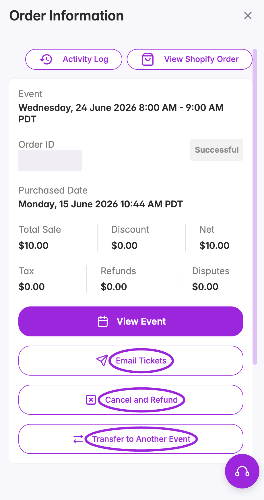
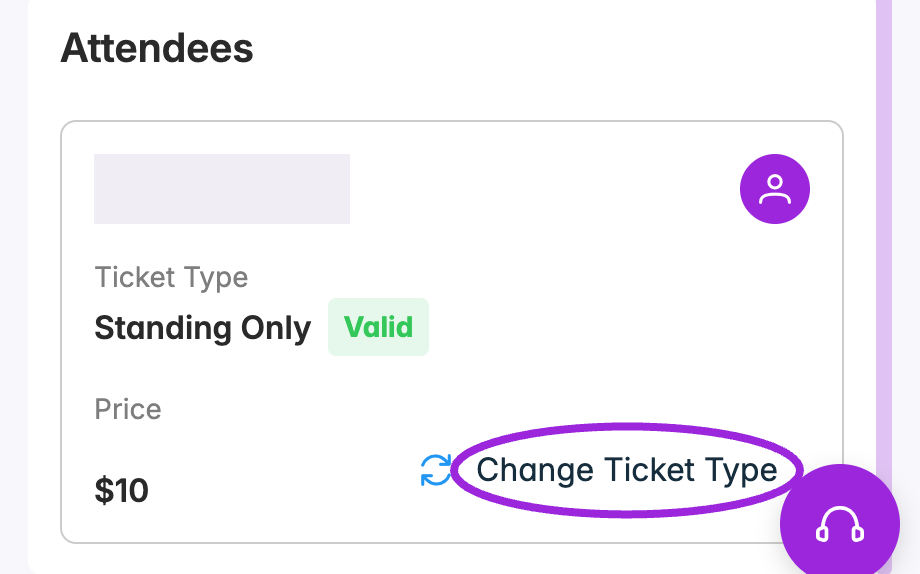

From an event's **Attendees** page, open the row's three-dot menu and choose **View Order**. You can also open **View Attendee → View Order**. The order link appears when the registration has a linked order.

## Read the order summary

**Order Information** shows the event date and time, order ID, purchase date, and an order badge. Use the financial totals and individual attendee/payment records to check a refund or transfer; the **Successful** header badge alone does not establish the current payment or refund outcome.

<Frame caption="The order drawer groups purchase totals and booking actions. Personal details and the order number are concealed.">
  
</Frame>

| Field | What it shows |
| --- | --- |
| **Event** | The booked date/time or occurrence, using the event's timezone; all-day, multi-session, time-slot, and Date TBD events display their corresponding date format. |
| **Order ID / Purchased Date** | The booking reference and when it was purchased. |
| **Total Sale** | The sales amount recorded for this order. |
| **Discount** | Recorded discount; a promo-code name appears when available. |
| **Net** | The order's recorded total. |
| **Tax / Refunds / Disputes** | Recorded tax, refunds, and lost-dispute amounts. |

## Every order action

| Control | How to use it |
| --- | --- |
| **Activity Log** | Review recorded actions and updates for the attendee context. Select **Back to Attendee Information** to return to that attendee. |
| **View Shopify Order** | Opens the linked order in Shopify admin when Shopify order information is available. You need access to that store. |
| **View Event** | Opens the event associated with the order. |
| **Email Tickets** | Opens **Send Order Confirmation** for all attendees in the order. [Review recipients and resend tickets](./email-and-sms-delivery#email-tickets-for-an-order). |
| **Cancel and Refund** | Opens the cancellation/refund options. It may be absent when a return has already been processed. [Choose cancellation or refund](./refunds-and-cancellations). |
| **Transfer to Another Event** | Select another live event, the occurrence if required, and a target ticket for every attendee. [Transfer the order](./transfers-and-ticket-changes). |
| Attendee card's person icon | Opens that attendee's contact information, questions, notes, and communication history. |
| **Change Ticket Type** | Changes the selected attendee's ticket type within the event. [Change a ticket](./transfers-and-ticket-changes#change-a-ticket-type-within-the-same-event). |

Use the **X** at the top right to close the drawer. Scroll inside it to reach the attendee cards and any additional sections.

## Attendees in the order

Each attendee card shows their name, ticket type, ticket indicator, and displayed ticket price. Use the person icon to open the individual record, or **Change Ticket Type** to choose another ticket for that attendee. Review the financial summary for the actual order totals; changing a ticket type does not reprice the order.

<Frame caption="Scroll below the order actions to open an attendee or change their ticket type. Identity is concealed.">
  
</Frame>

Orders containing group tickets can display a **Contains … Group Tickets** badge. For issuing a group ticket and its members, use a booking rather than changing a single attendee into a group ticket.

## Add-ons

When the order includes add-ons, the **Add-ons** section separates them from the main event's attendees. Each card can show the add-on event, attendee, selected occurrence, ticket type, and price, or **Included** for an included add-on.

- Select a linked add-on title or its person icon to open the add-on attendee.
- Use **Main Event** to return to the main booking's attendee.
- Older orders can show **Not assigned** when an add-on exists but has no linked attendee. In that case there is no attendee shortcut to open.

See [Event Add-ons](../event-management/event-add-ons) for setup.

## Payment installments

For an order with a saved installment schedule, **Payment Installments** shows how many installments are paid, the remaining balance, and each payment's description, amount, due or paid date, and **Paid**, **Pending**, **Overdue**, or **Failed** status. A completed schedule shows **All installments paid in full**.

This order section is a summary. Use the attendee list's installment/payment control for available payment-management actions, described in [Payment Installments](../event-management/installment-payments#collect-a-due-installment). Review scheduled payments individually before a cancellation; the bulk refund workflow does not accept installment tickets.

## Related attendee tools

For contact changes, question answers, and notes, see [Viewing Attendee Details](./viewing-attendee-details). For CSV reconciliation, use [Export Attendee Data](./export-attendees-and-check-in-data). For the list's filters, status changes, printing, and removal controls, see [Managing Attendees](./managing-attendees).
