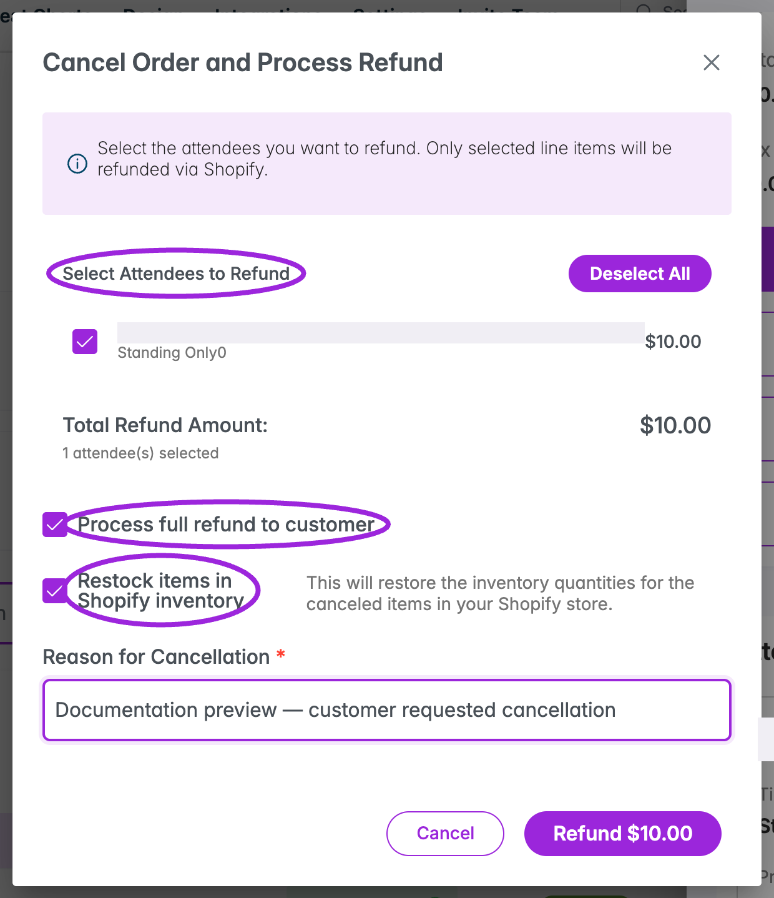
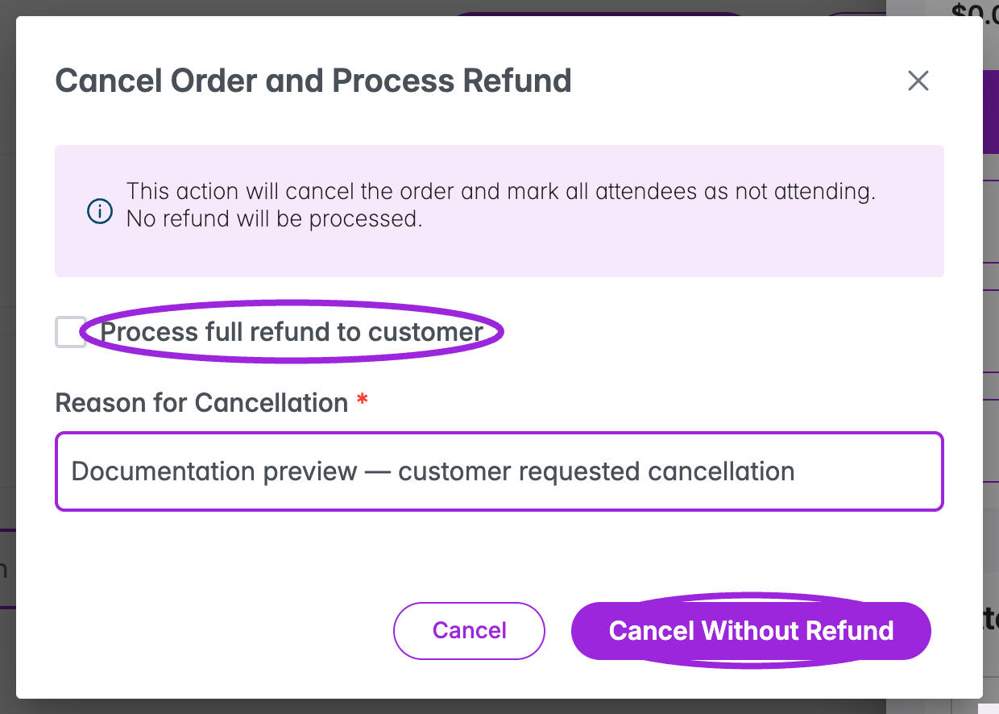
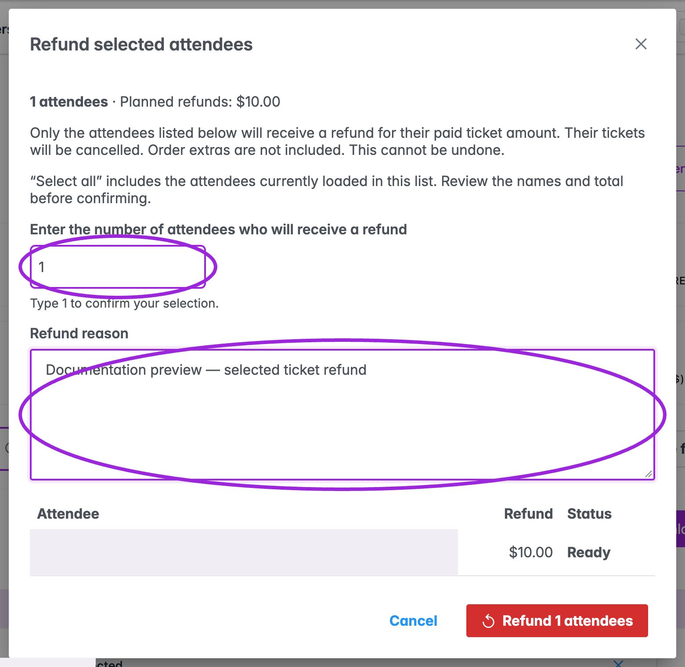

The Attendee Dashboard has separate actions for refunding selected tickets, canceling an order, and removing a mistaken registration. Choose the action that matches the booking you need to change.

| Task | Where to start |
| --- | --- |
| Cancel/refund a linked order | Row menu → **View Order → Cancel and Refund**. |
| Refund selected paid attendees | Select rows → **Refund** in the bulk toolbar. |
| Cancel an order without returning money | **Cancel and Refund**, then clear **Process full refund to customer**. |
| Remove a test or mistaken registration | Row menu → **Remove**, or select rows → **Delete**. [Removal instructions](./managing-attendees#remove-a-registration). |
| Change attendance status | Click the attendee's status. This does not initiate a payment refund. |

## Cancel and refund an order

1. Open **View Order** and check the order ID, attendees, amounts, and previous refunds.
2. Select **Cancel and Refund** to open **Cancel Order and Process Refund**.
3. Leave **Process full refund to customer** selected to request a refund. For Shopify, review the attendee selection described below.
4. Enter the required **Reason for Cancellation**.
5. Review the scope and confirm using **Confirm** or the displayed **Refund [amount]** button. Choose **Cancel** or close the dialog to leave without submitting.
6. Read the result, reopen the order, and review the affected attendees and refund amount. If the result is uncertain, check the payment provider before trying again.

For a non-Shopify order, this workflow requests a full refund and marks the order's attendees as **Not Attending**. For a custom partial amount, use the payment processor directly, as indicated in the dialog; the form does not provide a partial-amount input. The selected-attendee bulk workflow below is another option for eligible paid tickets.

### Shopify attendee selection and restocking

For a Shopify site, the dialog includes **Select Attendees to Refund**. Non-refunded attendees are initially selected. Use their checkboxes or **Select All / Deselect All**, then check the selected count and **Total Refund Amount**. Attendees already marked refunded are disabled. At least one attendee must be selected to submit a Shopify refund.

<Frame caption="Review the selected Shopify attendees, total, refund checkbox, and restocking option before confirming. This is an unsubmitted Demo preview.">
  
</Frame>

**Restock items in Shopify inventory** controls whether canceled quantities are restored to Shopify inventory. It is selected by default for Shopify and appears while the refund option is selected. Review this choice for the affected line items. The selected Shopify line items determine the refund scope; this is different from canceling the whole order without a refund.

For a refund performed in Shopify admin, open **View Shopify Order** and check the provider's result before issuing another refund in Ticket Spot.

## Cancel without a refund

1. Open **View Order → Cancel and Refund**.
2. Clear **Process full refund to customer**.
3. Enter **Reason for Cancellation**.
4. Confirm with **Cancel Without Refund**.

<Frame caption="Clearing the refund option changes the final action to Cancel Without Refund. The dialog has not been submitted.">
  
</Frame>

This cancels the order's attendance without returning the payment. In this mode the Shopify refund selection and restocking options are hidden; it is not a way to cancel only the attendees previously checked in the refund selection.

## Refund selected attendees in bulk

The bulk refund workflow supports **1–200 selected attendees** with eligible paid tickets. It supports Stripe, Square (including Square POS), and Shopify payments. It refunds and cancels the listed tickets; non-ticket order extras and Shopify inventory restocking are excluded.

1. Filter the attendee list and select the required rows. The header checkbox selects **currently loaded attendees**, not unseen results. Load more rows if needed and review the count.
2. Choose **Refund**. Ticket Spot prepares a preview of the exact selection and verified paid amounts. Opening the preview does not issue refunds.
3. Review every name, amount, currency, and the **Planned refunds** total. Multiple currencies have separate totals.
4. Type the exact attendee count in **Enter the number of attendees who will receive a refund**.
5. Enter a **Refund reason** (up to 192 characters).
6. Choose **Refund [count] attendees** only after checking the selection. A preview expires after 15 minutes; changed ticket or payment details also require a fresh preview.
7. Watch the per-attendee results. Choose **Done** after processing finishes, then verify the order and attendee records.

<Frame caption="The bulk refund preview verifies paid amounts and requires the exact count and a reason. Identity is concealed; no refund was started.">
  
</Frame>

### Selections that need individual review

The preview rejects unsupported selections rather than silently dropping attendees. Remove or review already-refunded, unpaid, waitlisted, installment, and group tickets; disputed orders; marketplace payments; and orders whose paid ticket amount cannot be verified. Unsupported providers or currencies also require individual review. Legacy orders without a reliable discount/fee allocation may be rejected.

Supported bulk-refund currencies are USD, CAD, EUR, GBP, AUD, NZD, CHF, DKK, NOK, SEK, SGD, HKD, JPY, MXN, BRL, INR, and ZAR.

### Understand bulk refund results

| Result | Meaning and next step |
| --- | --- |
| **Ready** | The attendee is in the preview; no refund has started. |
| **Waiting** | Queued for processing. |
| **Processing** | The payment group is being processed. |
| **Refunded** | The provider reported a completed refund. Review the updated record. |
| **Submitted to provider** | The provider accepted the refund, but it may still be pending. Check settlement with the provider. |
| **Not refunded** | The attempt failed. Read the attendee's message before taking another action. |
| **Needs review** | The result is uncertain. Check the actual provider transaction before issuing another refund. |

Refunds run by payment group and may pause for provider limits. The dialog cannot be closed while processing. If the connection drops, progress reconnects automatically; refreshing the same site/event page resumes the saved job. A finished job can contain different outcomes for different attendees, so review each row rather than relying on the overall completion count.

## Common questions

### Does Remove or Delete return money?

No. These remove registrations and clear their recorded financial amounts. Use a refund workflow for a payment refund, and avoid deleting a paid booking to make it appear refunded.

### Does Not Attending mean the ticket has been refunded?

No. Status and payment are separate. Check the order's **Refunds** and the payment provider's result.

### Why is Cancel and Refund missing?

An order must be linked to the attendee, and an already-processed return can hide the action. Actions also depend on access and the booking's state. Check **View Order** and existing refund history first.

### Can I retry a refund after a timeout?

Check the existing job and payment provider first. A lost response can occur after the provider accepted the request. **Needs review** is not permission to submit the same refund again.
