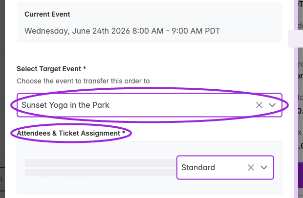
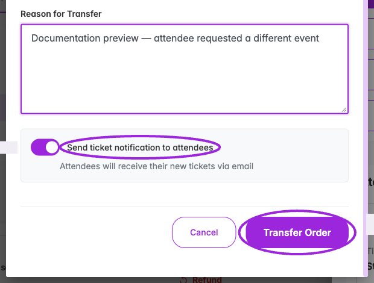
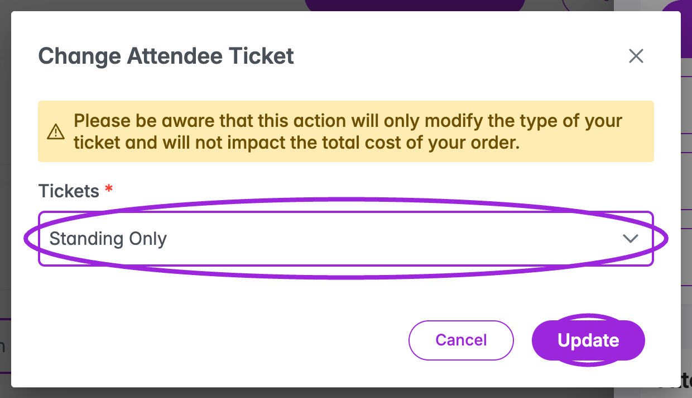

Use **Transfer to Another Event** to move an order's attendees to another event. Use **Change Ticket Type** to change one attendee's ticket within their current event. Both actions preserve the original purchase amounts; they do not collect an upgrade payment or issue a refund for a price difference.

## Transfer an order to another event

1. In the Attendee Dashboard, choose the row's **View Order** action.
2. Review all attendees in the order, including any add-on bookings, then select **Transfer to Another Event**.
3. In **Transfer Order to Another Event**, choose **Select Target Event**. The dropdown lists other live events on the same site; the current event and drafts are excluded.
4. If the destination has multiple dates, select **Select Date** and, for timed entry, **Select Time Slot**. The occurrence selector offers future occurrences.
5. Under **Attendees & Ticket Assignment**, choose a destination ticket for **each attendee**. The first available ticket can be assigned automatically; check every row rather than assuming the defaults are correct.

<Frame caption="Choose the destination and review each attendee's ticket assignment. Personal details are concealed; the transfer has not been submitted.">
  
</Frame>

6. Optionally enter **Reason for Transfer** for the activity record.
7. Choose whether to leave **Send ticket notification to attendees** enabled. It starts enabled and sends the new tickets by email when the transfer succeeds.
8. Select **Transfer Order**. **Cancel** closes the transfer without submitting.
9. Review the success or **Partial Transfer** notification. Check the source and destination attendee lists and each attendee's **Activity Log** to confirm who moved.

<Frame caption="Review the reason and notification choice before Transfer Order. This capture stops before submission.">
  
</Frame>

The form requires a destination, an occurrence when applicable, and ticket assignments for the attendees. **No tickets available** means the target has no tickets to assign; configure its tickets or select another destination.

### Transfer scope and follow-up

- This is an **order action**. Selecting one attendee as the entry point does not limit it to that person; the workflow attempts to transfer the order's attendees. Review orders with add-ons carefully.
- A partial transfer means some attendees did not move. Check both events before repeating the action.
- Original purchase prices are preserved. Handle any agreed extra charge or refund separately.
- For reserved seating, check the destination's seating chart and manage the seat assignment separately. This dialog has no seat-picker step.
- A Ticket Spot transfer does not automatically replace Shopify order variants. Review the linked Shopify order separately if its product/variant details also need to change.
- Choose a standard individual ticket as the destination. A group ticket must be issued through a booking so its members can be created.

This organizer action is separate from an attendee's [self-service cancel or transfer request](../attendee-portal/cancel-transfer-event).

## Change a ticket type within the same event

1. Open **View Order** and scroll to **Attendees**.
2. Find the correct attendee card and select **Change Ticket Type**.
3. In **Change Attendee Ticket**, choose the replacement from **Tickets**.
4. Review the notice that changing the type does **not** change the order's total cost.
5. Select **Update**, or **Cancel** to leave the ticket unchanged. Reopen the attendee/order to check the result.

<Frame caption="Choose another ticket for this attendee. The warning explains that the order cost is unchanged.">
  
</Frame>

There is no email-notification option in this dialog. If the attendee needs an updated confirmation, review the result and use [Email Tickets or Resend](./email-and-sms-delivery). Do not use this action to create group-ticket members or to move a reserved seat; use the corresponding booking or [seating assignment](../seating-charts/seat-selection#assign-seats-to-existing-attendees) workflow.
