**Viewing attendee details** allows event teams to access complete information about each attendee. This includes registration data, ticket type, order information, check-in status, and any custom fields collected during registration. Having this information available in one place helps with event coordination, attendee verification, and resolving on-site queries.

Let’s get started 🚀

**Step 1**: Log in to your **Ticket Spot** account, then click on the **Attendee** icon next to the event you want to export attendee data for.

**Step 2**: Click on **Manage Attendees** to open the attendee dashboard for that event.

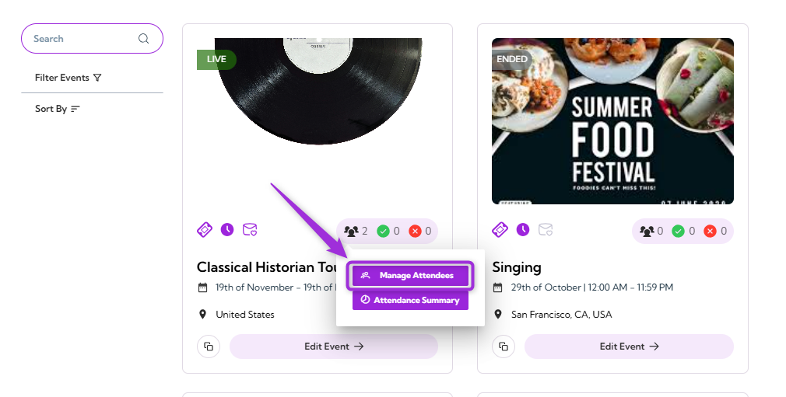

The detailed Attendees Dashboard will appear, showing the full list of attendees for the selected event.

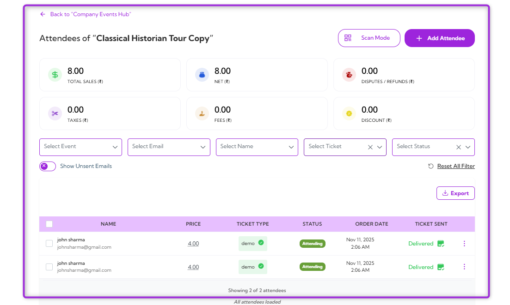

**Step 3**: Use the **filters** at the top of the Attendees Dashboard to view specific attendee groups. These filters help narrow down the list based on event, email, name, ticket type, or status.

The available filters are listed below:

| Ref. | Filter | Description | Example Use |
|------|--------|-------------|-------------|
| 1. | **Select Event** | Filters attendees by a specific event (useful when viewing data across multiple events). | View attendees only for “Workshop A.” |
|2.   | **Select Email** | Filters the list by an attendee’s email address. | Find a specific attendee using their email. |
| 3.  | **Select Name** | Filters attendees by first or last name. | Quickly locate “John Sharma” in a large list. |
|  4. | **Select Ticket** | Filters by ticket type. | View only “VIP” or “General Admission” attendees. |
| 5. | **Select Status** | Filters by attendance or registration status. | Show only “Checked In” or only “Pending” attendees. |
| 6. | **Show Unsent Emails (Toggle)** | Displays attendees who have not received automated emails or confirmations. | Identify attendees who need a resend. |
| 7. | **Reset All Filters** | Clears all filters and returns the full attendee list. | Return to the complete list after filtering. |

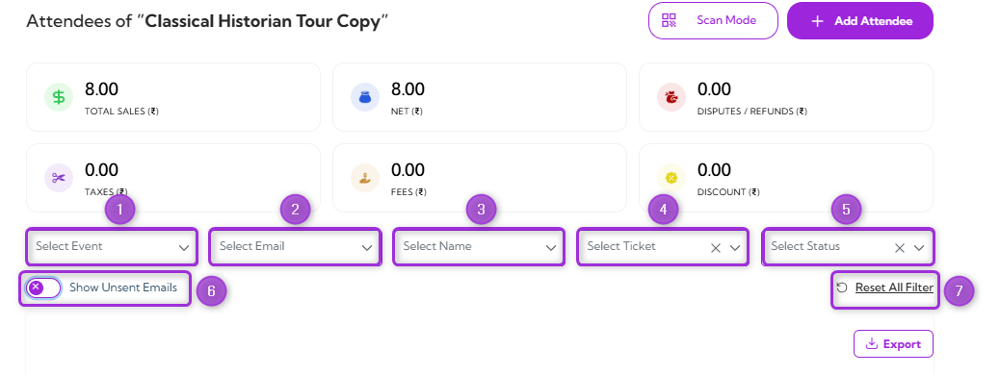

Displaying all attendees that match the selected criteria. Each row shows key details such as **name**, **price**, **ticket type**, **status**, **order date**, and **ticket sent**.

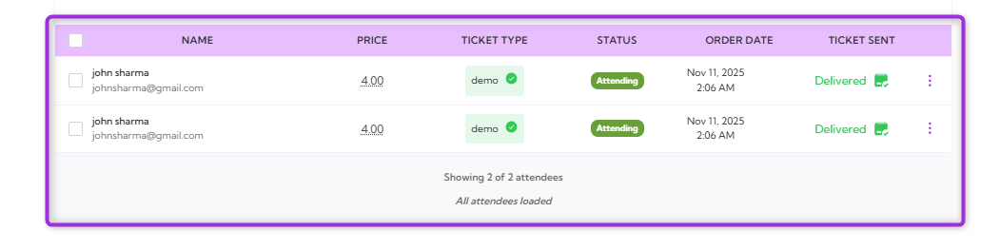

**Step 4**: Select any **attendee** from the list and click on it  to view more information about the attendee.

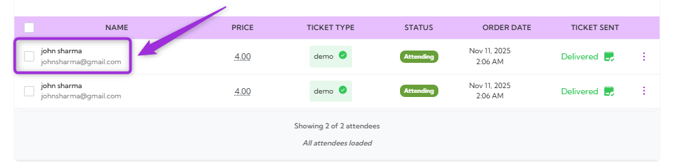

The Detailed Attendee Information panel will open, showing contact details, ticket information, questions, notes, and email delivery history.

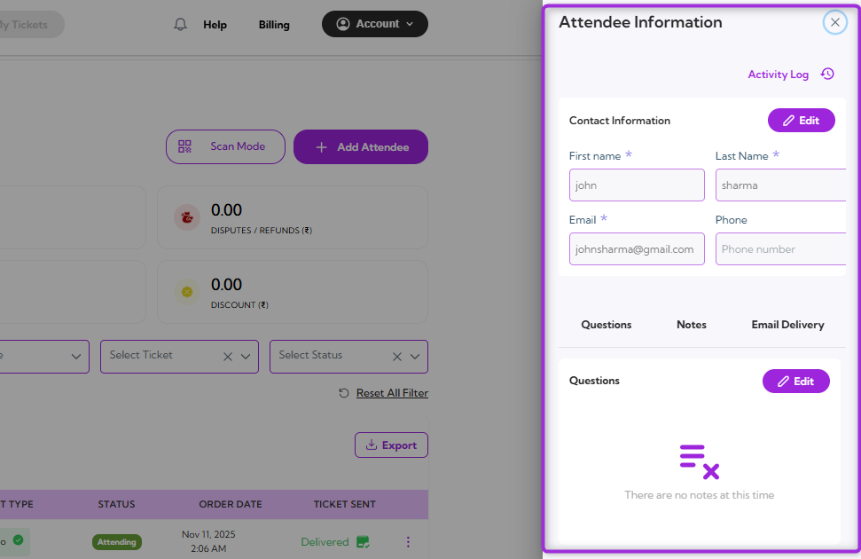

**Contact Information**: Displays the attendee’s basic details, including first name, last name, email, and phone number.

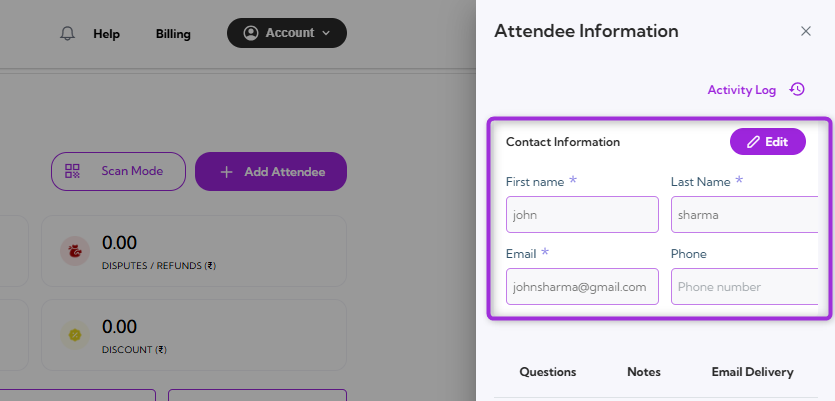

**Questions**: Shows the attendee’s responses to custom questions collected during registration.

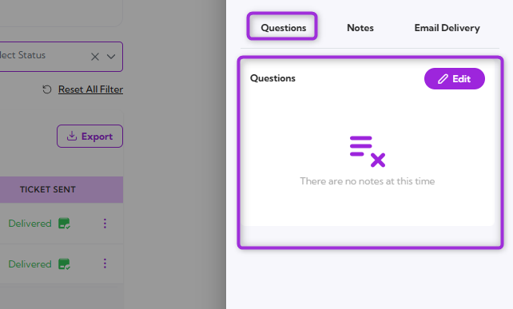

**Notes**: Contains internal notes added by the event team, useful for tracking special requests or follow-ups.

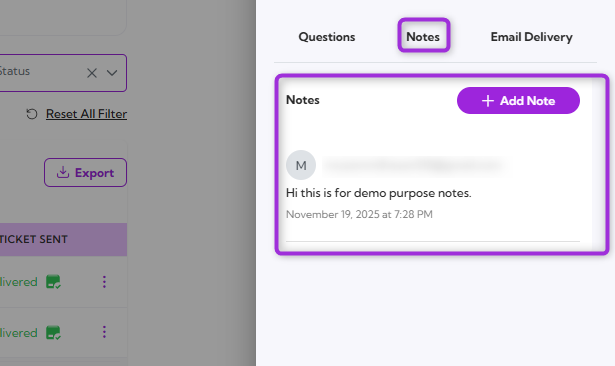

**Email Delivery**: Shows the history of emails sent to the attendee, including delivery status and timestamps.

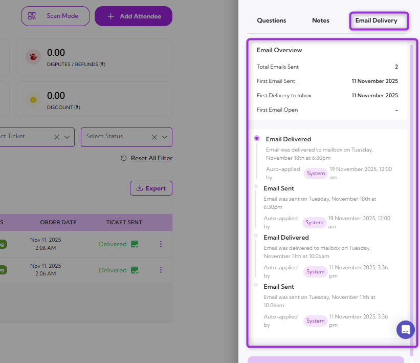

> **Note:** All sections in the Attendee Information panel can be edited. Tap **Edit** in any section to update contact details, modify question responses, or add notes as needed.
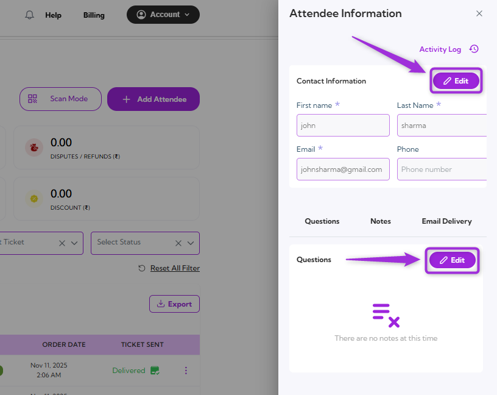

In summary, the Attendee Information panel provides a central place to view, filter, and update all attendee details, making it easy to manage everything from contact information to notes and email activity.
