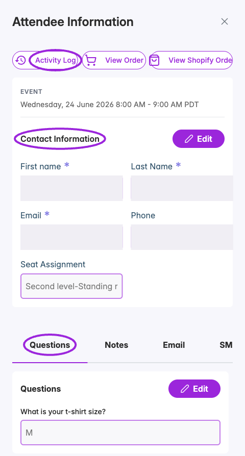
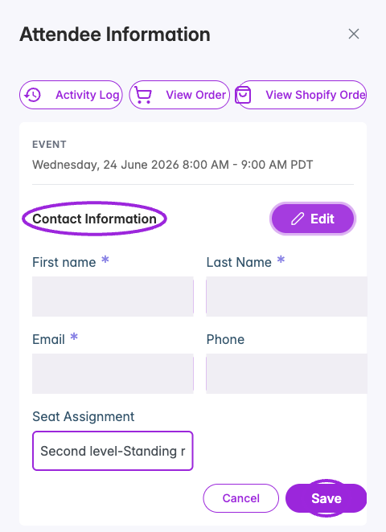
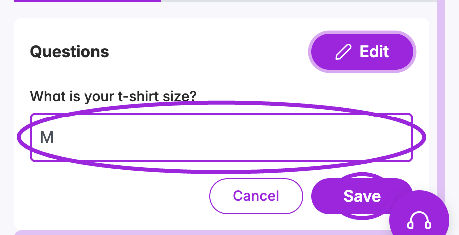
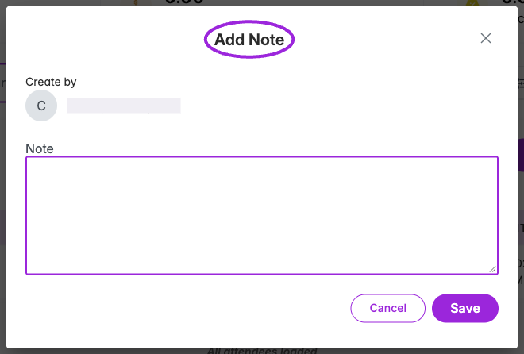
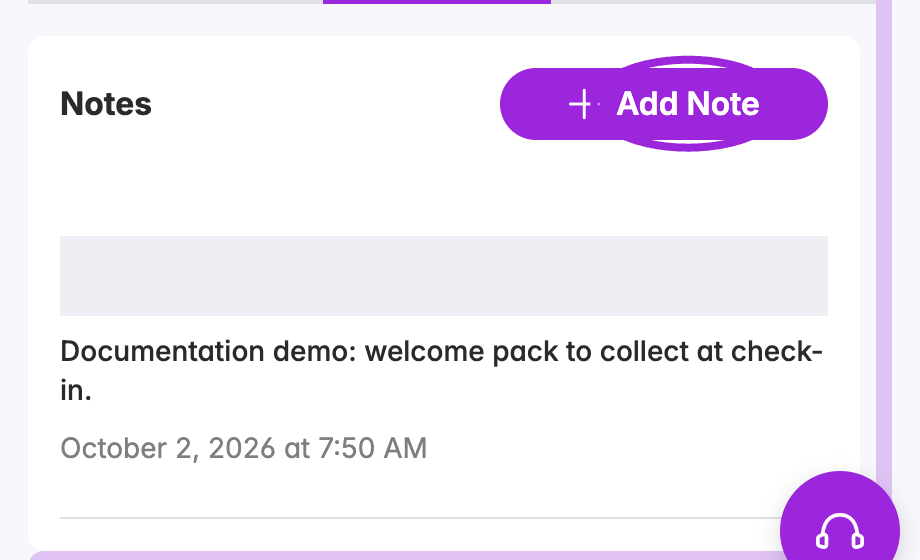
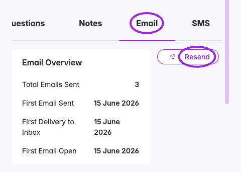
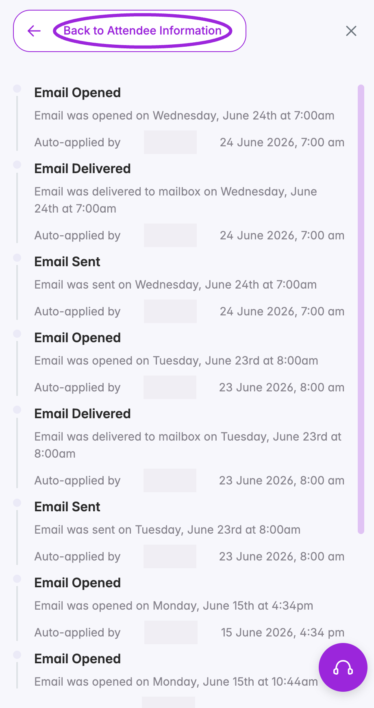
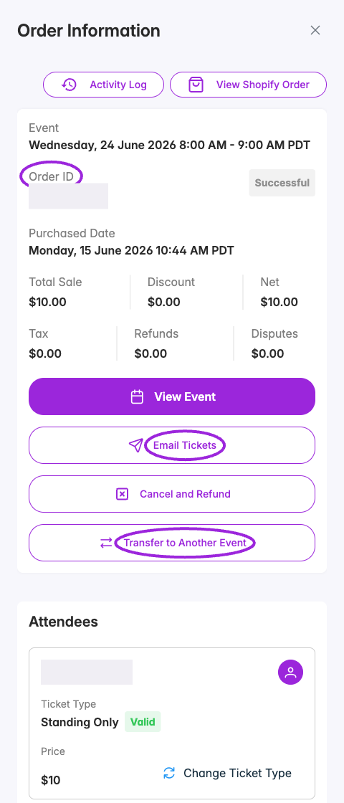

Open an event's **Attendees** page. Use **Search attendees…** to find a name or email, then click the attendee's name. You can also choose **View Attendee** from the row's three-dot menu.

<Frame caption="The attendee panel connects contact details, questions, activity, and the order. Personal details are concealed.">
  
</Frame>

## Contact information

The top of the panel identifies the booked event date and time. **Contact Information** shows the attendee's first name, last name, email, phone, and seat label when present.

Choose **Edit** to update the available fields, then **Save**. **Cancel** discards your edits. Editing controls depend on your role; Ticket Checker accounts cannot edit contact details.

<Frame caption="Save applies contact changes; Cancel leaves the record unchanged.">
  
</Frame>

Use the event's [seating view](../seating-charts/seat-selection#assign-seats-to-existing-attendees) to reserve or move a seat on a seating chart. Editing a displayed seat label is not the chart assignment workflow.

## Questions

The **Questions** tab shows answers collected during registration. This edits an attendee's recorded answers; to change what future registrants are asked, edit the event's [Additional Information](../event-management/additional-information) instead.

1. Open **Questions** and review the existing responses.
2. Choose the **Edit** button inside the Questions section (separate from Contact Information's Edit).
3. Change the supported answer fields and select **Save**, or **Cancel** to leave edit mode without submitting.
4. Reopen the record to verify the saved answers. An empty Questions panel means there are no recorded responses to edit.

<Frame caption="Questions has its own Edit, Save, and Cancel controls. Contact details are concealed.">
  
</Frame>

For waiver or terms questions, the record can also show the terms label, signed time, checkbox confirmation, entered name, and digital signature. **View Content**, **View Link**, or **View Document** opens the recorded terms when available. Waiver confirmations are read-only, including in edit mode. These details depend on what the question collected; an ordinary text answer does not contain signature evidence.

## Notes

Use **Notes → Add Note** to record internal information for your team. Enter the note and choose **Save**, or cancel to leave the record unchanged. Saved notes show their author and creation time.

The add-note dialog requires note text. **Cancel** clears the draft; use its close control to leave the dialog if it remains open. Existing note cards are read-only: this panel does not offer edit or delete actions for a saved note.

<Frame caption="Add an internal note without changing the attendee's registration answers.">
  
</Frame>

<Frame caption="Saved notes remain with the attendee record and show an author and timestamp. Identity is concealed in this Demo example.">
  
</Frame>

## Email and SMS history

**Email** shows a delivery overview and a timeline of recorded email activity. The overview includes total emails sent and the first send, inbox delivery, and open dates when recorded. Use the timeline to inspect individual events.

<Frame caption="Review delivery evidence before using Resend.">
  
</Frame>

**Resend** opens a confirmation dialog. Check the recipient and choose **Send** only when you want to send another ticket confirmation. **SMS** provides the recorded text-message delivery overview and timeline when available.

See [Check Ticket Email and SMS Delivery Status](./email-and-sms-delivery) for every indicator, the overview fields, failure troubleshooting, and the differences between attendee, order, and bulk confirmation actions.

Communication history is read-only. Contact details, supported answers, and internal notes have separate editing controls; there is no general edit action for every tab.

## Activity log

Choose **Activity Log** at the top of the panel to review recorded attendee actions and updates, including timestamps and the responsible account or system where available. Choose **Back to Attendee Information** to return.

<Frame caption="Activity Log records attendee actions and updates. Names and account details are concealed.">
  
</Frame>

Each entry can include an action title, details, an **Updated by** or **Auto-applied by** attribution, and a timestamp. The log is read-only and can also include communication activity. Use the Email and SMS tabs for the channel-specific summaries and timelines.

## Linked order

Choose **View Order** when the attendee belongs to an order. The order panel shows its ID, purchase date, status, sales and adjustments, attendees, and applicable add-ons or payment installments.

<Frame caption="The order panel groups the purchase and its available actions. Identity and order number are concealed.">
  
</Frame>

The order has its own actions and attendee cards. Follow the dedicated instructions for [order details and add-ons](./managing-orders), [refunds and cancellations](./refunds-and-cancellations), [transfers and ticket changes](./transfers-and-ticket-changes), and [email confirmations](./email-and-sms-delivery#email-tickets-for-an-order). A Shopify-linked record can also show **View Shopify Order**, which opens Shopify admin and requires access to that store.

For outstanding scheduled payments, see [Payment Installments](../event-management/installment-payments). For list filters, bulk actions, and status changes, see [Managing Attendees](./managing-attendees).
