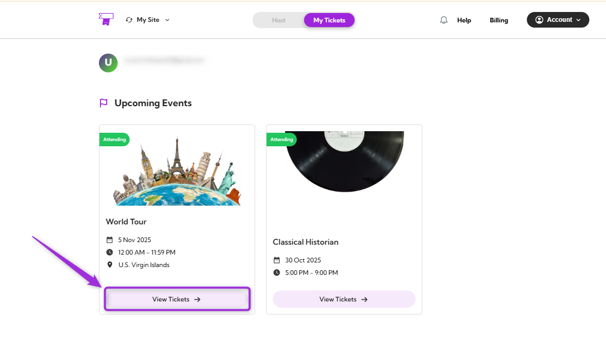

The **Cancel** or **Transfer** Event option lets you manage your registration directly from your **Attendee Dashboard**. You can cancel your registration if you’re unable to attend or transfer it to another available event. This provides a quick and efficient way to update your participation without additional assistance.

Let’s get started 🚀

## Navigation

**Step 1**: Log in to your **TicketSpot account** and click on the **My Tickets** tab in the top navigation bar..

**Step 2**: You can view all your upcoming events in the Attendee Dashboard. Select the event you want to cancel or transfer and click **View Tickets**.

**Step 3**: Click **Cancel** or **Transfer** in the Event Details panel on the right side of the screen to open the action window.

## Cancel Registration
If you can no longer attend the event, click on the **Cancel Registration**. Provide a reason for your cancellation, then click on **Submit Cancellation**. Your status will be updated to **Not Going** immediately after the cancellation is processed.

## Transfer to Another Event
If you wish to move your registration to a different event, click **Transfer to Another Event**. From the dropdown menu, select the event you want to transfer your ticket to, choose the event date, and provide a reason for the transfer. After confirming your selections, click **Submit Transfer** to complete the process.

A confirmation message will appear, stating that your transfer request has been sent for approval.
