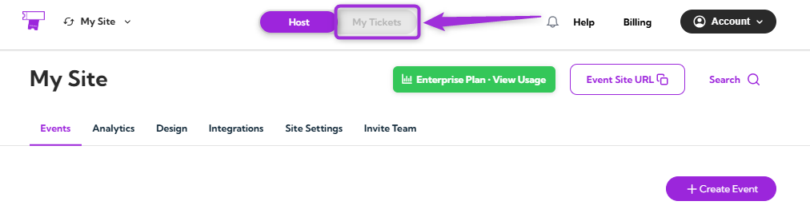
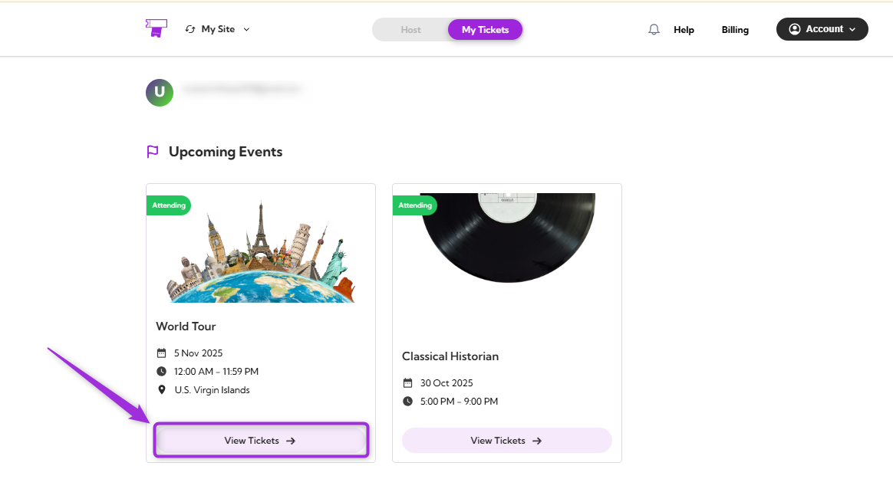
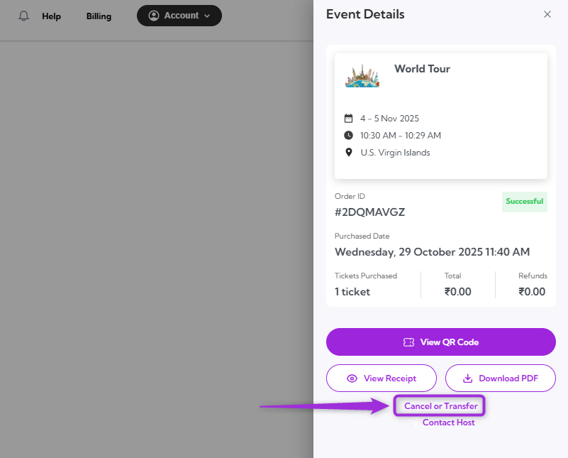
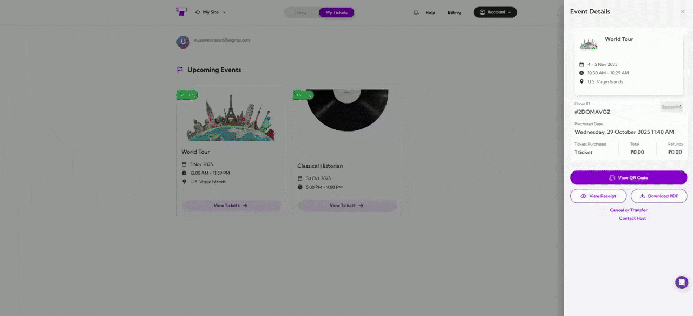
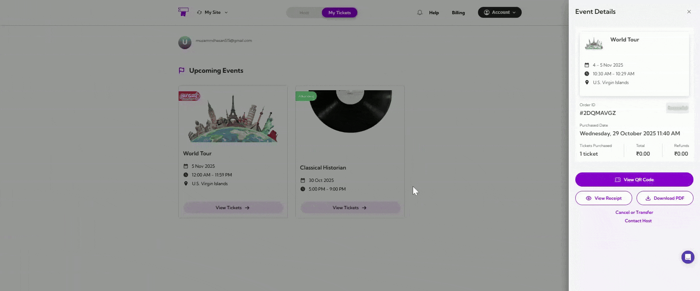

The **Cancel** or **Transfer** Event option lets you manage your registration directly from your **Attendee Dashboard**. You can cancel your registration if you’re unable to attend or transfer it to another available event. Available actions and approval requirements depend on the organizer.

## Navigation

**Step 1**: Log in to your **TicketSpot account** and click on the **My Tickets** tab in the top navigation bar.

**Step 2**: You can view all your upcoming events in the Attendee Dashboard. Select the event you want to cancel or transfer and click **View Tickets**.

**Step 3**: Click **Cancel** or **Transfer** in the Event Details panel on the right side of the screen to open the action window.

## Cancel Registration
If you can no longer attend the event, click on the **Cancel Registration**. Provide a reason for your cancellation, then click on **Submit Cancellation**. Read the confirmation to see whether your request is awaiting review or has been processed. Check the final registration status before assuming the cancellation is complete.

## Transfer to Another Event
If you wish to move your registration to a different event, click **Transfer to Another Event**. From the dropdown menu, select the event you want to transfer your ticket to, choose the event date, and provide a reason for the transfer. After confirming your selections, click **Submit Transfer** to complete the process.

A confirmation message will appear, stating that your transfer request has been sent for approval.

Submitting a cancellation does not guarantee a refund. Contact the host about refund eligibility and timing. If Cancel or Transfer is not displayed, use [Contact Host](/attendee-portal/contact-host).

## Confirm and pay an eligible transfer

If the organizer enables self-service event transfers, **Payments → Upgrade or transfer** offers eligible destinations and their price differences. Select **Review change** to review and confirm the transfer in secure checkout. This flow applies the change after payment or a zero-price confirmation. The request flow above still submits a transfer for approval. See [manage payments](/attendee-portal/manage-payments) for eligibility, card payments and screenshots.
