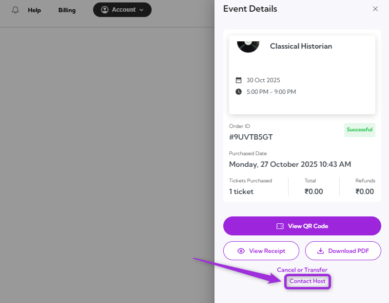

If you have any questions or need assistance with the event, you can contact the event host directly using the **Contact Host** feature. You can send a message to the organizer, and you’ll receive a response to your registered email address as soon as possible.

Let’s get started 🚀

**Step 1**: Log in to your TicketSpot account and click on the My Tickets tab in the top navigation bar.

**Step 2**: You can view all your upcoming events in the Attendee Dashboard. Select the event you purchased a ticket for and click View Tickets.

**Step 3**: Click on the Contact Host in the Event Details panel, right side of the screen, to open the message window.

**Step 4**: Type your message in the text box and click on the Send Message to submit your inquiry. The host will respond to the email address associated with your account.

A confirmation message will appear, confirming your message has been successfully sent to the host.

