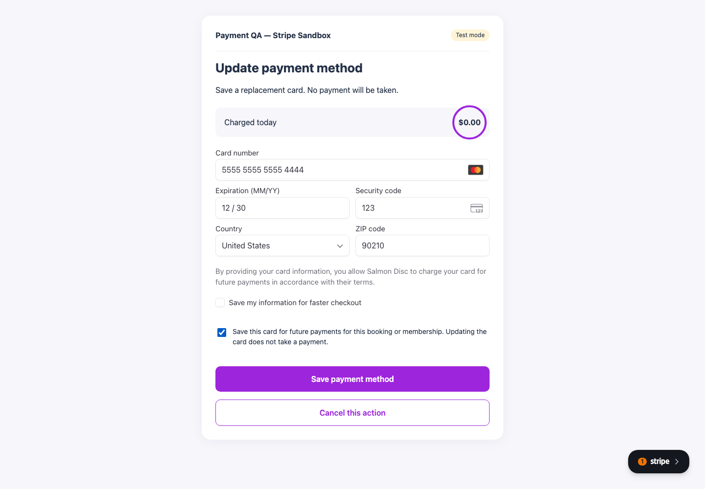
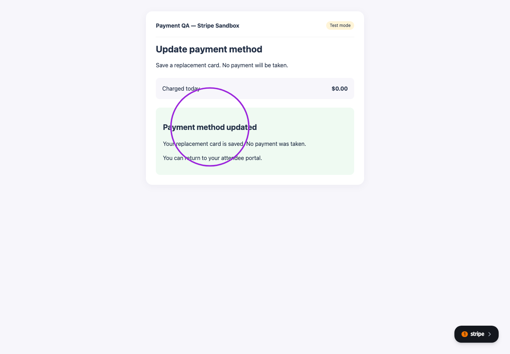
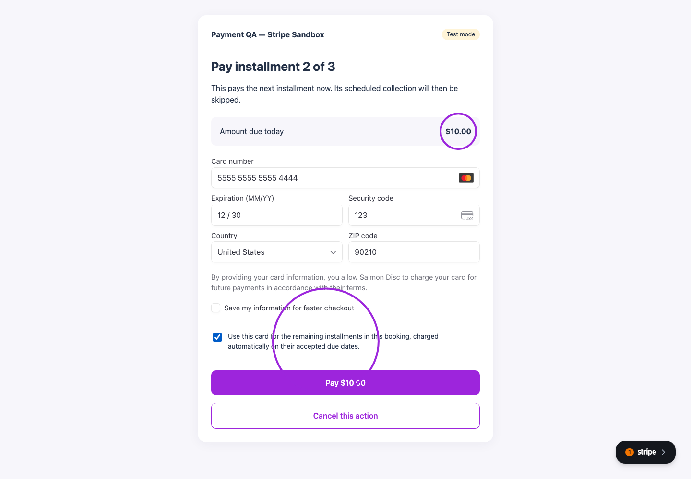
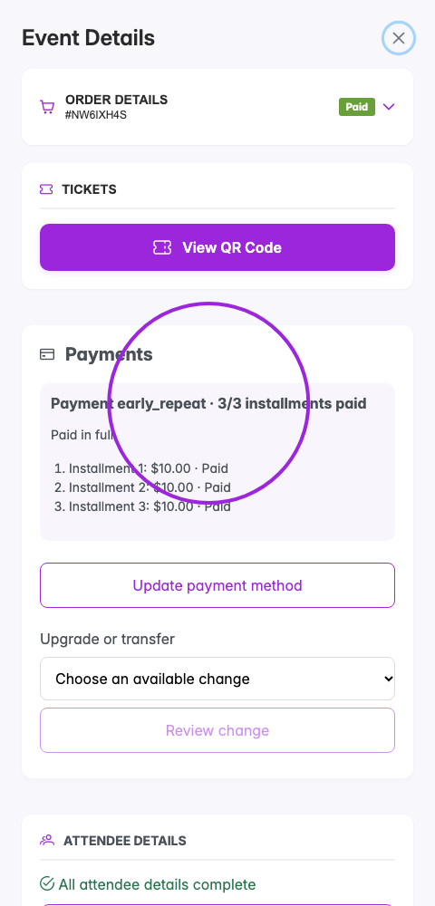
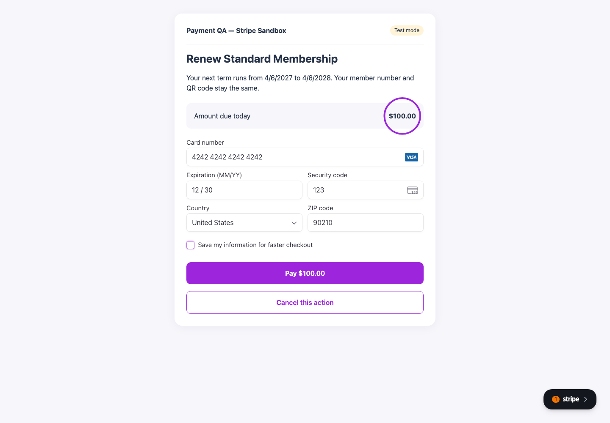
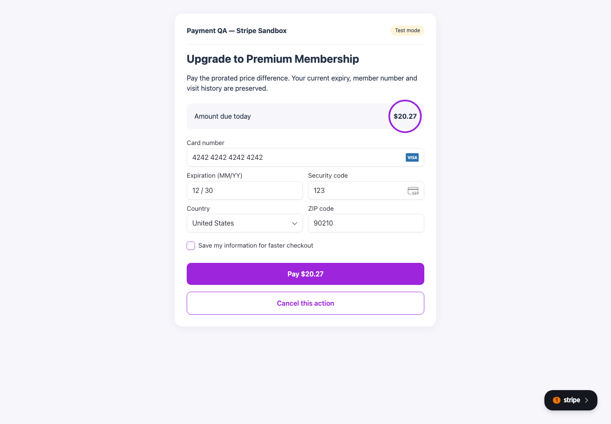
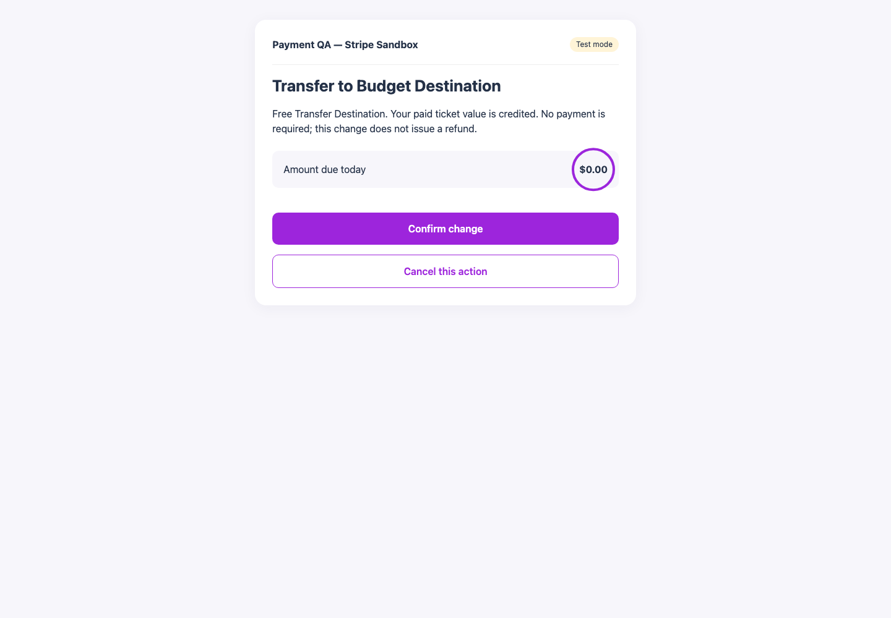
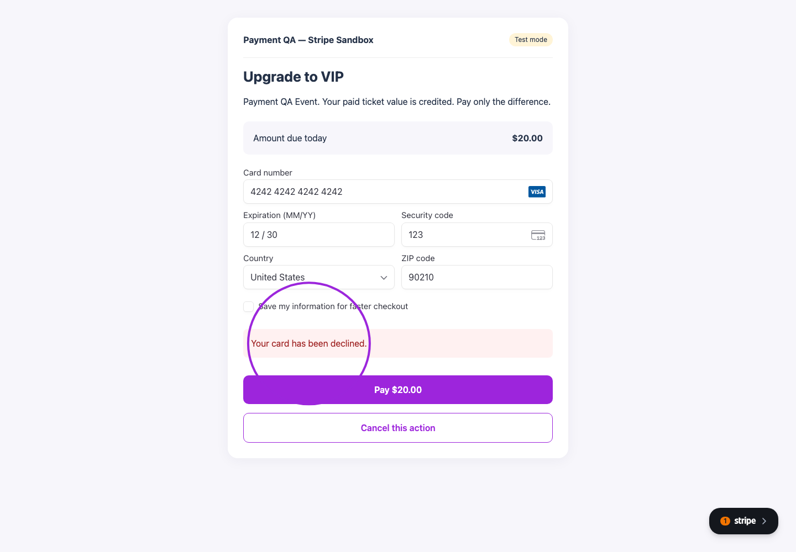
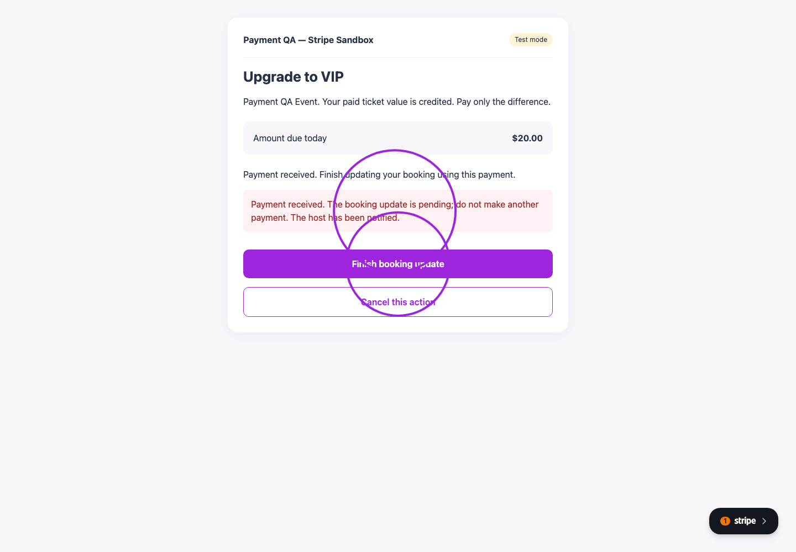

Open **My Passes**, select a ticket or membership, and find **Payments** in its details. Your organizer controls which actions are available. The secure checkout uses the organizer's name and branding.

<Note>These screenshots use synthetic bookings and Stripe test cards. Amounts are examples.</Note>

## Update a payment method

<Steps>
<Step title="Open the payment controls">
Select **Update payment method** on your booking or membership.
</Step>
<Step title="Authorize the replacement card">
Enter the card, accept the saved-card authorization, and select **Save payment method**. Updating a card takes no payment. For an installment agreement, it replaces the card used for its remaining payments.

<Frame caption="Review Charged today: $0.00 and the authorization before saving a replacement card.">
  
</Frame>
</Step>
<Step title="Check the result">
Wait for **Payment method updated**. Your installment progress and remaining balance do not change when you save a card.

<Frame caption="The replacement card is saved without taking a payment.">
  
</Frame>
</Step>
</Steps>

## Pay an installment early or recover a failed payment

The Payments card shows **1/3**, **2/3**, or **3/3 installments paid**, the remaining balance, and each accepted due date. New automatic agreements charge your saved card on or after those dates. You can pay the next unpaid installment early when the organizer allows it. Older manual agreements keep their original collection mode.

Select **Pay installment X of Y**, review the amount, enter the card and accept the authorization, then pay. You can also use this action after a declined payment or when your bank requires authentication. Only the next unpaid installment is offered.

<Frame caption="Pay the next $10 installment now. The later installment keeps its existing due date.">
  
</Frame>

Return to the portal to check the progress. A payment already made early is skipped by its scheduled collection. Saving or replacing a card does not itself settle an installment.

<Frame caption="All three installments are paid and the remaining balance is zero.">
  
</Frame>

When the final installment settles, the usual **New Order** email provides the ticket PDF, receipt and QR code, subject to any required approval. See [installment payments](/event-management/installment-payments) for the organizer's charge controls and payment filters.

## Renew or upgrade a membership

Open **Memberships → View Membership → Payments**. Select **Renew [membership name]** and review the term dates and full renewal price. An early renewal adds a term after your current expiry; an expired membership starts its new term when renewed. This is a one-time renewal payment.

<Frame caption="Review the renewal price and the dates of the next membership term.">
  
</Frame>

Your member number, QR code and visit history remain the same. The purchased term's visit allowance becomes available when that term starts. Renewing early does not reset the visits used in your current term.

For an enabled **Membership Upgrade**, choose an eligible plan under **Upgrade or transfer** and select **Review change**. An upgrade charges the prorated price difference for the current term. Its expiry and visit history stay the same; the new plan must provide at least the existing visit allowance.

<Frame caption="A current-term membership upgrade charges the prorated difference and preserves the expiry.">
  
</Frame>

A renewal or upgrade confirmation includes the updated membership PDF. Lifetime memberships do not need renewal. Upgrades need host review when a future renewal term is already purchased.

## Upgrade a ticket or transfer to another event

For an eligible fully paid booking, choose an option under **Upgrade or transfer**, then select **Review change**. The checkout credits the paid ticket value and shows the remaining price difference. Review the destination before confirming.

<Frame caption="The existing paid ticket value is credited; this upgrade charges only the $20 difference.">
  
</Frame>

A transfer at an equal or lower price can show **$0.00 → Confirm change**. It does not issue a refund. Once the change is complete, your confirmation contains the updated ticket PDF and QR code.

<Frame caption="This lower-priced event transfer requires confirmation and takes no payment.">
  
</Frame>

Self-service changes currently support Stripe card payments and standard fixed-price individual tickets. Changes involving marketplace settlement, seats, groups, series, time slots, special access rules, taxes, discounts or extra fees require a host quote. Pending balances, refunded or disputed orders and checked-in tickets also require review. Existing [Cancel or Transfer](/attendee-portal/cancel-transfer-event) requests remain available separately where enabled.

## If a payment needs attention

A declined card leaves the booking unpaid. Correct the card details or use another card in the same checkout. If prompted, complete your bank's authentication.

<Frame caption="After a declined attempt, replace the card and retry the same checkout. The booking stays unchanged until payment succeeds.">
  
</Frame>

If payment succeeds but updating the booking is interrupted, the checkout says **Payment received** and offers **Finish booking update**. Resume that action to finish using the existing payment. Contact the host with the reference if review is still needed.

<Frame caption="Finish the booking update using the payment already received.">
  
</Frame>

Closing the window keeps **Resume [action]** in the portal. Use **Cancel this action** to release an unpaid action. An uncompleted action expires after 30 minutes. A processing or paid payment is reconciled instead of being cancelled. Only one payment action can be open for a booking or membership at a time. **Open payment in a new tab** is available if the embedded checkout cannot open your bank's confirmation.
