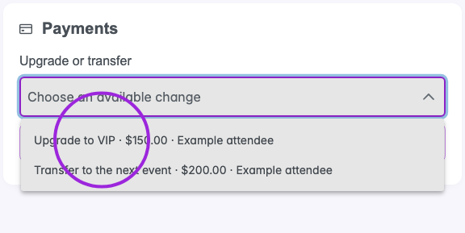
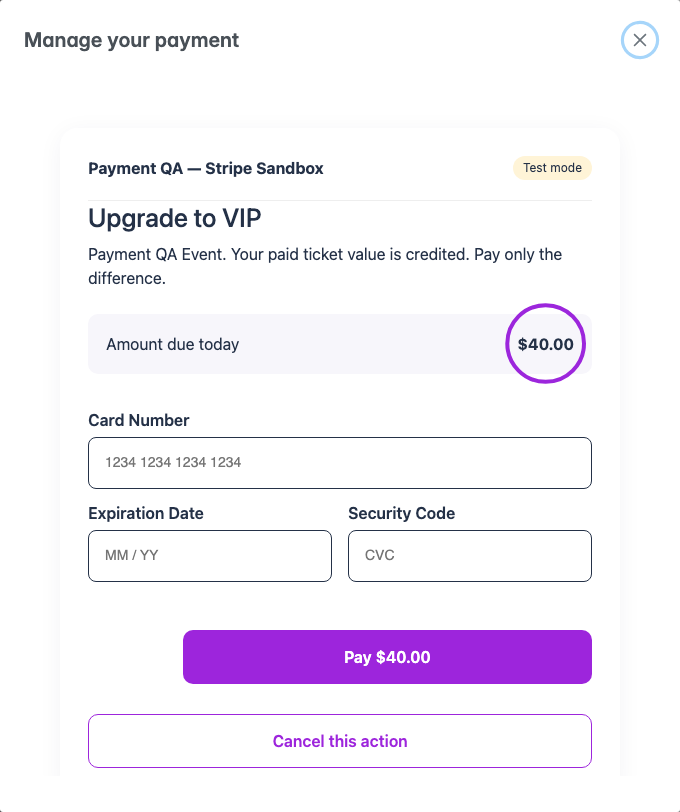
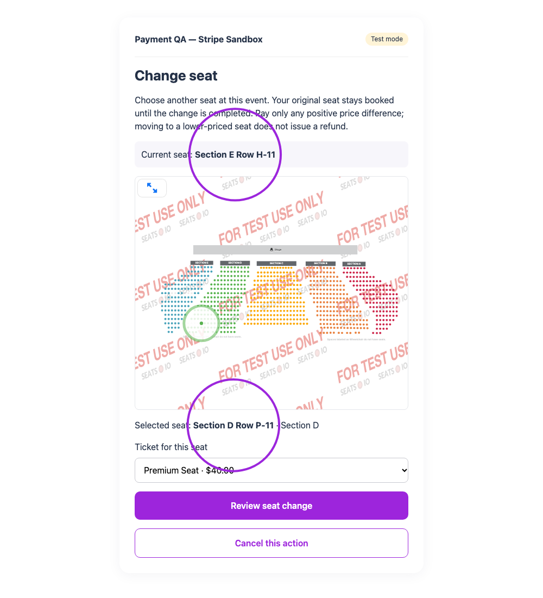
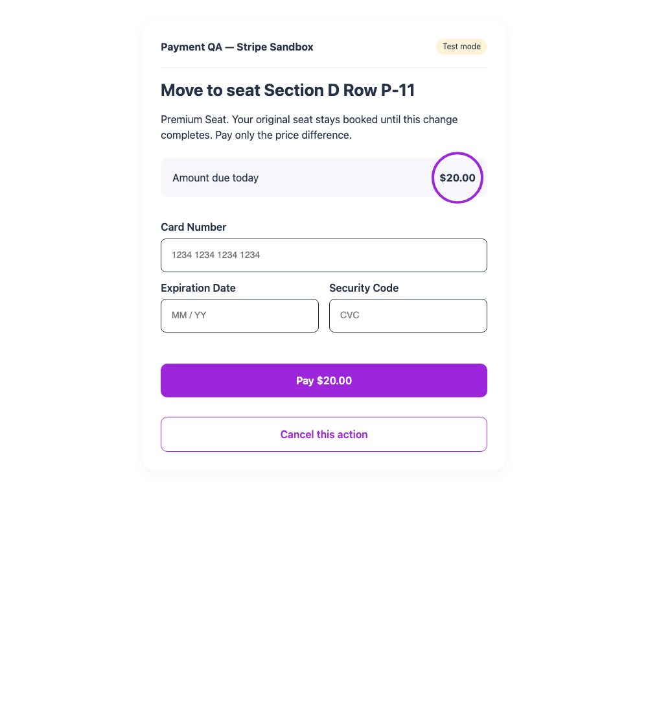
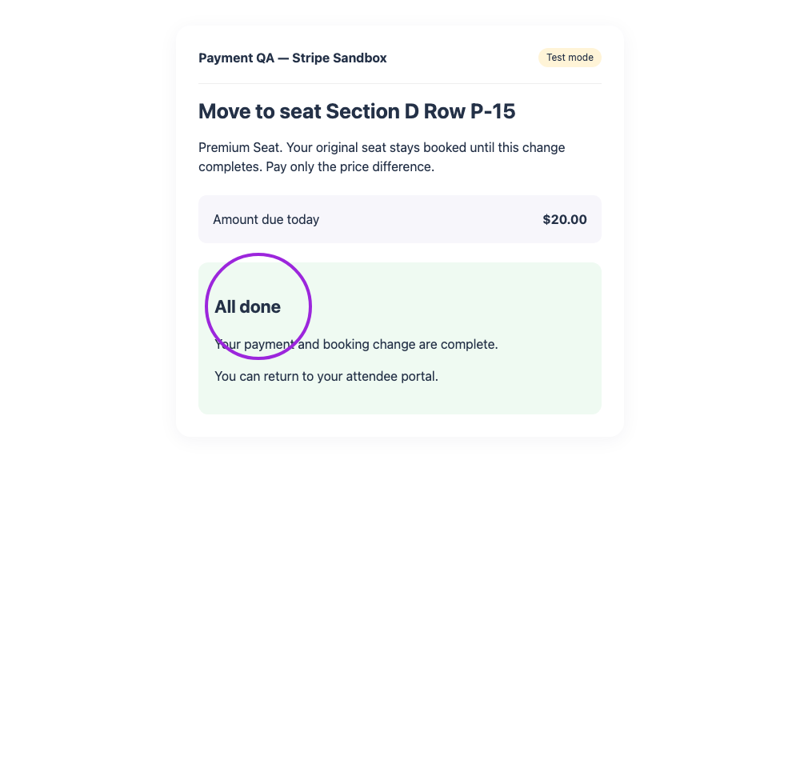

Open **My Passes**, select a ticket or membership, and find **Payments** in its details. Your organizer controls which actions are available. The secure widget checkout opens inside the portal and uses the organizer's name and branding. Updating a card keeps you in My Passes. For one-time payments, the checkout uses the organizer’s configured Stripe, PayPal or Square form. Available payment methods depend on that provider and your device. Saved-card updates and automatic installment agreements use Stripe cards.

<Note>These screenshots use synthetic bookings and Stripe test cards. Amounts are examples.</Note>

## Update a payment method

<Steps>
<Step title="Open the payment controls">
Select **Update payment method** on your booking or membership.
</Step>
<Step title="Authorize the replacement card">
For Stripe, enter the card number, expiration date and security code in the form with Visa and Mastercard logos. Accept the saved-card authorization, and select **Save payment method**. Updating a card takes no payment. For an installment agreement, it replaces the card used for its remaining payments.

<Frame caption="Review Charged today: $0.00 and the authorization before saving a replacement card.">
  
</Frame>
</Step>
<Step title="Check the result">
Wait for **Payment method updated**. Your installment progress and remaining balance do not change when you save a card.

<Frame caption="The replacement card is saved without taking a payment.">
  
</Frame>
</Step>
</Steps>

## Pay an installment early or recover a failed payment

The Payments card shows **1/3**, **2/3**, or **3/3 installments paid**, the remaining balance, and each accepted due date. New automatic agreements charge your saved card on or after those dates. You can pay the next unpaid installment early when the organizer allows it. Older manual agreements keep their original collection mode.

Select **Pay installment X of Y**, review the amount, enter the card and accept the authorization, then pay. You can also use this action after a declined payment or when your bank requires authentication. Only the next unpaid installment is offered.

<Frame caption="Pay the next $10 installment now. The later installment keeps its existing due date.">
  
</Frame>

Return to the portal to check the progress. A payment already made early is skipped by its scheduled collection. Saving or replacing a card does not itself settle an installment.

<Frame caption="All three installments are paid and the remaining balance is zero.">
  
</Frame>

When the final installment settles, the usual **New Order** email provides the ticket PDF, receipt and QR code, subject to any required approval. See [installment payments](/event-management/installment-payments) for the organizer's charge controls and payment filters.

## Renew or upgrade a membership

Open **Memberships → View Membership → Payments**. Select **Renew [membership name]** and review the term dates and full renewal price. An early renewal adds a term after your current expiry; an expired membership starts its new term when renewed. This is a one-time renewal payment.

<Frame caption="Review the renewal price and the dates of the next membership term.">
  
</Frame>

Your member number, QR code and visit history remain the same. The purchased term's visit allowance becomes available when that term starts. Renewing early does not reset the visits used in your current term.

For an enabled **Membership Upgrade**, choose an eligible plan under **Upgrade or transfer** and select **Review change**. An upgrade charges the prorated price difference for the current term. Its expiry and visit history stay the same; the new plan must provide at least the existing visit allowance.

<Frame caption="A current-term membership upgrade charges the prorated difference and preserves the expiry.">
  
</Frame>

The organizer’s usual order confirmation is resent after renewal or upgrade and includes the updated membership PDF and a receipt for the additional payment. Lifetime memberships do not need renewal. Upgrades need host review when a future renewal term is already purchased.

## Upgrade a ticket or transfer to another event

For an eligible fully paid booking, choose an option under **Upgrade or transfer**, then select **Review change**. The checkout credits the paid ticket value and shows the remaining price difference. Review the destination before confirming.

<Frame caption="Choose an available upgrade or transfer, then select Review change. Prices shown are examples.">
  
</Frame>

A free ticket can also be upgraded to a paid ticket when the organizer enables upgrades. Its credit is $0, so the checkout charges the full price of the selected ticket. The selected ticket must be available within its sales window and meet the order’s ticket limit. An upgrade keeps your existing event place, while a transfer requires space at the destination event. The selected ticket is reserved while you complete the payment.

<Frame caption="A free admission upgraded to a $40 VIP ticket charges $40 once.">
  
</Frame>

<Frame caption="The existing paid ticket value is credited; this upgrade charges only the $20 difference.">
  
</Frame>

A transfer at an equal or lower price can show **$0.00 → Confirm change**. It does not issue a refund. Once the change is complete, the organizer’s usual order confirmation is resent with the updated ticket PDF and QR code, plus a receipt for any additional payment. The change also appears in the booking’s activity history, where the organizer sees the previous and new ticket names.

<Frame caption="This lower-priced event transfer requires confirmation and takes no payment.">
  
</Frame>

Self-service changes support standard fixed-price individual tickets using the organizer’s configured payment provider. Use **Change seat** below for an eligible seated booking. Changes involving marketplace settlement, bookings that use more than one capacity place, groups, series, time slots, special access rules, taxes, discounts or extra fees require a host quote. Pending balances, refunded or disputed orders and checked-in tickets also require review. Existing [Cancel or Transfer](/attendee-portal/cancel-transfer-event) requests remain available separately where enabled.

## Choose a different seat

Your organizer can enable **Design → Attendee Ticket Page → Self-Service Seat Changes**. This switch is **off by default** and is available on Business and higher. When enabled, an eligible booking with a confirmed seat shows **Change seat** in Payments.

<Steps>
<Step title="Choose a replacement">
Select **Change seat**, then choose one available seat on the event’s seating chart. If its category offers several ticket types, choose the applicable ticket. Select **Review seat change**.

<Frame caption="Choose a replacement on the same seating chart. The current seat remains booked.">
  
</Frame>
</Step>
<Step title="Review the difference">
The checkout credits your existing paid value. A higher-priced ticket charges only the positive difference using the organizer’s configured payment form. An equal or lower-priced choice shows **$0.00 → Confirm change**; it does not issue a refund. Your replacement is reserved while you complete checkout.

<Frame caption="Moving from a $20 ticket to a $40 seat ticket charges $20.">
  
</Frame>
</Step>
<Step title="Confirm the change">
Complete the payment or select **Confirm change**. After success, the new seat is booked, the previous seat is released, and the booking shows the replacement. The organizer’s usual order confirmation is resent with the updated ticket PDF and QR code, subject to their communication settings. The attendee activity history records the previous and new seat labels and any ticket change.

<Frame caption="The seat change is complete. Reopening the action does not take another payment.">
  
</Frame>
</Step>
</Steps>

Changing a seat at the same event keeps your existing event place. Moving within the same ticket type works even when that ticket is sold out; switching ticket types requires availability in the replacement type. Pricing comes from the ticket assigned to the seat’s category.

A declined payment keeps your original seat booked. Retry the same action with another card. **Cancel this action** releases the unpaid replacement and keeps your original seat. Closing checkout leaves a resumable action; an unpaid action expires after 30 minutes. If payment was received but the booking update is pending, use **Finish booking update** in the same action.

Seat changes support individual, fully paid, unscanned bookings at the same future event on its active published chart. Tables, group seats, restricted channels, pending balances, refunded or disputed orders, complex taxes/fees/discounts, and changes involving series or time slots require the host’s help.

## If a payment needs attention

A declined card leaves the booking unpaid. Correct the card details or use another card in the same checkout. If prompted, complete your bank's authentication.

<Frame caption="After a declined attempt, replace the card and retry the same checkout. The booking stays unchanged until payment succeeds.">
  
</Frame>

If payment succeeds but updating the booking is interrupted, the checkout says **Payment received** and offers **Finish booking update**. Resume that action to finish using the existing payment. Contact the host with the reference if review is still needed.

<Frame caption="Finish the booking update using the payment already received.">
  
</Frame>

Closing the window keeps **Resume [action]** in the portal. Use **Cancel this action** to release an unpaid action. An uncompleted action expires after 30 minutes. A processing or paid payment is reconciled instead of being cancelled. Only one payment action can be open for a booking or membership at a time.

Payment options and the secure checkout display a loading spinner while opening. If the checkout cannot load, select **Retry** in the payment window to continue inside the portal.
