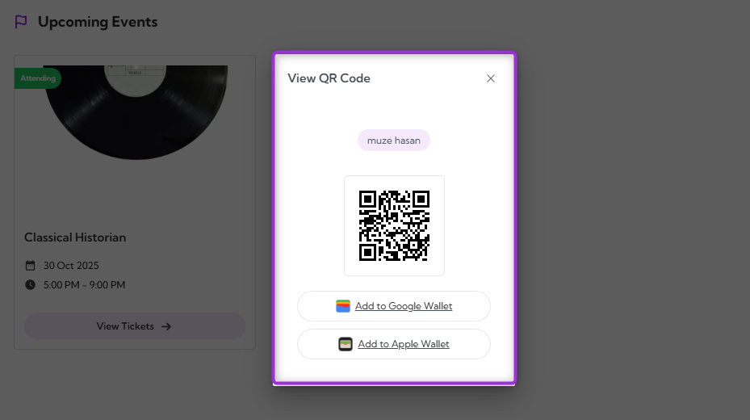
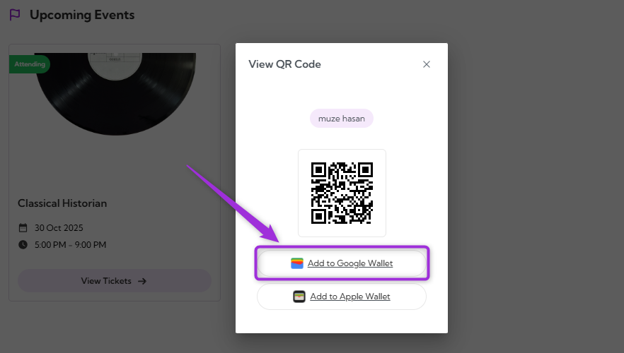
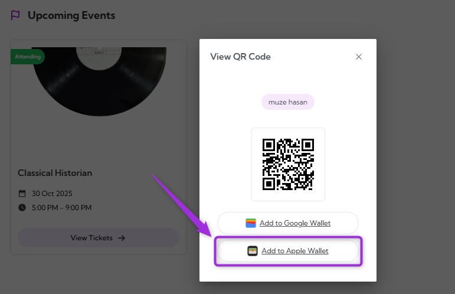

The **QR Codes** and **Digital Wallet** feature allows attendees to access and use digital tickets for event entry. Each ticket includes a unique QR code that can be viewed directly in the **Attendee Dashboard** or saved to a mobile wallet for quick check-in at the venue.

Let’s get started 🚀

## View QR Code

You can view your event QR codes directly from your **TicketSpot account** for quick check-in at the venue.

**Step 1**: Log in to your **TicketSpot account** and click on the **My Tickets** tab in the top navigation bar.

**Step 2**: You can view all your upcoming events in the Attendee Dashboard. Select the event you purchased a ticket for and click on **View Tickets**.

**Step 3**: Click on the **View QR Code** to see the event’s QR code.

**Step 4**: A **View QR Code** window appears showing your ticket’s QR code. You can scan this code at the event entrance or use the options below to add it to your digital wallet (Google or Apple wallet) for quick access.

> **Note:** Each ticket has a unique QR code. Once scanned at the event check-in, it can’t be reused. Make sure to present the correct QR code for each attendee to avoid access issues.

## Digital Wallet

The **Digital Wallet** feature makes it easier to access your tickets during check-in. After viewing your QR code, you can save the ticket to your mobile wallet for quick and reliable access at the venue — even without an internet connection.  

Both Google Pay and Apple Wallet provide offline access to tickets, event reminders, and quick ticket display from your phone’s lock screen or notifications for quick and easy entry.

### Add to Google Wallet (Android)

1. Click on the **Add to Google Wallet** below your QR code.

2. Review the details of your event and click on **Add** to confirm. This saves your ticket pass to your Google Wallet.

Your ticket will appear in the **Google Wallet** app with the event name, QR code, date, and time. You can open it anytime for scanning at the venue entrance.

### For iOS (Apple Wallet)
1. Click on the **Add to Apple Wallet** below your QR code.

2. Review the details of your event and click on **Add to wallet** to confirm. This saves your ticket pass to your Google Wallet.

You can view your saved ticket anytime in the **Apple Wallet** app for check-in at the event.