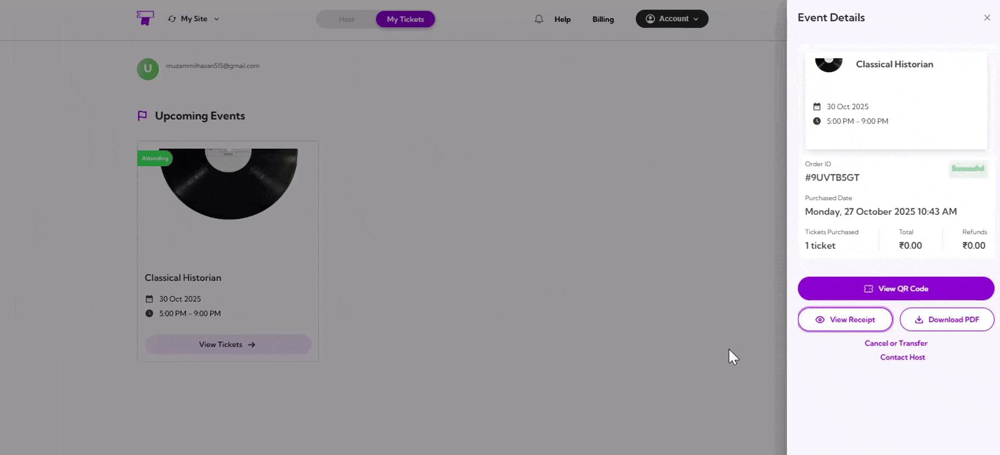
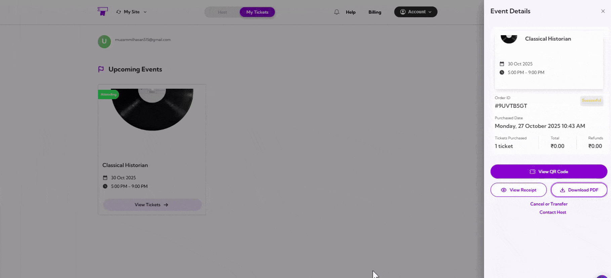

Access your purchase receipt and download a PDF directly from the **Event Details** panel. You can view your payment confirmation or download the PDF, which includes the event details and QR code for entry. This makes it easy to keep a record and have your entry ready for check-in.

Let’s get started 🚀

## Navigation

**Step 1**: Log in to your **TicketSpot account** and click on the **My Tickets** tab in the top navigation bar.

**Step 2**: You can view all your upcoming events in the Attendee Dashboard. Select the event you purchased a ticket for and click on **View Tickets**.

You will see the **Event Details** panel appear on the right side of the screen.

## View Receipt
Click on the **View Receipt** to open your purchase receipt. This will display key details such as the event name, date, time, ticket holder’s name, order date, and payment summary.

## Download PDF
Click on the **Download PDF** to get a printable version of your event details. The PDF includes event details, ticket holder information, and the QR code for entry. You can print it or save it to your device as a backup for easy access.

