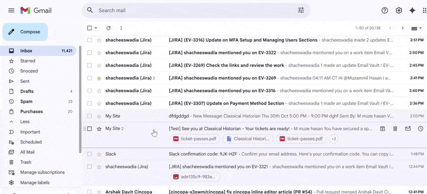
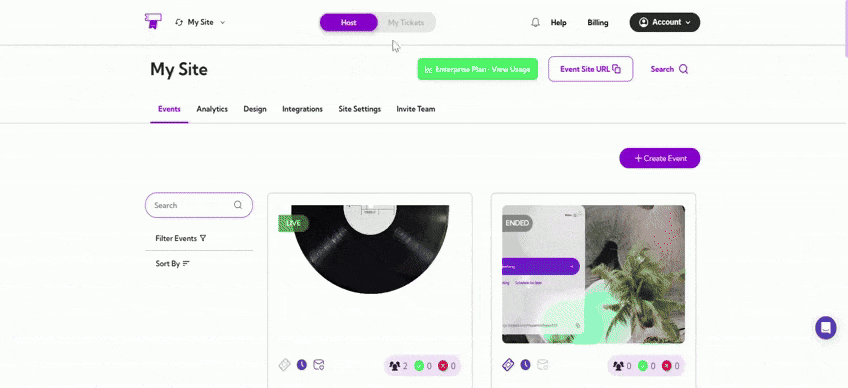
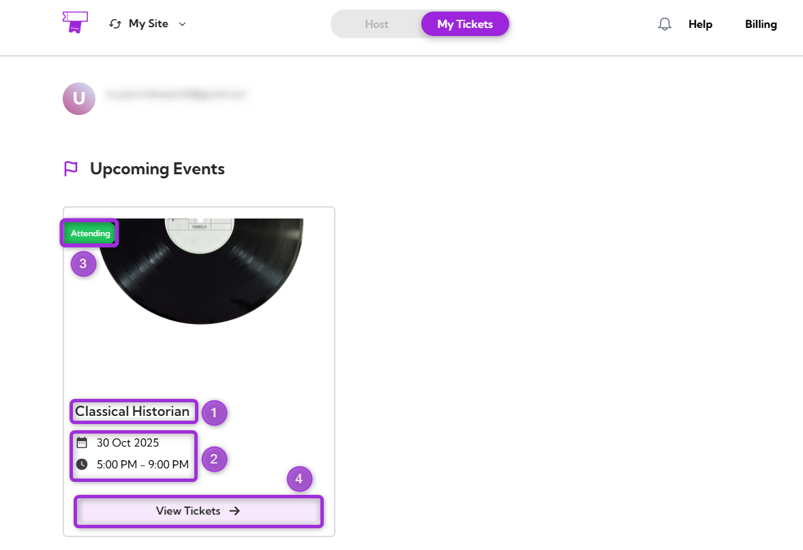
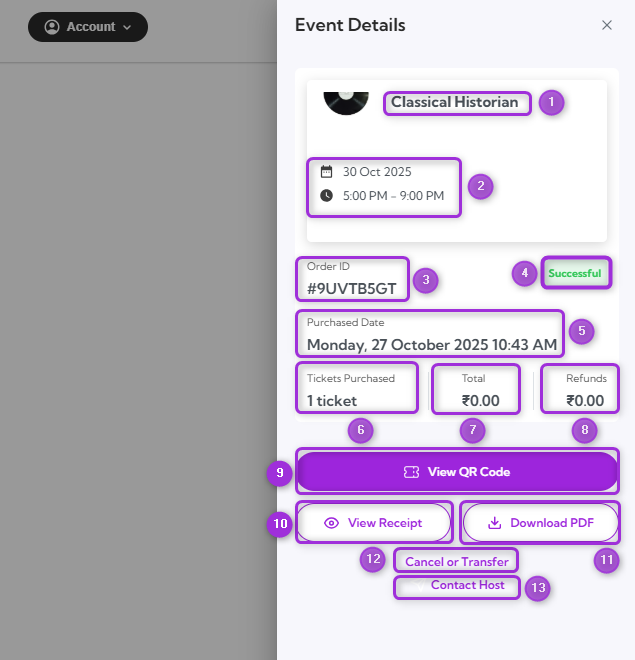

The **Viewing Your Tickets** feature allows attendees to access and manage their event tickets through the **TicketSpot Attendee Portal**. From the dashboard, users can view ticket details, download ticket PDFs, cancel or transfer a ticket, and contact the organizer directly for assistance. All upcoming and past events are displayed in one centralized view, making it easy to manage bookings and event access efficiently.

Let’s get started 🚀

## Prerequisites

Before accessing your tickets, ensure the following:
- You have **purchased tickets** using your valid email address.
- You have **access to that email inbox** to receive login codes or confirmation links.

## Accessing Your Tickets

There are two ways to access your tickets:

#### From Confirmation Email

1. Open the **ticket confirmation email** sent to your registered email address.
2. Click on the **View Tickets**.
3. You’ll be redirected to the **Attendee Dashboard**, where all your event tickets are displayed.

#### From Event Website

1. Log in to your **TicketSpot account**. In the top navigation bar, click **My Tickets**.
2. You’ll see all your events listed. Find the event you want and click **View Ticket** to open its details.

## Upcoming Events

The **Upcoming Events** section lists all events associated with your TicketSpot account. Each event card includes key details and a quick action button to view ticket information.

| Ref. | Field | Description |
|------|----------------|-------------|
| 1. | Event Name | Displays the event title, allowing you to identify the event easily. |
| 2. | Date and Time | Shows the scheduled date and start time of the event. This helps confirm when the event will take place. |
| 3. | Status | Indicates the current event participation status, such as Attending, Upcoming, or Cancelled. |
| 4. | View Tickets | Opens the **Event Details** panel for that event, where you can see your ticket order information and available actions. |

## Viewing Event Details
When you click **View Tickets** on an event card, the **Event Details** panel appears on the right side of the screen. It displays complete order information and available ticket actions.

| Ref. | Field / Action | Description |
|------|----------------|-------------|
| 1. | Event Name | Displays the full event title to confirm which event the tickets belong to. |
| 2. | Date and Time | Shows the exact date and start time of the event. |
| 3. | Order ID | A unique identifier assigned to your ticket purchase. Use this for tracking or contacting support. |
| 4.| Status | Indicates the current ticket order status, such as Successful, Pending, or Cancelled. |
| 5. | Purchase Date | Displays when the ticket order was completed. |
| 6. | Tickets Purchased | Shows the total number of tickets included in the order. |
| 7. | Total | Displays the total amount paid, including any fees or taxes. |
| 8. | Refunds | Shows refund details if any part of the purchase was refunded. |
| 9. | View QR Code | Opens the digital QR code for check-in at the event entrance. |
| 10. | View Receipt | Displays the full purchase summary, including payment and transaction details. |

