**Attendee Communication Design** allows you to control every message sent to your attendees. You can adjust the titles, labels, and details for confirmations, reminders, announcements, waitlist updates, and checkout messages. Each communication type can be customized so the information is clear, consistent, and aligned with your event. This ensures attendees receive the right details at the right time throughout their entire event experience.

This configuration creates a seamless communication journey—from ticket confirmation to post-event updates—so attendees always receive clear, timely, and relevant information.

Let’s get started 🚀

## Navigation

**Step 1:** Log in to your **Ticket Spot** account and click on the **Design** tab.

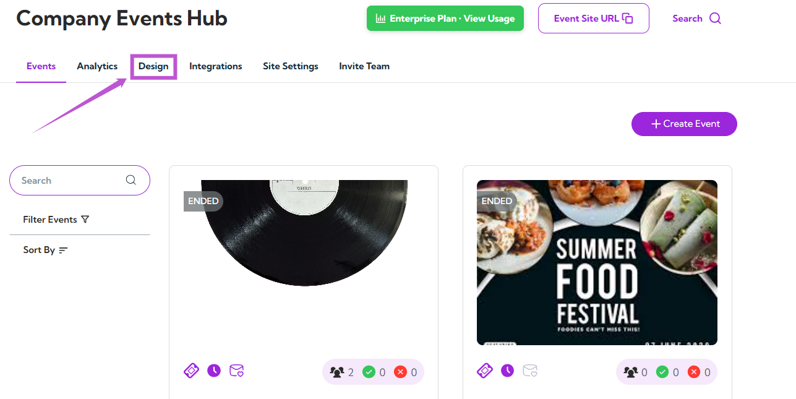

**Step 2:** Click on the **Attendee Communication** tab to open the design settings.

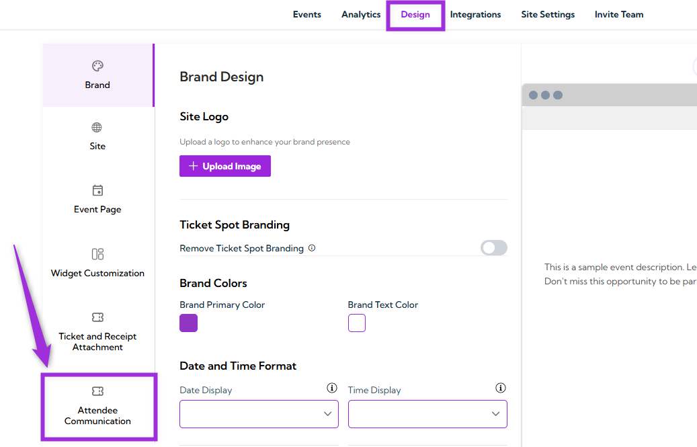

**Step 3:** Select the **communication type** you want to customize from the dropdown menu:

- Email Communication  
- Checkout Communication  
- Check-In Communication  

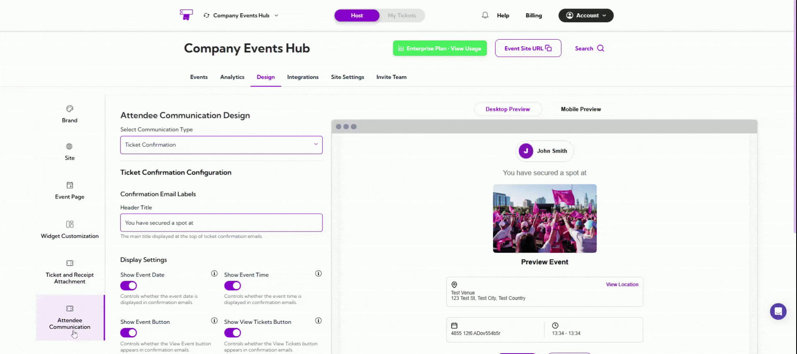

You will be navigated to the design settings for the selected type.

# Email Communication

Email Communication includes all the automated messages sent to attendees, such as confirmations, reminders, announcements, and status updates. Each email type can be customized individually to match your event’s tone and provide the right information at the right time.

**Available Email Types include:**

- Ticket Confirmation
- Event Reminder
- Post Event
- Announcement
- Pending Approval
- Approval Declined
- Approval Confirmed
- Waitlist Confirmation
- Waitlist Ticket Released
- Not Attending

## Ticket Confirmation

Ticket Confirmation design controls how the confirmation email appears when an attendee completes a registration or ticket purchase. This includes customizing the main heading shown at the top of the email, choosing whether event details such as date and time are displayed, and updating the text used for action buttons like View Event, View Tickets, or View Location.

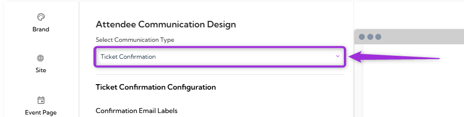

### Confirmation Email Labels

| Field | Description | Example |
|-------|-------------|---------|
| Header Title | The main title is displayed at the top of the confirmation email. | “You have secured a spot at” |

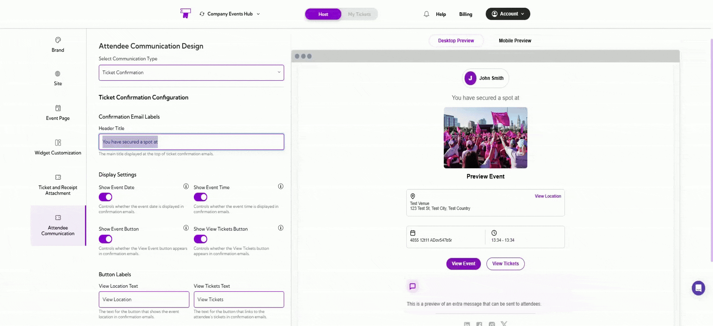

### Display Settings

| Setting | Description |
|--------|-------------|
| Show Event Date | When enabled, the event date is displayed inside the confirmation email. |
| Show Event Time | When enabled, the event time appears inside the confirmation email. |
| Show Event Button | When enabled, a button linking to the event page is shown in the email. |
| Show View Tickets Button | When enabled, a button that opens the attendee’s ticket is included in the email. |

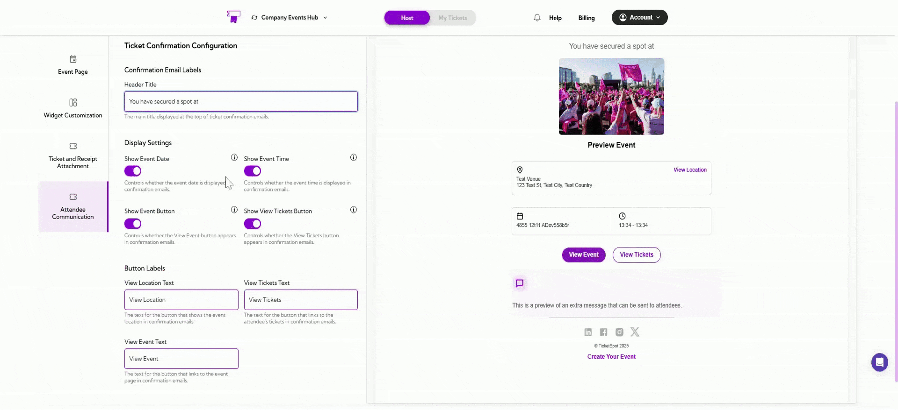

### Button Labels

| Field | Description | Example |
|--------|-------------|---------|
| View Location Text | The text for the button that shows the event location in confirmation emails. | View Location |
| View Tickets Text | The text for the button that links to the attendee's tickets in confirmation emails. | View Tickets |
| View Event Text | The text for the button that links to the event page in confirmation emails. | View Event |

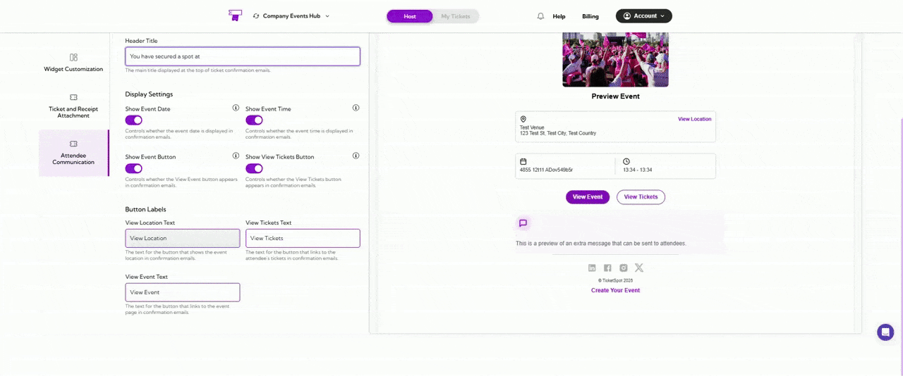

## Event Reminder

Event Reminder design controls the appearance of reminder emails sent before the event begins. These settings allow you to customize the title, countdown text, time-unit labels, and the action buttons included in the reminder email.

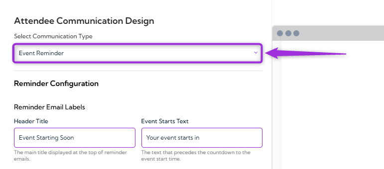

### Reminder Email Labels

| Field | Description |
|--------|-------------|
| Header Title | The main display is at the top of the reminder email. |
| Event Starts Text | The text shown before the countdown to the event start time. |

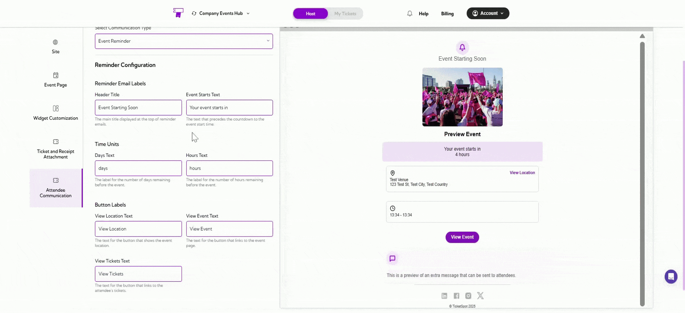

### Time Units

| Field | Description |
|--------|-------------|
| Days Text | The label for the number of days remaining before the event. |
| Hours Text | The label for the number of hours remaining before the event. |

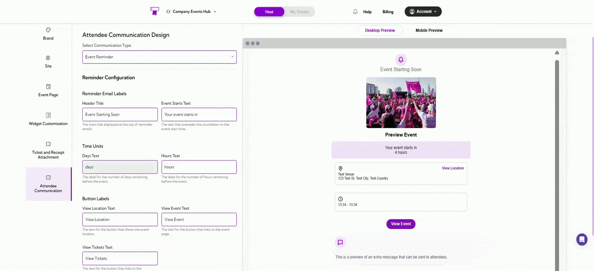

### Button Labels

| Field | Description |
|--------|-------------|
| View Location Text | The text for the button that opens the event location. |
| View Event Text | The text for the button that links to the event page. |
| View Tickets Text | The text for the button that links to the attendee’s tickets. |

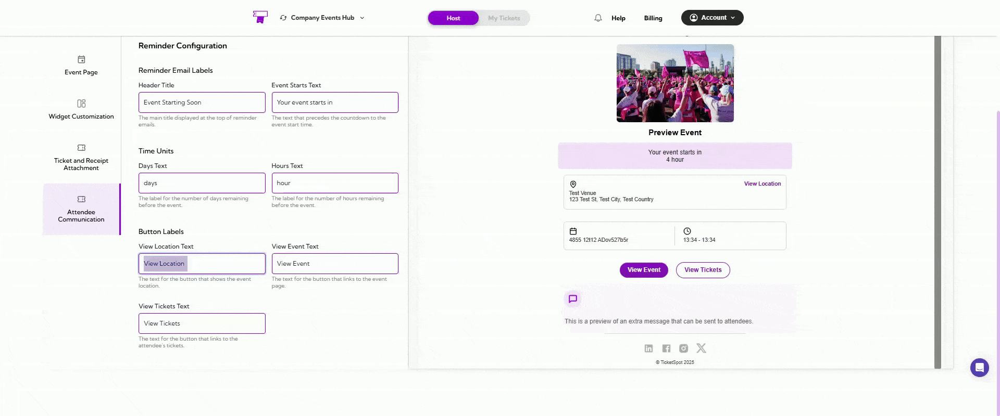

## Post Event

Post Event design controls the email sent to attendees after the event has ended. This message is typically used to thank participants, share follow-up information, or include a note from the host. The settings allow you to customize the main heading and the title that appears above any custom message you want to include.

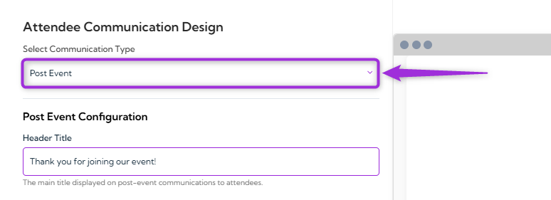

### Post Event Configuration

| Field | Description |
|--------|-------------|
| Header Title | The main title is displayed at the top of the post-event email. |
| Custom Message Title | The title is shown before any custom message you want to include. |

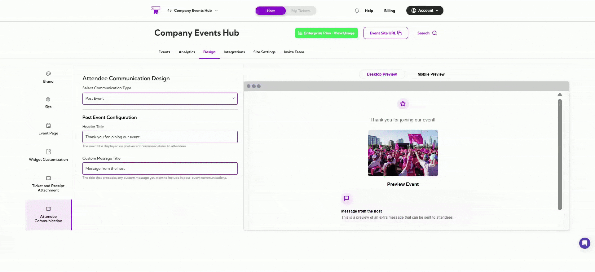

## Announcement

**Announcement** design controls how announcement emails appear when you need to send important updates or extra information to attendees. These settings let you customize the announcement title, sender label, and the button text that links attendees back to the event page.

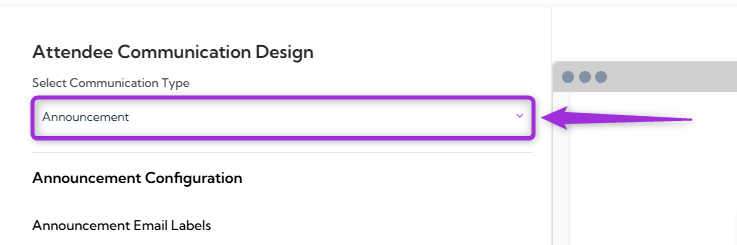

### Announcement Email and Button Labels

| Field | Description |
|--------|-------------|
| Announcement Title | The main title displayed at the top of the announcement email. |
| Sent By Label | The label shown before the sender’s name. If left blank, the sender name will not appear. |
| View Event Text | The text for the button that links to the event page. |

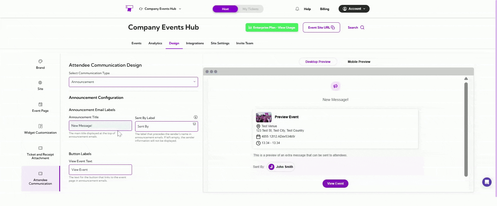

## Pending Approval

**Pending Approval** Email Design helps you customize how the message appears to attendees when their registration is waiting for host approval, including the title, subject line, and the message shown inside the approval notification.

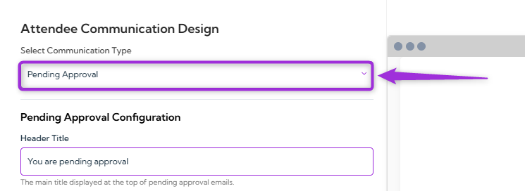

### Pending Approval Configuration

| Field | Description |
|--------|-------------|
| Header Title | The main title displayed at the top of the pending approval email. |
| Email Subject | The subject line used for pending approval notifications. |
| Message Content | The message explaining their registration is awaiting host approval. |

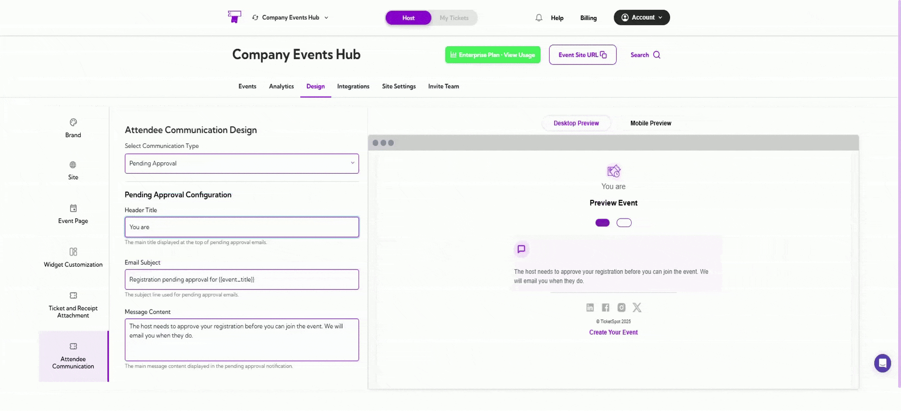

## Approval Declined

**Approval Declined** Email Design allows you to customize the message shown to attendees when their registration request is not approved. This includes updating the title, subject line, and the explanation provided in the declined notification.

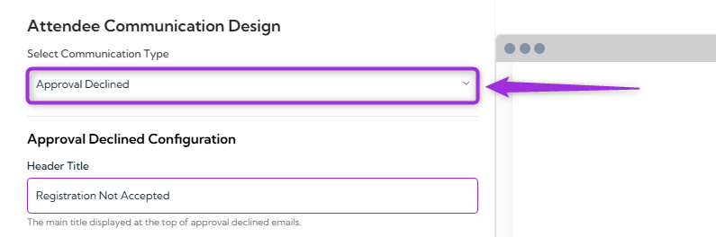

### Approval Declined Configuration

| Field | Description |
|--------|-------------|
| Header Title | The main title displayed at the top of approval-declined emails. |
| Email Subject | The subject line used for approval-declined notifications. |
| Message Content | The message explaining why registration was not accepted. |

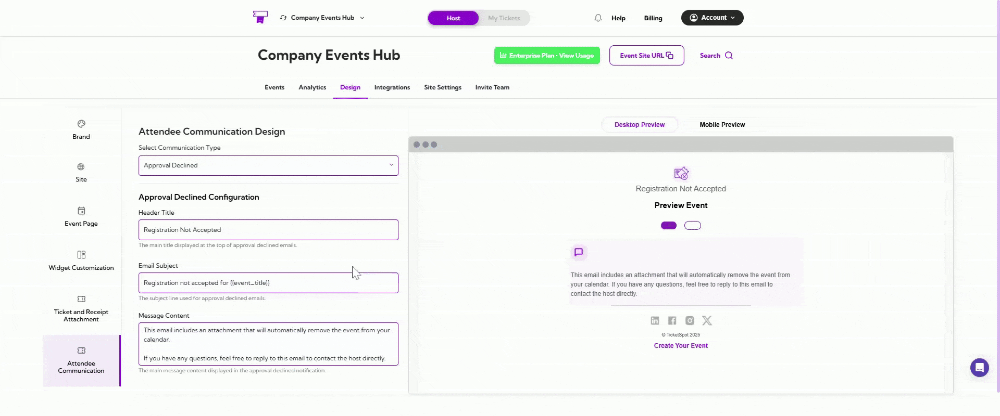

## Approval Confirmed

**Approval Confirmed** Email Design allows you to customize the message shown to attendees when their registration has been approved. This includes setting the title, email subject, and confirmation message that appears in the notification.

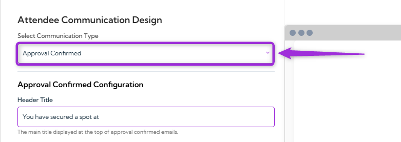

### Approval Confirmed Configuration

| Field | Description |
|--------|-------------|
| Header Title | The main title displayed at the top of approval-confirmed emails. |
| Email Subject | The subject line used for approval confirmation. |
| Message Content | The confirmation message shown after approval. |

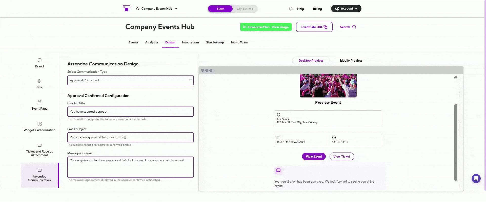

## Waitlist Confirmation

Waitlist Confirmation Email Design allows you to customize the message sent when an attendee joins the waitlist for an event. This includes setting the title, subject line, and notification message that explains their waitlist status.

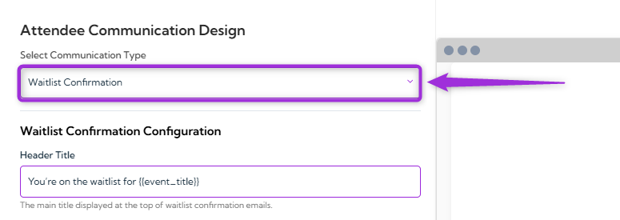

### Waitlist Confirmation Configuration

| Field | Description |
|--------|-------------|
| Header Title | The main title shown at the top of the waitlist confirmation email. |
| Email Subject | The subject line used for waitlist confirmations. |
| Message Content | Message informing the attendee they have been added to the waitlist. |

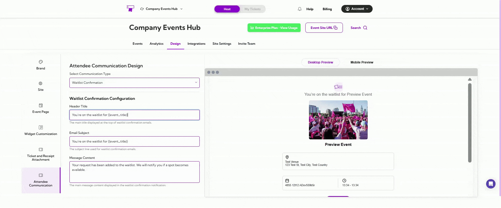

## Waitlist Ticket Released

Waitlist Ticket Released Email Design allows you to customize the message sent when a spot becomes available for someone on the waitlist. This notification confirms their registration approval and provides event details.

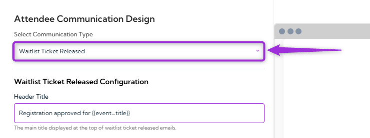

### Waitlist Ticket Released Configuration

| Field | Description |
|--------|-------------|
| Header Title | The main title shown at the top of the waitlist ticket release email. |
| Email Subject | Subject line used when informing attendees that a spot has opened. |
| Message Content | Message confirming their place and next steps. |

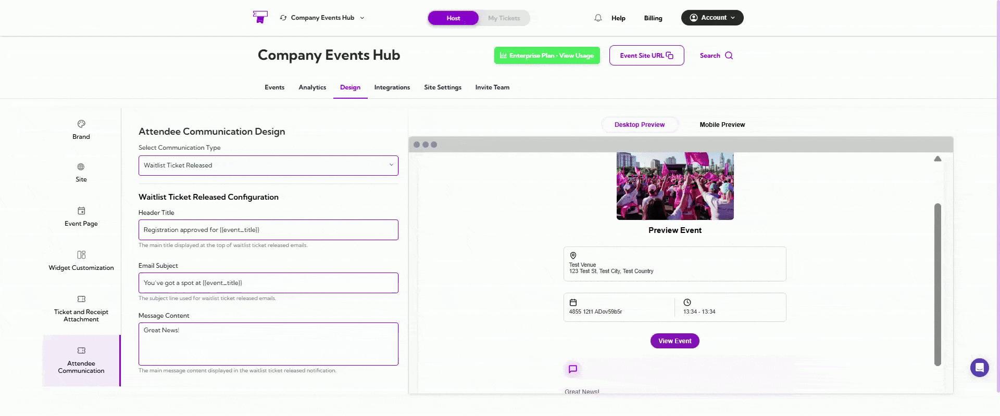

## Not Attending

Not Attending Email Design allows you to customize the message sent when an attendee is marked as not going. This notification email helps the attendee know their status has been updated and provides a clear message from the event host.

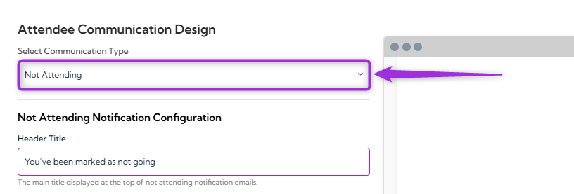

### Not Attending Notification Configuration

| Field | Description |
|--------|-------------|
| Header Title | The main title shown at the top of the not-attending email. |
| Email Subject | Subject line for notifying an attendee they’re marked as not attending. |
| Message Content | Message confirming the change and relevant info. |

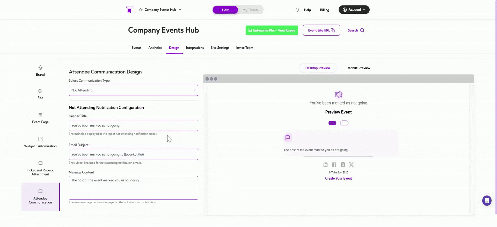

# Checkout

**Checkout communication** templates allow you to customize what attendees see immediately after completing their purchase. This includes the order confirmation page, labels, buttons, and optional actions like viewing receipts or downloading passes. These settings help you create a clear, branded post-purchase experience.

## Checkout Complete

**Checkout Complete** design settings allow you to control how the final confirmation screen appears once an attendee finishes their order. You can customize the header, labels, and action buttons so the page clearly summarizes the order and gives attendees quick access to tickets, receipts, and other follow-up actions.

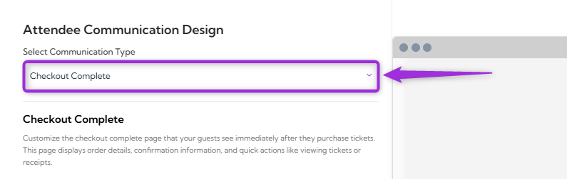

### Confirmation Page Labels

| Field | Description |
|--------|-------------|
| Header Title | The main title on the checkout complete page. |
| Order ID Label | The label before the order ID. |
| Confirmation Message | The message confirming tickets have been sent. |

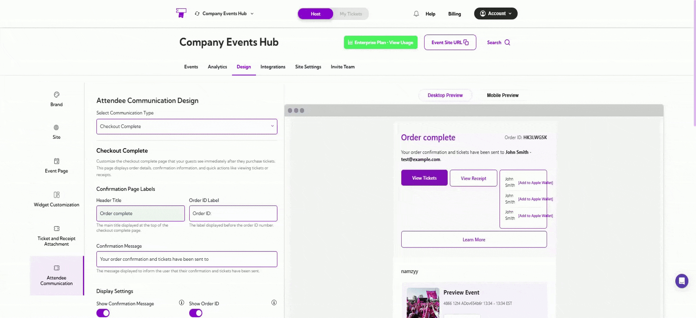

### Display Settings

Each toggle controls whether a specific element appears on the checkout complete page:

| Field | Description |
|--------|-------------|
| Show Confirmation Message | Displays confirmation text. |
| Show Order ID | Displays the order ID. |
| Show View Tickets Button | Shows View Tickets button. |
| Show View Receipt Button | Shows View Receipt button. |
| Show Download Pass Button | Shows Apple Wallet pass button. |
| Show Custom Link Button | Shows a custom external link button. |
| Show Add to Calendar | Displays Add to Calendar option. |

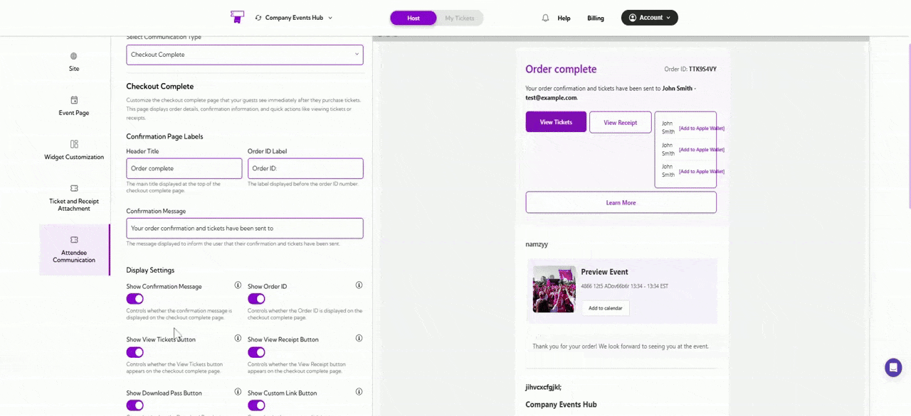

### Button Labels

| Ref | Field                   | Description |
|-----|--------------------------|-------------|
| 1   | View Tickets Button Text | Label for the View Tickets button. |
| 2   | View Receipt Button Text | Label for the View Receipt button. |
| 3   | Download Pass Button Text | Label for the Download Pass (Apple Wallet) button. |
| 4   | Custom Link Button Text  | Label for the custom button that opens an external link. |
| 5   | Custom Link URL          | The URL that opens when the custom button is clicked (must include https://). |

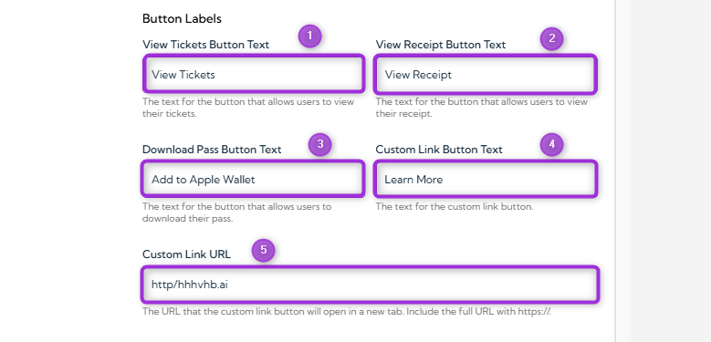

### Event Information Labels

| Ref | Field                | Description |
|-----|----------------------|-------------|
| 1.   | Your Order Is For Text | The text is shown before the event details. |
| 2.   | Add to Calendar Text  | Label for the Add to Calendar option. |
| 3.   | Manage Tickets Text   | Label for the link that directs attendees to manage their tickets. |
| 4.   | You Ordered From Text | Text displayed before the host/organizer information. |
| 5.  | Custom Message Title  | The title is used if you add a custom message from the host. |

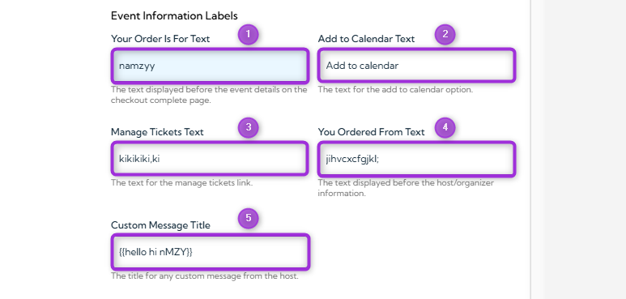

# Shopify Thank You Page

**Shopify Thank You Page** design settings allow you to control how the final confirmation screen appears after customers complete their purchase through Shopify. These options enable you to edit the header, labels, and action buttons, allowing customers to quickly access their tickets, download passes, or add the event to their calendar directly from the Shopify checkout flow.

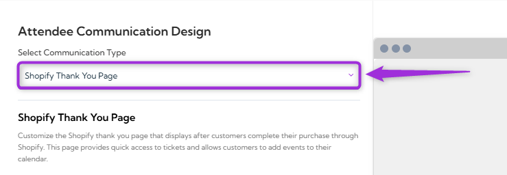

## Page Configuration

**Header Title:** Main heading at the top of the Shopify Thank You Page.

Example: Access Your Tickets

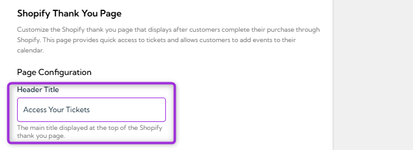

### Display Settings

| Ref | Field                     | Description |
|-----|----------------------------|-------------|
| 1   | Show Confirmation Message | When enabled, the confirmation message appears on the page. |
| 2   | Show View Tickets Button  | When enabled, the “View Tickets” button is displayed. |
| 3   | Show View Receipt Button  | When enabled, the “View Receipt” button appears on the page. |
| 4   | Show Download Pass Button | When enabled, the “Add to Wallet” (Download Pass) button appears. |
| 5   | Show Add to Calendar      | When enabled, customers see the option to add the event to their calendar. |

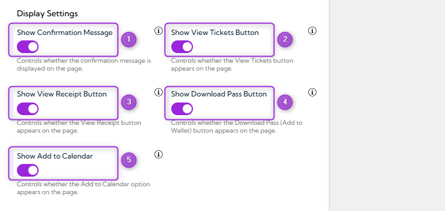

### Button Labels

| Ref | Field                     | Description |
|-----|----------------------------|-------------|
| 1   | View Tickets Button Text  | The label for the button that opens the attendee’s tickets.  Example: View Tickets |
| 2   | View Receipt Button Text  | The label for the button that opens the attendee’s receipt.  Example: View Receipt |
| 3   | Download Pass Button Text | The label for the button that lets customers add the pass to their wallet.  Example: Add to Wallet |
| 4   | Add to Calendar Text      | The label for the option that lets customers add the event to their calendar.  Example: Add to Calendar |

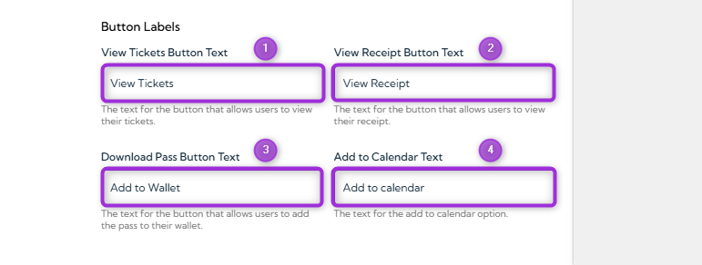

# Check-In

The **Check-In** allows event organizers to customize the interface used for scanning and validating attendee tickets on-site. These settings help ensure a smooth, clear, and professional check-in experience, whether staff members are operating the scanner or attendees are using a self-service kiosk.

## Self Check-In Kiosk

**Self Check-In Kiosk** interface is used at the venue to help attendees check themselves in by scanning their tickets. This design panel allows you to customize all on-screen text, success messages, warnings, and error states shown during the check-in process. It ensures your kiosk experience is clear, branded, and easy for attendees to follow.

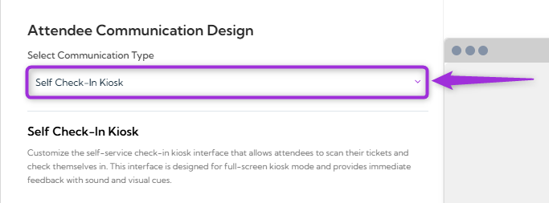

### Idle Screen

| Ref | Field           | Description |
|-----|------------------|-------------|
| 1   | Header Title     | The main title was displayed on the kiosk idle screen while waiting for an attendee to scan their ticket. |
| 2   | Header Subtitle  | Instructions displayed below the header guide attendees on how to initiate the scan. |

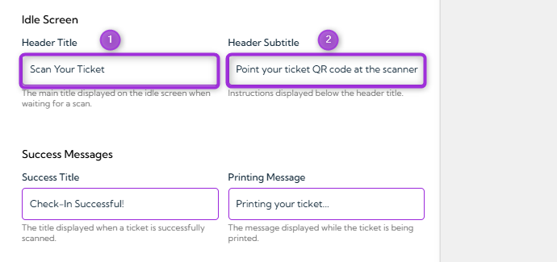

### Success Messages

| Ref | Field           | Description |
|-----|------------------|-------------|
| 1   | Success Title    | The title is shown when a ticket scan is successful. |
| 2   | Printing Message | The message shown while the ticket is printing (if printing is enabled). |
| 3   | Scans Label      | The label shown above the scan counter (e.g., “Scans:” to display total check-ins). |

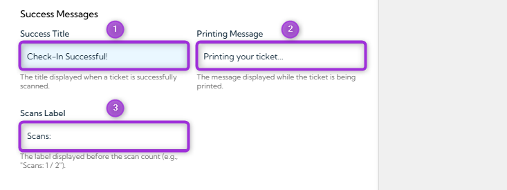

### Printing Settings

#### Enable Auto Print 

When this option is enabled, the kiosk prints tickets automatically after a successful scan. If disabled, tickets will not print on their own and must be printed manually if needed.

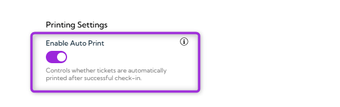

### Warning Messages

| Ref | Field                  | Description |
|-----|-------------------------|-------------|
| 1   | Warning Title           | The title is displayed when a ticket has already been scanned. |
| 2   | Warning Help Message    | Optional help text is shown to guide the attendee (e.g., “Please see staff if you need help”). |
| 3   | Warning Countdown Text  | Countdown message before returning to the scan screen. Use seconds as a placeholder. |

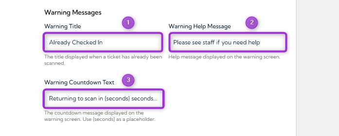

### Error Messages

| Ref | Field                | Description |
|-----|-----------------------|-------------|
| 1   | Error Title           | The title is displayed when the scan fails or the ticket is invalid. |
| 2   | Error Help Message    | Help text is shown when an error occurs (e.g., “Please see staff for assistance”). |
| 3   | Error Countdown Text  | Countdown message displayed before returning to the scan screen. |

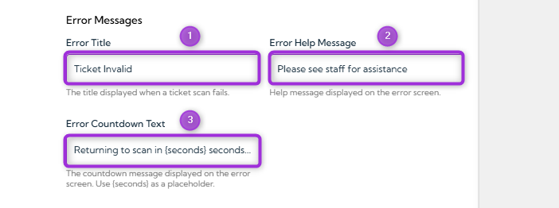

### Loading & Invalid States

| Ref | Field               | Description |
|-----|----------------------|-------------|
| 1   | Loading Text         | The message is displayed while event details are loading. |
| 2   | Invalid Kiosk Title  | The title is shown when the kiosk code is invalid. |
| 3   | Invalid Kiosk Message | The message is displayed when the kiosk URL/code cannot be validated. |

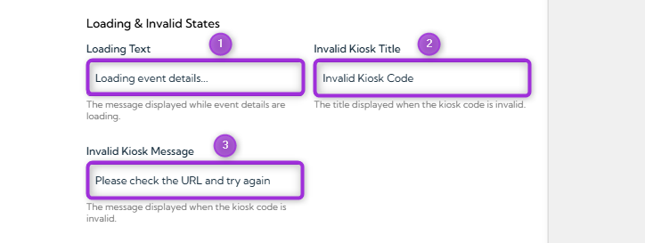

With all communication types configured, attendees receive clear and timely updates at every step—making their event experience more organized, predictable, and seamless.