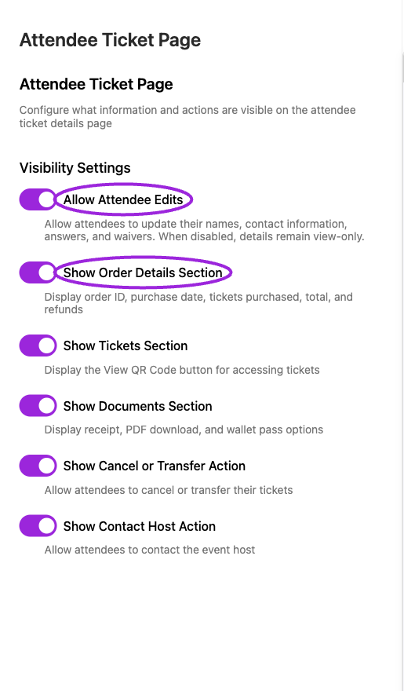
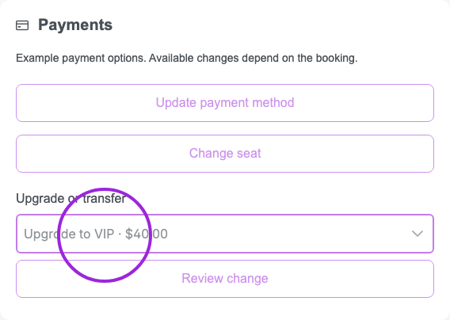

Use **Design → Attendee Ticket Page** to configure the information and actions attendees see when opening their ticket details. This design section is available on Business and higher.

## Configure visibility

<Frame caption="Design → Attendee Ticket Page configures attendee edits and the sections shown on the ticket page. Use the separate sample preview to inspect the result.">
  
</Frame>

1. Select the correct site and open **Design**.
2. Select **Attendee Ticket Page**.
3. Under **Visibility Settings**, set the controls below.
4. Wait for **Successfully updated attendee page settings** after each change. These switches save immediately; a failed update restores the previous value.

| Option | Effect |
|---|---|
| **Allow Attendee Edits** | Allows editing names, contact information, answers, and waivers. When off, details are view-only. |
| **Show Order Details Section** | Displays order ID, purchase date, purchased tickets, total, and refunds. |
| **Show Tickets Section** | Displays the View QR Code control. |
| **Show Documents Section** | Displays receipt, PDF download, and wallet-pass options where available. |
| **Show Cancel or Transfer Action** | Displays the cancel/transfer action. Event eligibility and cancellation/transfer settings still matter. |
| **Show Contact Host Action** | Displays the option to contact the host. |

These settings control presentation. Showing a document section does not create a missing document or enable a feature excluded by the ticket or plan.

## Verify as an attendee

<Frame caption="The built-in attendee ticket-page preview shows QR access, document downloads, and attendee actions.">
  
</Frame>

Open a test attendee's ticket page and check the visible sections. With edits disabled, confirm that details are view-only. If you hide Tickets or Documents, consider how attendees will otherwise obtain their QR code before the event.

## Related guides

- [Viewing tickets](../attendee-portal/viewing-your-tickets)
- [QR codes and wallets](../attendee-portal/qr-code-digital-wallets)
- [Cancel or transfer requests](../attendee-portal/cancel-transfer-event)

## Self-service payment actions

In the attendee page settings, use **Pay Installments Early**, **Ticket Upgrades**, **Self-Service Seat Changes**, **Event Transfers**, **Membership Renewals** and **Membership Upgrades** to control the actions offered in the portal. Early installment payments and membership renewals are enabled by default; ticket upgrades, seat changes, event transfers and membership upgrades require you to enable them. Saving a replacement card takes no payment. Availability still depends on the booking, payment provider and the selected change. See [manage payments](/attendee-portal/manage-payments) for the attendee flow and supported changes.

Eligible free tickets can upgrade to a paid ticket: their credit is $0, so the attendee pays the full destination ticket price. When ticket upgrades or event transfers are enabled, the sample preview shows the Payments card with example choices. Preview controls are disabled and take no payment; check an actual test booking for its available changes and prices.

<Frame caption="Enabled ticket upgrades appear in the sample preview. These example controls take no payment.">
  
</Frame>

**Self-Service Seat Changes** is off by default. Enable it to let eligible attendees select another individual seat on the same event’s seating chart and pay any positive difference. Equal or lower-priced moves take no payment and issue no refund. The original seat remains booked until the move completes. The sample Payments preview shows a disabled **Change seat** control when enabled.
