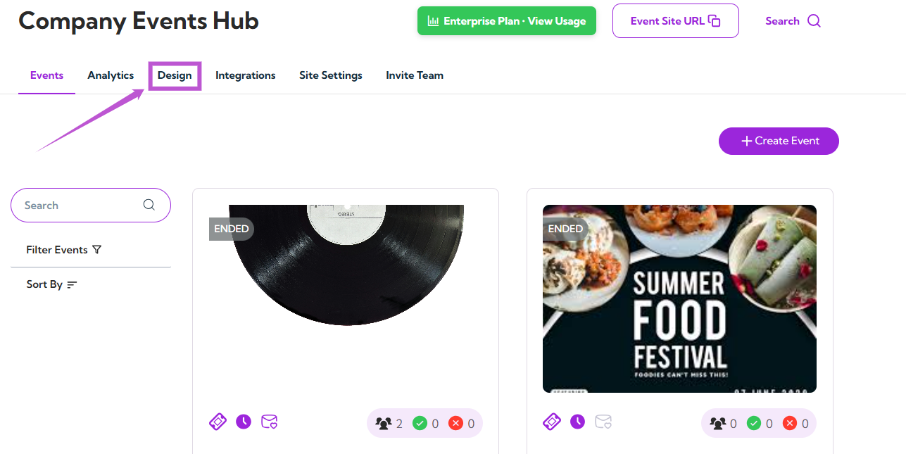
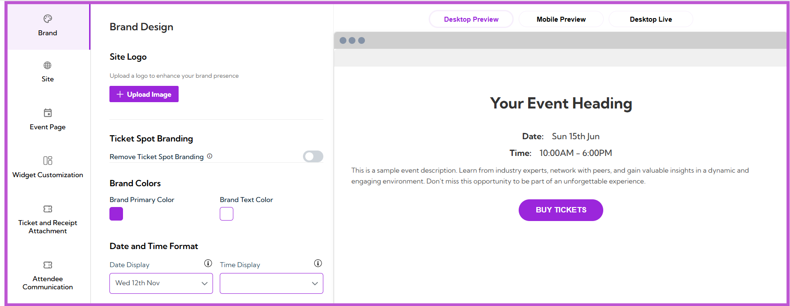
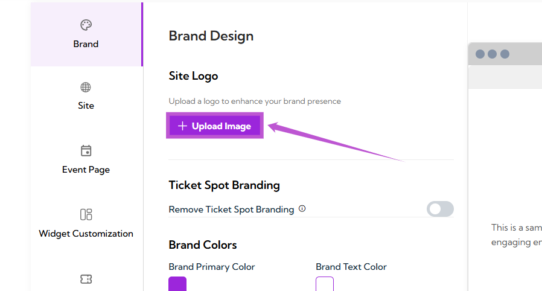
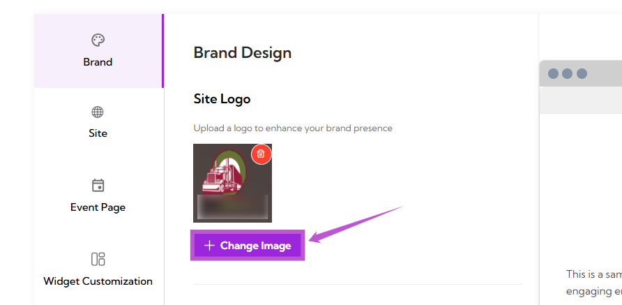
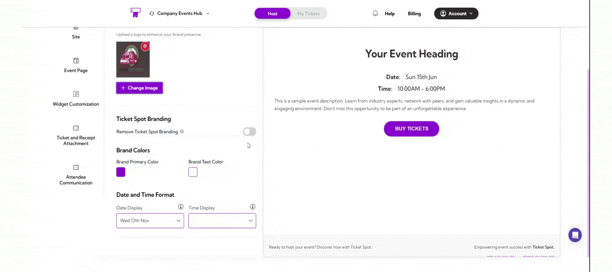
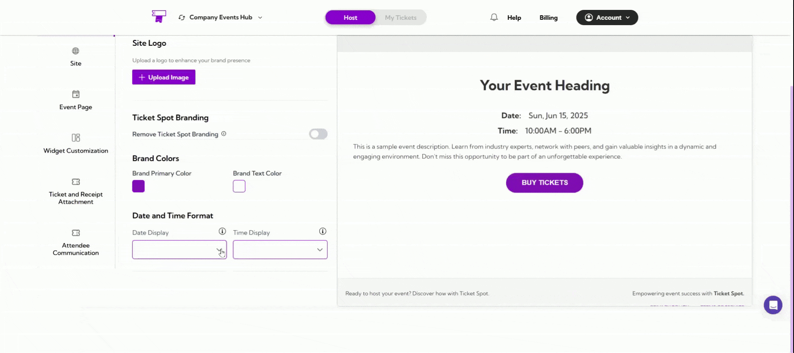

The **Brand Design** section allows you to customize the appearance of your event page to align with your brand’s visual identity. This includes options for uploading your site logo, adjusting branding elements, selecting colors, and formatting the date and time display. You can also preview your changes before making them live.

Let’s get started 🚀

## Navigation

**Step 1:** Log in to your **Ticket Spot** account and click on the **Design** tab.

You will be navigated to the **Brand Design** page, where you can customize your brand's design.

## Site Logo

The **Site Logo** section allows you to upload or change the logo that represents your event page.

**Step 1:** Click on the **Upload Image** button.

**Step 2:** A **file selection dialog box** will appear. This is the pop-up window where you can browse through your files and folders. Select the image you want to upload, and click **Open**.

Once the image is uploaded, it will automatically appear in the **Site Logo** field.

**Step 3:** Click on the **Change Image** button to update your logo.

## Ticket Spot Branding

In the **Ticket Spot Branding** section, you can decide whether or not to show Ticket Spot branding on your event page.

You can toggle **ON** to show Ticket Spot branding on your event page, or toggle **OFF** to remove the branding and display your own branding instead.

## Brand Colors

In the **Brand Colors** section, you can customize the colors used on your event page to align with your branding.

- **Brand Primary Color:** Click on the color box next to *Brand Primary Color* to select the main color for your event page (e.g., buttons, accents).
- **Brand Text Color:** Click on the color box next to *Brand Text Color* to select the color for the text on your event page.

By selecting these colors, you can match the event’s design with your brand’s visual identity.

## Date and Time Format

In the **Date and Time Format** section, you can customize how the date and time appear on your event page.

- **Date Display:** Click on the dropdown menu next to *Date Display* to choose how you want the date to be shown (e.g., “Wed 12th Nov”).
- **Time Display:** Click on the dropdown menu next to *Time Display* to choose the preferred format for displaying the time (e.g., “1:34 PM”).

By adjusting these settings, you can match the date and time format with your region or preference.

## Preview Your Customizations

After making changes to your event page design, you can preview how it will look on different devices:

- **Desktop Preview:** Click on the **Desktop Preview** tab to see how your event page will appear on desktop devices.
- **Mobile Preview:** Click on the **Mobile Preview** tab to view how your event page will look on mobile devices.
- **Desktop Live:** Click on the **Desktop Live** tab to view a live version of your event page.

> **Tip:** Use the **Desktop Preview** and **Mobile Preview** to ensure your design looks good on all screen sizes before going live.
