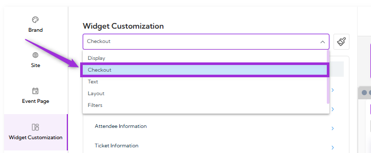
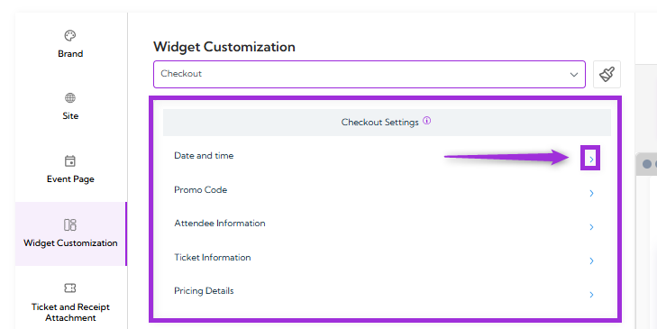
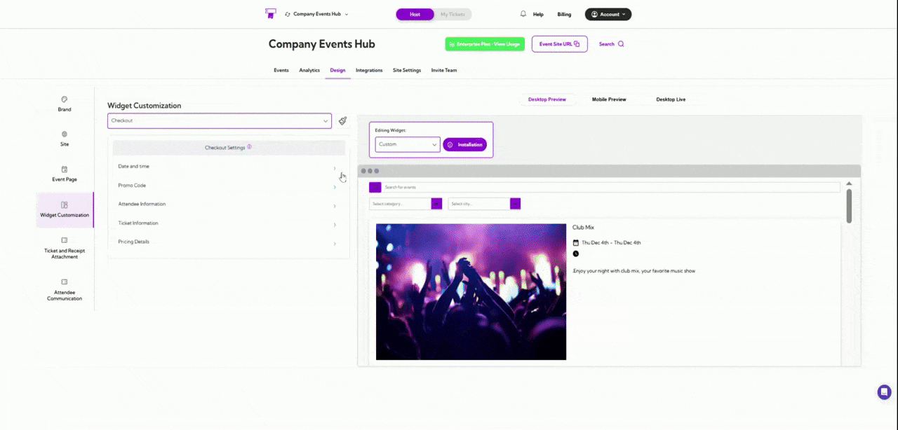
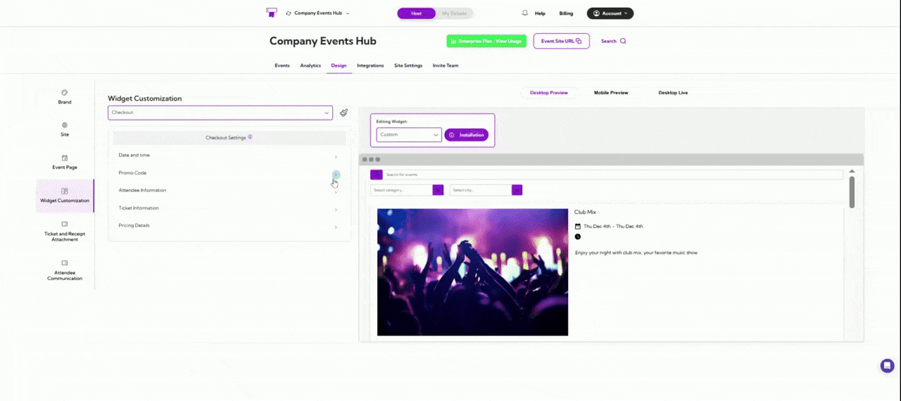
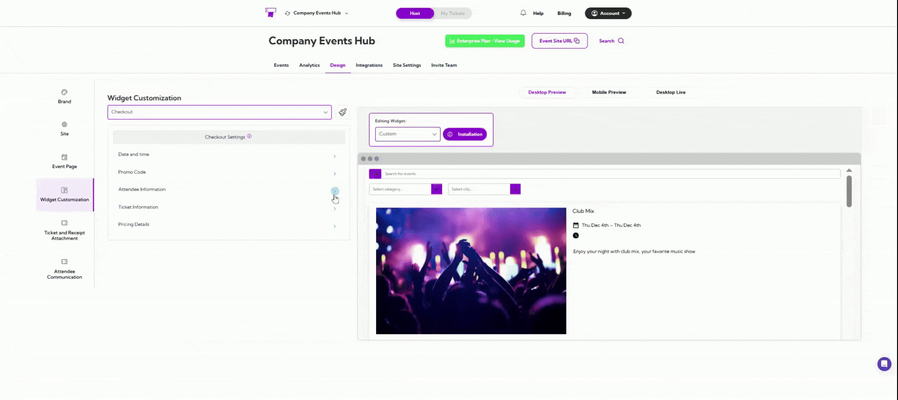
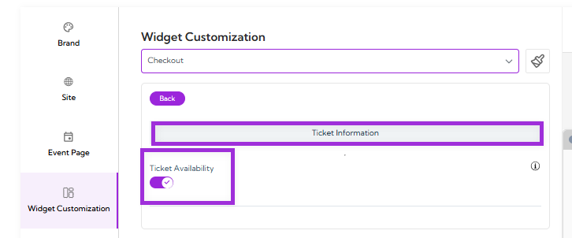
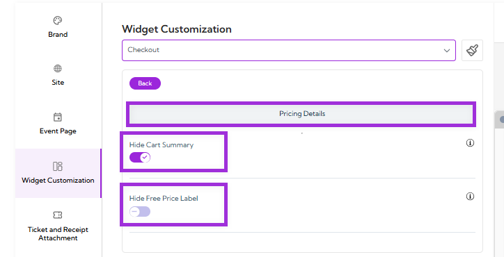

**Checkout** settings allow you to control how the checkout experience looks and functions inside
the widget. You can adjust what details appear, how dates and times are shown, whether promo
codes are allowed, and what information attendees must provide before completing their order.
This helps you create a smooth, clear, and reliable checkout flow so attendees can complete
their purchase without confusion.

Let’s get started 🚀

From the Widget Customization dropdown, select the **Checkout** option.

You will see the list of available settings:

- Date and Time
- Promo Code
- Attendee Information
- Ticket Information
- Pricing Details

Click the **arrow icon** next to the setting you want to customize to open its configuration options.

## Date and Time

**Date and Time** controls how event dates, times, and time zones are shown during checkout,
helping attendees clearly understand when the event begins and ends.

The table below explains each field.

| Field            | Description                                                                                   |
| ---------------- | --------------------------------------------------------------------------------------------- |
| **Date Display**     | Select how the event date appears during checkout (e.g., Sat 29th Nov).                       |
| **Time Display**     | Choose the time format shown to attendees: 12-hour or 24-hour styles.                         |
| **Show Start Date**  | Displays the event’s start date on the checkout screen.                                       |
| **Show Start Time**  | Shows the event’s start time so attendees know when the event begins.                         |
| **Show End Date**    | Displays the event’s end date, useful for multi-day or long events.                           |
| **Show End Time**    | Shows the event’s end time to give attendees clear schedule expectations.                     |
| **Include Timezone** | Adds the event’s timezone to avoid confusion for attendees in different regions.              |

## Promo Code

**Promo Code** settings control how discount codes appear and function during the checkout
process. You can choose whether to show the promo code field, automatically expand it, and
decide where it should be placed for better visibility.

| Field               | Description                                                                                                  |
| ------------------- | ------------------------------------------------------------------------------------------------------------ |
| **Display Promo Code**  | Shows or hides the promo code field during checkout.                                                         |
| **Auto-Open Promo Code** | When enabled, it automatically expands the promo code field when the checkout page loads.                  |
| **Promo Code Placement** | Choose where the promo code field appears: • **Top of Checkout** – visible immediately when the user starts checkout. • **Next to Checkout Summary** – placed near the order totals for quick access. |

## Attendee Information

**Attendee Information** controls how attendee details are collected during checkout. These
settings determine whether information is captured for each attendee or only for the primary
buyer, and whether certain fields appear on the checkout form.

| Setting                    | Description                                                                                      |
| -------------------------- | ------------------------------------------------------------------------------------------------ |
| **Per-Ticket Attendee Data**   | When enabled, a separate attendee information form appears for every ticket purchased. When disabled, only the buyer’s details are collected. |
| **Show Confirm Email**         | Displays an additional email confirmation field during checkout to ensure accuracy before submission. |

## Ticket Information

**Ticket Information** in Widget Customization controls what ticket-related details are shown to
users during checkout. This helps you decide how much availability information you want to
display within your widget’s design.

### Ticket Availability

**Enable** this option to show the number of tickets remaining for the selected event. When turned
on, attendees can see how many spots are left before completing their purchase.

Turn it **off** if you prefer not to display availability or want to keep the checkout interface simpler.

## Pricing Details

**Pricing Details** settings allow you to control how pricing information appears during checkout.
These settings help you manage what users see in the cost breakdown, keeping the interface
as simple or detailed as you prefer.

- **Hide Cart Summary:** Enable this option to hide the full cart summary during checkout. When enabled, users will not see the detailed order breakdown or total cost section.
- **Hide Free Price Label:** Enable this option to remove the “Free” label from events that do not require payment. This is useful when you prefer a cleaner or more neutral presentation for zero-cost tickets.

A live preview of each setting appears in the right panel, allowing you to confirm the design
before applying it.
