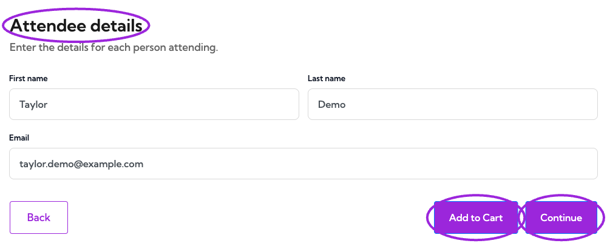
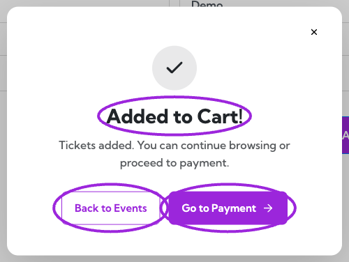
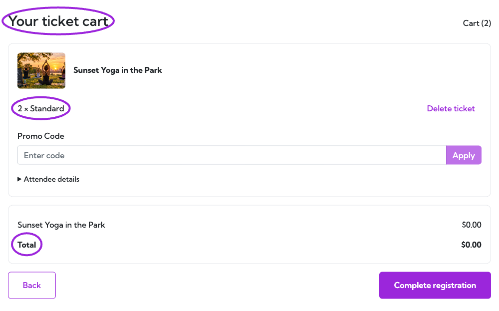

Open **Design → Widget → All Settings → Checkout** for the selected widget. The sections are **Date & time on the checkout page**, **Promo & access codes**, **Attendee information**, **Cart & pricing**, and **Multi-event cart**.

1. Choose checkout date/time formats and which start/end values and timezone to show.
2. Enable **Show promo code field** for discounts and **Show access code field** for hidden-ticket codes. Choose whether either input opens automatically and where promo codes appear.
3. Turn on **Collect attendee details for each ticket** if each guest must supply their own information. Enable **Ask buyers to re-enter their email** to require matching entries.
4. Choose whether to show remaining ticket quantity, hide the cart summary, or hide the free-ticket price label.
5. Wait for saving, then complete a test checkout using the installed widget.

See the [complete checkout reference](./widget-checkout-reference) for every control. Configure actual ticket rules in [Tickets](/event-management/ticket-setup) and question requirements in [Additional Info](/event-management/additional-information).

## Cart across multiple events

Open **Checkout → Multi-event cart** and turn on **Allow a cart across events and time slots** to let buyers collect tickets across events or time slots and pay once. This setting applies to every widget on the site. With it off, checkout contains one event selection and its add-ons.

<Frame caption="All Settings → Checkout → Multi-event cart enables one cart across events and time slots for this site.">
  
</Frame>

The same site-wide switch is also available as **Settings → General → Enable Cart**. Changing either location affects the same site setting. It is separate from **Hide the cart summary**, which only changes the checkout presentation.

To check the result, add tickets from one event or time slot, return to the event list, add another eligible selection, and review both in the cart before payment. Recheck quantities, dates, required companion tickets, and seat availability. For Shopify's product-page flow, also verify the [Ticket Selector](../plugins/shopify-ticket-selector) and Shopify cart handoff.

Choose **Add to Cart**, then **Back to Events** to keep browsing or **Go to Payment** to review. The cart button shows the current ticket count. The Ticket Spot browsing cart is available in its standard checkout; waitlist registration, Shopify checkout handoff, and POS follow their own flows.

<AccordionGroup>
<Accordion title="Add tickets to the cart">
<Frame caption="Complete attendee details, then choose Add to Cart to keep browsing or Continue to review.">
  
</Frame>
<Frame caption="Choose Back to Events to keep browsing or Go to Payment to review the cart.">
  
</Frame>
</Accordion>
<Accordion title="Review the cart before checkout">
<Frame caption="Check events, quantities, attendee details, discounts, and the total before completing registration or payment.">
  
</Frame>
</Accordion>
</AccordionGroup>

Adding a selection checks availability and attendee details. It does not create a paid order or reserve ordinary ticket inventory. Seat holds still expire according to the seating checkout rules.

Combined selections must belong to the same organizer, use the same currency, and pay the same receiving account. Otherwise they must be purchased separately. A combined checkout accepts up to 20 event/time-slot selections and 500 tickets or attendees; ticket-specific order limits still apply. Returning to the same event/time slot updates its existing cart selection.

The browsing cart is kept in memory for the current page session. Reloading the page clears it. Keep the widget open while collecting selections, and check the final review before paying. Removing a ticket updates that selection's quantity and associated attendee/seat data.

## Related controls in other sections

**Display → Checkout & payment** contains ticket-first and combined date/time/ticket selection. **Text → Checkout** changes headings, buttons, per-attendee progress, copy-details actions, validation messages, and review-step wording. **Design → Customize components** styles the checkout.

Hiding the cart summary or a free-price label does not change the price. Showing a promo or access-code input does not create a code. The Ticket Spot selector on Shopify hands the purchase to Shopify checkout; verify both parts.

{/* CURRENT CAPTURES */}

## Current controls

<AccordionGroup>

<Accordion title="Attendee details and email confirmation">

<Frame caption="All Settings → Attendee information — Attendee details and email confirmation. The circles identify Collect attendee details for each ticket and Ask buyers to re-enter their email.">
  
</Frame>

</Accordion>

<Accordion title="Promo and access-code fields">

<Frame caption="All Settings → Promo &amp; access codes — Promo and access-code fields. The circles identify Show promo code field and Open the promo code field automatically.">
  
</Frame>

</Accordion>

<Accordion title="Checkout dates, availability and price summary">

<Frame caption="All Settings → Cart &amp; pricing — Checkout dates, availability and price summary. The circles identify Show how many tickets are left and Hide the cart summary.">
  
</Frame>

</Accordion>

</AccordionGroup>
