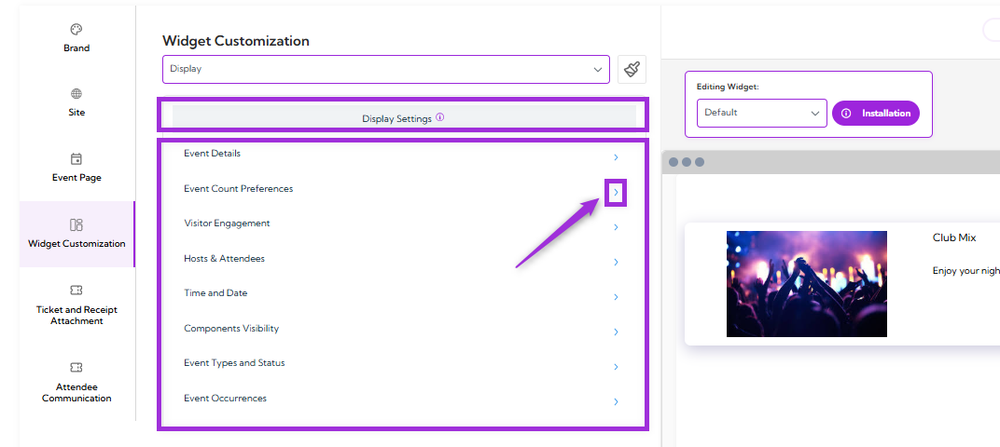
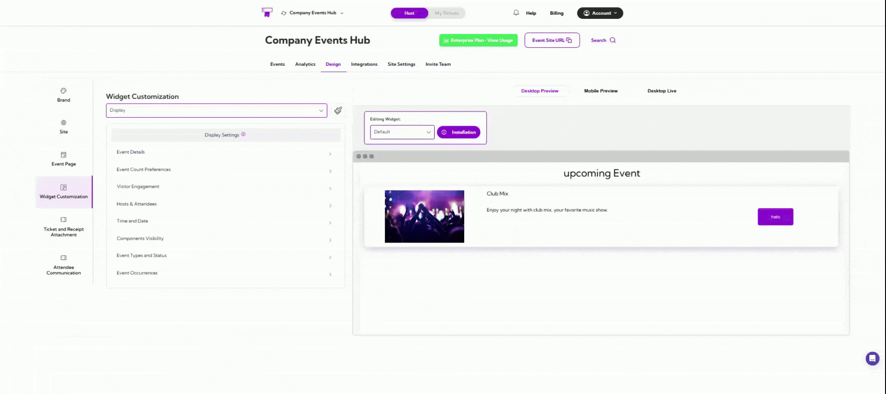
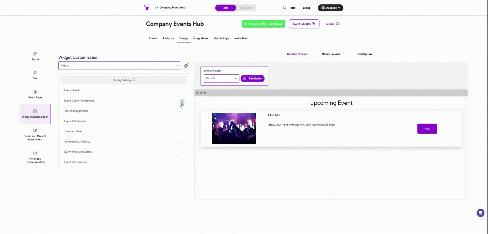
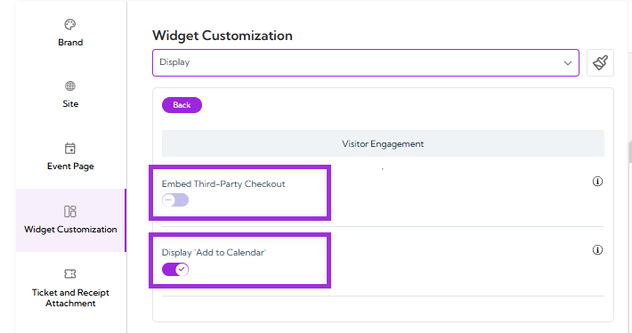
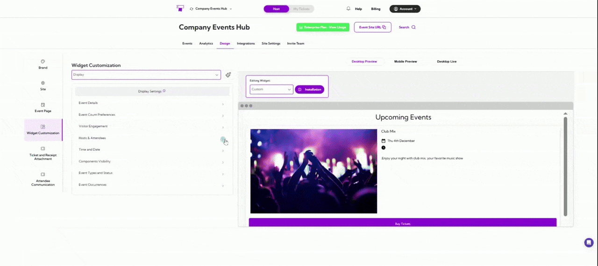
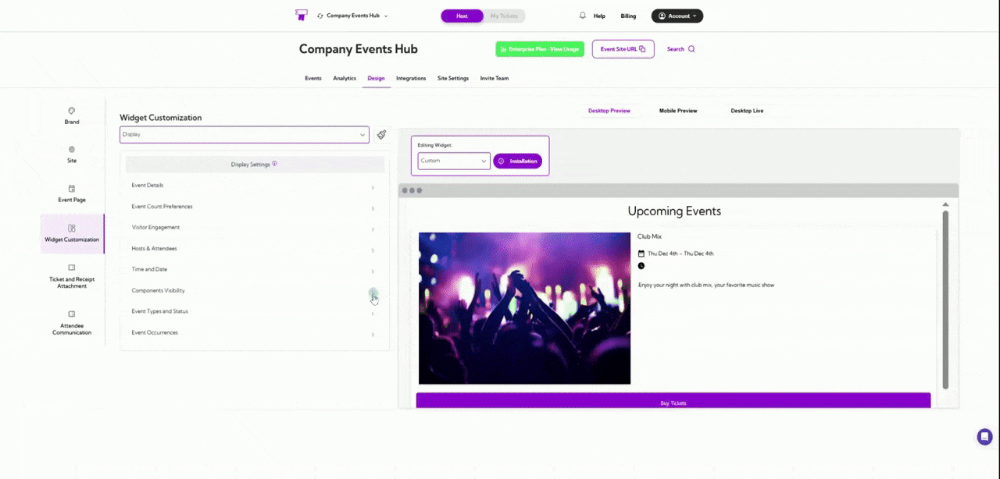
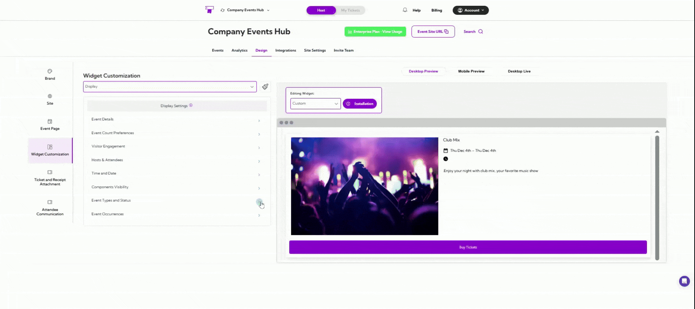

**Display** settings control how event information appears inside your widget. This includes options for showing full descriptions, selecting image sizes, adjusting text behavior, and enabling or disabling visual elements. These settings help you create a clear, readable event layout that matches your design preferences.

Let’s get started 🚀

In the Display settings section, you’ll see a list of available settings you can customize:

- Event Details  
- Event Count Preferences  
- Visitor Engagement  
- Hosts & Attendees  
- Time and Date  
- Components Visibility  
- Event Types and Status  
- Event Occurrences  

Click the **arrow icon** next to the setting you want to customize to open its configuration options.

## Event Details

| Field                    | Description                                                                                                                             |
| ------------------------ | --------------------------------------------------------------------------------------------------------------------------------------- |
| Display Full Description | Shows the entire event description instead of a shortened preview, or you can also select the length of the description.               |
| Image Size               | Sets the size of the event image. Options: Small, Medium, Large.                                                                        |
| Disable Image Zoom       | Prevents users from zooming into event images.                                                                                          |
| Use Plain Text           | Displays the event description without any formatting.                                                                                  |
| Right to Left Text       | Enables right-to-left text orientation for supported languages.                                                                         |
| Remove Title URL Link    | Removes the clickable link from the event title so it appears as plain text.                                                            |
| Image Carousel           | Shows multiple images as a swipeable carousel instead of a single image.                                                                |

## Event Count Preferences

| Field                     | Description                                                                                                                             |
| ------------------------- | --------------------------------------------------------------------------------------------------------------------------------------- |
| Show All Available Events | Enable the display of every published event in the widget. Disable if you want to limit the number of events shown.                    |
| Limit Total Events        | Set the maximum number of events to display (e.g., 5). Only applies when “Show All Available Events” is turned off.                    |
| Event Display Order       | Choose how events are sorted: • Start Time Ascending – Shows the earliest upcoming events first. • Start Time Descending – Shows the latest upcoming events first. |
| Display ‘Load More’ Button | When enabled, a “Load More” button appears to let visitors view additional events beyond the initial limit.                            |

## Visitor Engagement

| Field                      | Description                                                                                                          |
| -------------------------- | -------------------------------------------------------------------------------------------------------------------- |
| Embed Third-Party Checkout | Allows you to embed an external checkout flow inside the widget instead of redirecting users to another page.       |
| Display ‘Add to Calendar’  | Shows an Add to Calendar option so visitors can save the event directly from the widget.                             |

## Hosts & Attendees

| Field                  | Description                                                                                                                           |
| ---------------------- | ------------------------------------------------------------------------------------------------------------------------------------- |
| Show Hosted By Section | Enables the “Hosted By” block on the widget. When turned on, users will see the event host information. You can also edit the Hosted by label. |
| Show Attendees Section | Displays the list of attendees when enabled. If turned off, attendee names will not be shown on the widget. You can also edit the Attendees label. |

## Time and Date

| Field                | Description                                                                                                      |
| -------------------- | ---------------------------------------------------------------------------------------------------------------- |
| Date Display Format  | Select how the event date appears (e.g., Sat 29th November).                                                     |
| Include Timezone     | Adds the event’s timezone next to the date/time.                                                                 |
| Auto-Adjust Timezone | Automatically adjusts the displayed time based on the viewer’s location.                                         |
| Show Start Time      | Displays the event’s start time on the widget.                                                                   |
| Show End Time        | Displays the event’s end time on the widget.                                                                     |
| Time Display Format  | Choose between 12-hour and 24-hour time formats: 1:24 PM, 13:24, or 13:24 PM.                                    |
| Show Start Date      | Enables or hides the start date for the event.                                                                   |
| Show End Date        | Enables or hides the end date for the event.                                                                     |

## Components Visibility

| Field                      | Description                                                                                                  |
| -------------------------- | ------------------------------------------------------------------------------------------------------------ |
| Display Widget Header      | Shows or hides the header area at the top of the widget.                                                     |
| Display Attend Button      | Shows the main action button attendees use to view or join the event.                                        |
| Show Event Title           | Displays the event title in the card. Turn off to hide titles.                                               |
| Show Event Logo            | Shows the event’s image or logo on the event listing card.                                                   |
| Show Zoom Host Details     | Displays the Zoom host name/details for virtual events.                                                      |
| Show Event Status          | Displays the event status (e.g., Sold Out, Closed, In Progress).                                             |
| Display Online Event Label | Shows an “Online Event” tag for virtual events.                                                              |
| Show Until End             | Displays how long the event will remain active/visible.                                                      |
| Display Venue Name         | Shows the venue name for in-person events.                                                                   |
| Display City               | Shows the event’s city.                                                                                      |
| Display Full Address       | Displays the complete venue address.                                                                         |
| Button Corners             | Enables rounded corners for buttons to match your theme styling.                                             |
| Show Submit Event Button   | Shows a button that allows visitors to submit their own event suggestions.                                   |
| Submit Event Label         | Custom text that appears above the submit event prompt.                                                       |
| Submit Event Button Text   | Customizes the button text for submitting an event.                                                           |

## Event Types and Status

| Field               | Description                                                                                                                  |
| ------------------- | ---------------------------------------------------------------------------------------------------------------------------- |
| Show Private Events | Displays events marked as private on your site. Turn off if private events should remain hidden from public view.           |
| Show Live Events    | Shows events currently marked as “Live.” Recommended to keep on for active event listings.                                  |
| Show Previous Events| Displays events that have already ended. Turn off to avoid showing past events.                                             |
| Show Draft Events   | Shows events still in draft mode. Useful for internal reviews before going live.                                            |
| Show Sold Out Events| Displays events that are fully booked. Helpful when you still want attendees to see demand or join a waitlist elsewhere.    |

## Event Occurrences

| Field               | Description                                                                                                           |
| ------------------- | --------------------------------------------------------------------------------------------------------------------- |
| Display All Events  | Shows every scheduled occurrence of an event. Turn off to display only the next upcoming occurrence.                 |
| Enable Date Grouping| Groups recurring events under a date selector to help attendees browse events by their preferred dates.               |

A live preview of each setting appears in the right panel, allowing you to confirm the design before applying it.
