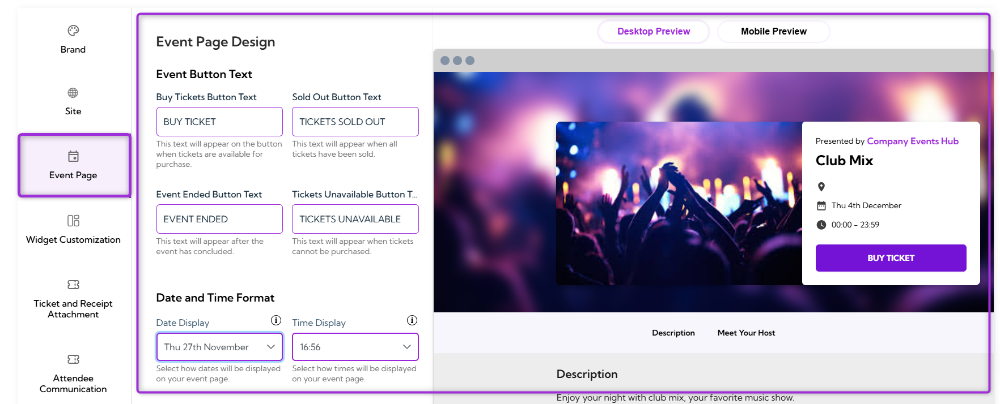
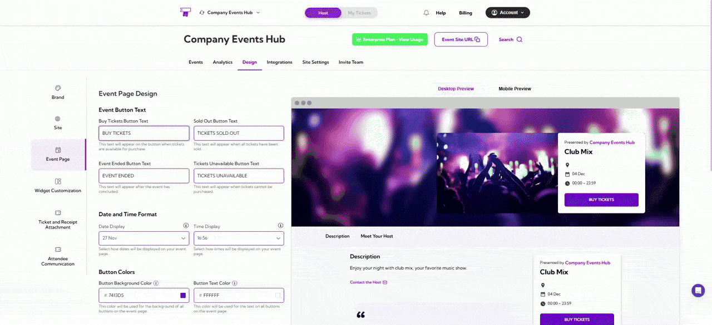
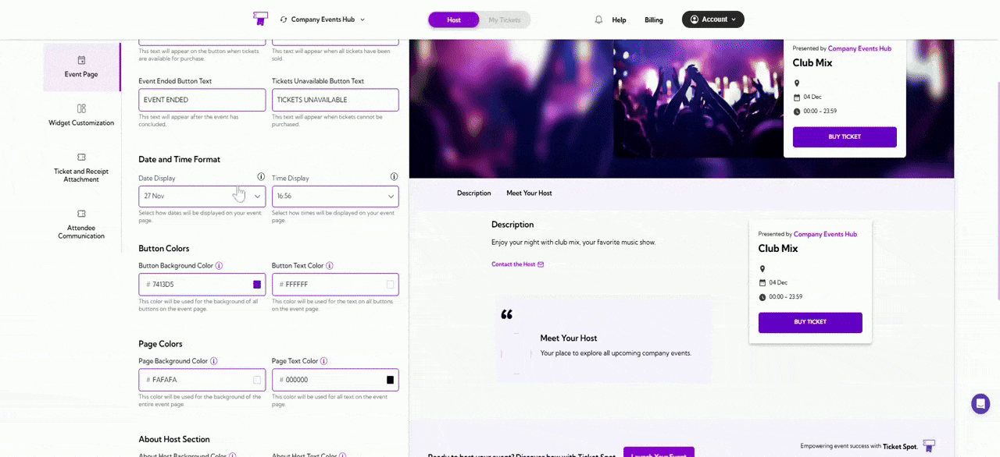
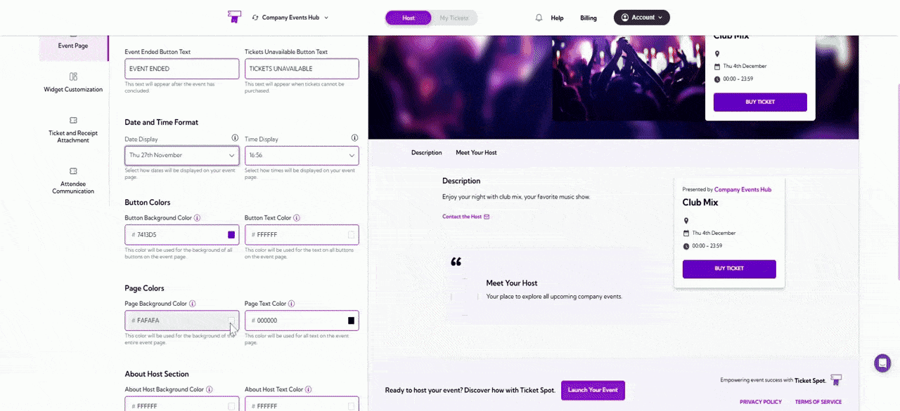
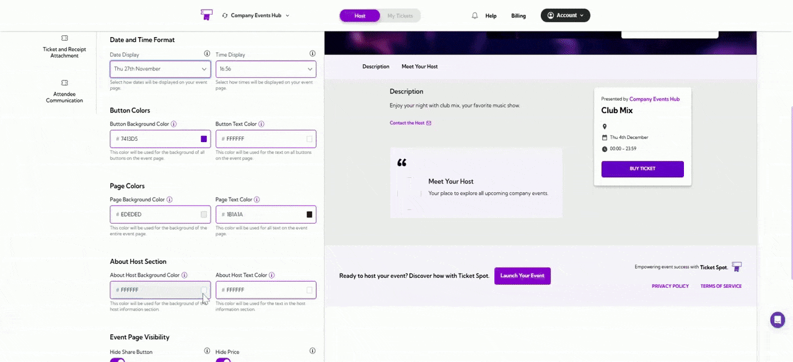
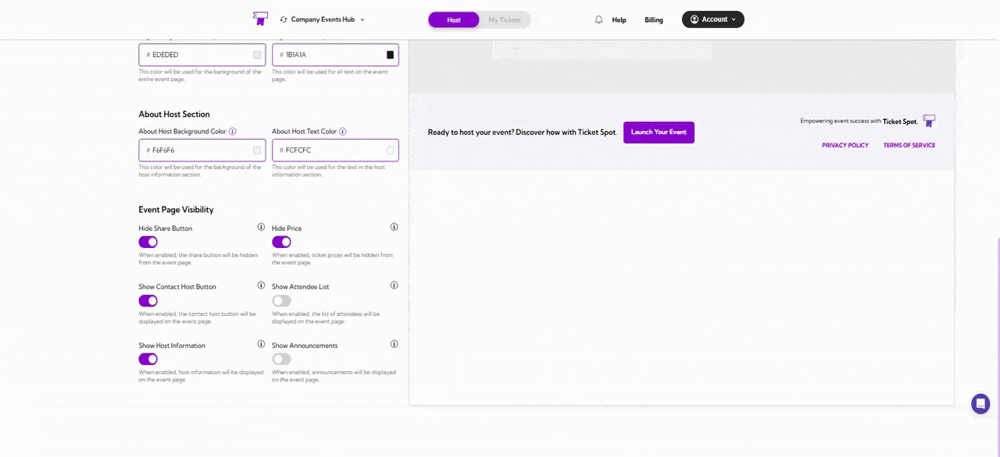
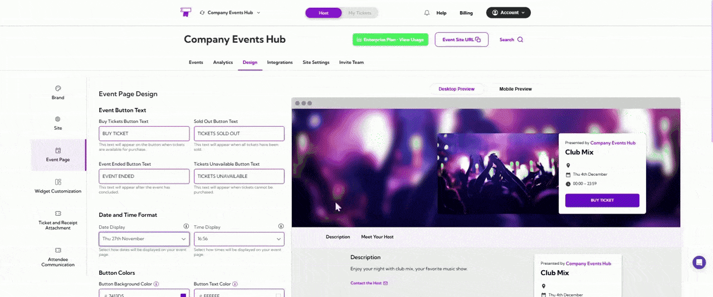

**Event Page Design** gives you an easy way to customize your event page to match your brand. You can adjust colors, update button labels, and modify layout elements to create a clean and consistent experience for your attendees.
These settings help you highlight key details—such as ticket options and event information—so attendees can quickly understand what they need and complete their purchase without confusion.

Let’s get started 🚀

## Navigation

**Step 1:** Log in to your **Ticket Spot** account and click on the **Design** tab.

**Step 2:** Click on the **Event Page** tab to open the Event Page design settings.

You will be navigated to the **Event Page Design** page, where you can customize how your event details appear to attendees.

## Event Button Text

**Event Button Text** section allows you to customize the text displayed on various action buttons across your event page. Updating these labels helps you maintain consistent messaging and ensures attendees clearly understand each event state.

| Field | Description | Example |
|-------|-------------|---------|
| **Buy Tickets Button Text** | Appears when tickets are available for purchase. You can customize the main call-to-action shown on the event page. | Buy Tickets, Get Tickets, Register Now |
| **Sold Out Button Text** | Displayed when all tickets for the event have been sold out. Clearly communicates that no more tickets are available. | Sold Out, Fully Booked |
| **Event Ended Button Text** | Shown after the event has concluded. Lets visitors know the event is no longer active. | Event Ended, This Event Has Ended |
| **Tickets Unavailable Button Text** | Displayed when tickets are not available yet or temporarily paused. Useful for upcoming or restricted events. | Tickets Unavailable, Coming Soon |

## Date and Time Format

**Date and Time** Format section allows you to choose how dates and times are displayed on your event page. Adjusting these formats helps ensure the event information matches your preferred style or regional format.

| Field | Description | Example |
|-------|-------------|---------|
| **Date Display** | Controls how the event date appears on your event page. Choose the format that best suits your audience or brand style. | 27 Nov, 27 Nov 2025, Thu 27th November, Thu 27th Nov 2025 |
| **Time Display** | Controls how the event time appears. You can choose between 12-hour or 24-hour styles. | 16:56, 16:56 PM, 4:56 PM |

## Page Colors

**Page Colors** section allows you to customize the overall color theme of your event page. You can adjust both the background and text colors to match your brand’s identity and ensure a visually consistent experience.

| Field | Description | Example |
|-------|-------------|---------|
| **Page Background Color** | Sets the background color for the entire event page. Choose a color that supports readability and fits your brand style. | #FAFAFA |
| **Page Text Color** | Sets the color for all general text on the event page. Select a color that contrasts well with the page background. | #000000 |

## About Host Section

**About Host** section allows you to customize the colors used in the host information area on your event page. Adjusting these settings helps you maintain a consistent visual design and ensure the host details remain easy to read.

| Field | Description | Example |
|-------|-------------|---------|
| **About Host Background Color** | Sets the background color for the host information section on the event page. Choose a color that complements your page background and supports readability. | #FFF67F |
| **About Host Text Color** | Sets the text color for all content displayed in the host information section. Use a color that contrasts well with the background. | #FFFFFF |

## Event Page Visibility

**Event Page Visibility** section allows you to control what information and actions are visible on your event page. You can enable or disable specific elements to create the experience you want attendees to see.

| Field | Description |
|-------|-------------|
| **Hide Share Button** | When enabled, the share button will be hidden from the event page, preventing attendees from sharing the event link. |
| **Hide Price** | When enabled, ticket prices will not be shown on the event page, which is useful for private or invitation-only events. |
| **Show Contact Host Button** | When enabled, a “Contact Host” button will appear on the event page, allowing attendees to reach out directly. |
| **Show Attendee List** | When enabled, the attendee list will be visible on the event page, showing who is attending. |
| **Show Host Information** | When enabled, the host details section will appear on the event page, giving attendees more context about the organizer. |
| **Show Announcements** | When enabled, event announcements will be displayed, helping you share updates with attendees. |

## Preview Your Customizations

After making changes to your event page design, you can preview how it will appear on different devices. This helps ensure your layout, colors, and text display correctly on both desktop and mobile screens.

**Desktop Preview:** Click the **Desktop Preview** tab to see how your event page will appear on desktop devices.

**Mobile Preview:** Click the **Mobile Preview** tab to view how your event page will look on mobile devices.

>**Tip:** Use both previews to confirm that your event page design looks clean, readable, and well-structured across all screen sizes before publishing event.
