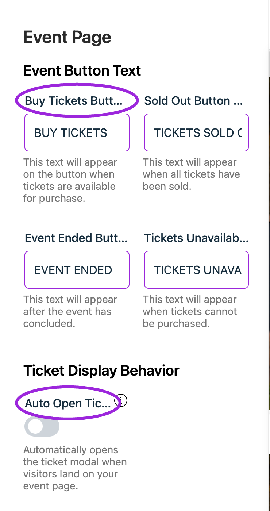
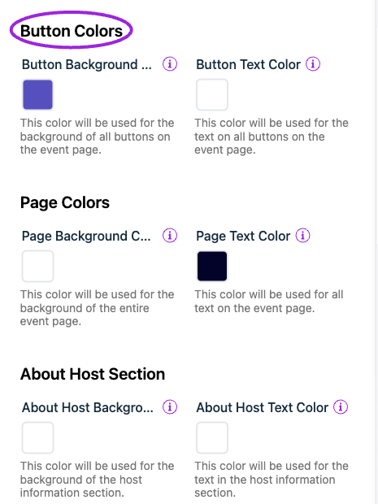
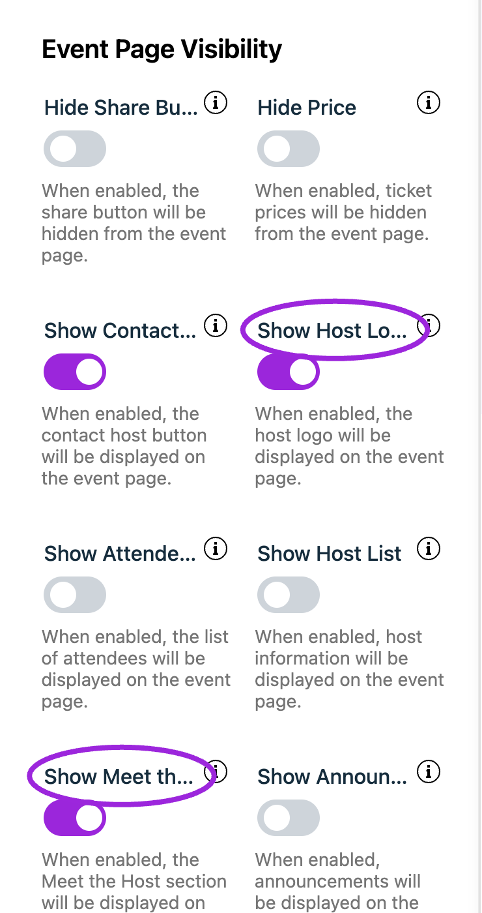
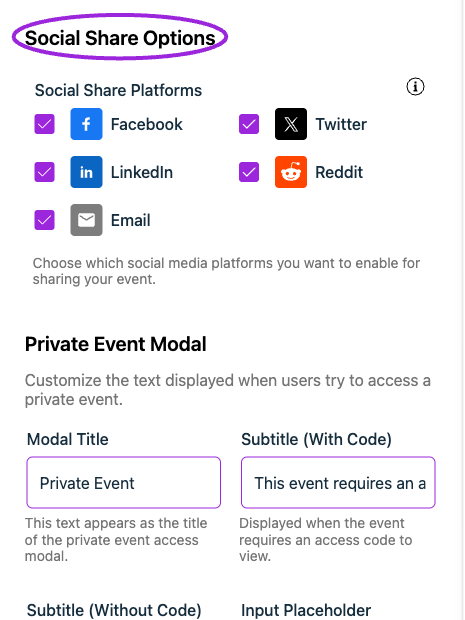
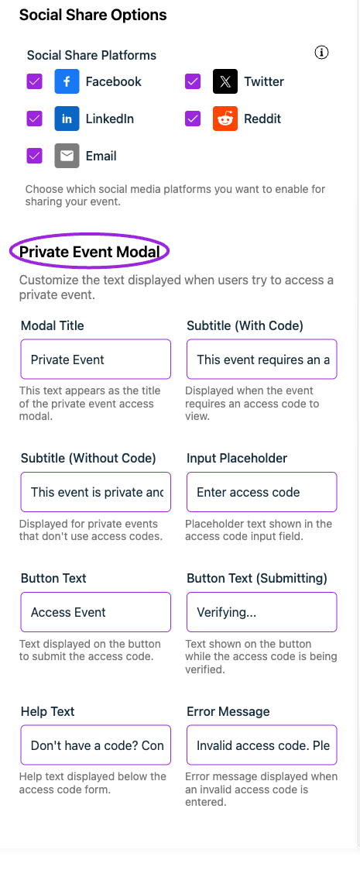
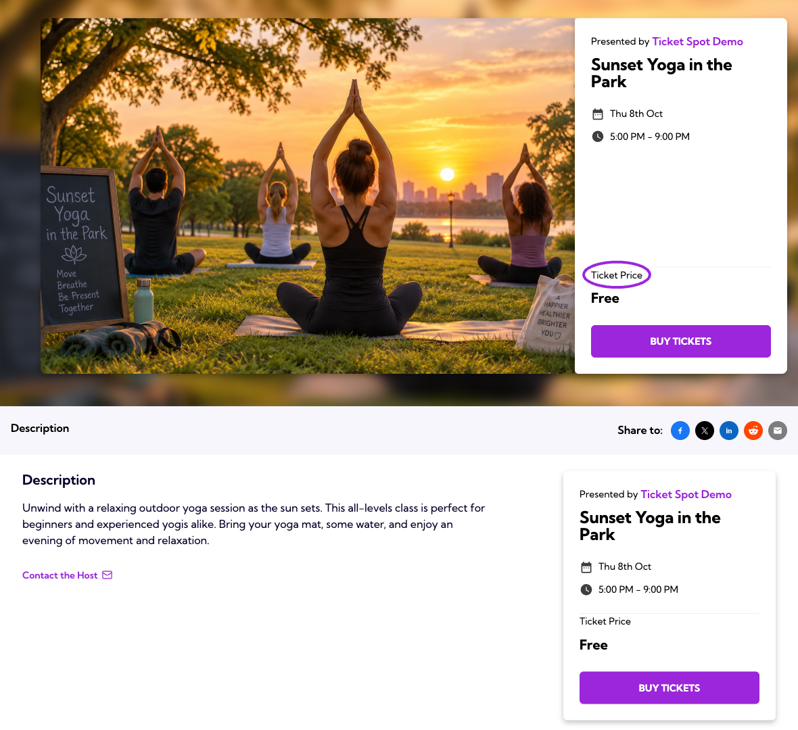
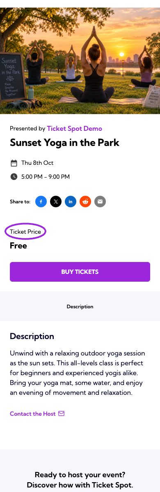

Open **Design → Event Page**. These settings control the hosted event page. Use [Widget design](./widget-customization-overview) for embedded widget settings. Changes save automatically; wait for the update and check a real event page.

## Purchase buttons

<Frame caption="Choose the wording for each ticket availability state and whether selection opens automatically.">
  
</Frame>

| Setting | Purpose |
|---|---|
| Buy Tickets Button Text | Main action when tickets are available. |
| Buy Membership Button Text | Main action for events set up to sell memberships; defaults to **BUY MEMBERSHIP**. |
| Sold Out Button Text | Button wording when the event is sold out. |
| Event Ended Button Text | Button wording after the event ends. |
| Tickets Unavailable Button Text | Button wording when tickets are unavailable. |
| Auto Open Tickets | Open ticket selection automatically when visitors arrive. |

Button wording does not change availability, capacity, or sales dates. Configure those in the event and its tickets or membership plans. Membership sales pages automatically hide event dates, times, venues and ticket-price details. See [Sell memberships without tickets](../memberships/sell-without-tickets).

## Colors

<Frame caption="Set button, page, and host-section colors independently.">
  
</Frame>

Set **Button Background Color** and **Button Text Color** for actions, **Page Background Color** and **Page Text Color** for the page, and **About Host Background Color** and **About Host Text Color** for the host section. Check text contrast after changing either background or text.

## Visible sections and sharing

<Frame caption="Choose the host, attendee, sharing, and date information visitors can see.">
  
</Frame>

| Setting | Purpose |
|---|---|
| Hide Share Button | Hide the built-in sharing action. Visitors can still copy the page link. |
| Hide Price | Hide the event-page price display; this does not make paid tickets free. |
| Show Contact Host Button | Offer the contact-host action. |
| Show Host Logo | Show the organizer's logo. |
| Show Attendee List | Show the attendee section. Review this before publishing. |
| Show Host List | Show the event's host list. |
| Show Meet the Host Section | Show the organizer introduction. |
| Show Announcements | Show event announcements. |
| Hide Date, Hide Time | Hide those details on the page without changing the event schedule. |
| Social Share Platforms | Choose the platforms offered in the sharing interface. |

<Frame caption="Choose which platforms appear in the event Share action.">
  
</Frame>

## Private-event messages

<Frame caption="Customize the title, subtitles, input, actions, help, and error messages for private-event access.">
  
</Frame>

The **Private Event Modal** has separate **Modal Title**, **Subtitle (With Code)**, **Subtitle (Without Code)**, **Input Placeholder**, **Button Text**, **Button Text (Submitting)**, **Help Text**, and **Error Message** fields.

These fields change presentation. Configure whether an event is private and which codes work in [Event Details](../event-management/eventdetails).

## Preview the result

Select a suitable event where the preview offers an event selector. Compare **Desktop Preview** and **Mobile Preview**, then open the event's actual page. Check the ticket action, host information, sharing, and any private-event dialog you use. An event must exist before its content can appear in the preview.

<Frame caption="The hosted Demo event shows its image, schedule, price, ticket action, description, sharing, and contact-host link.">
  
</Frame>

<Frame caption="The same hosted event on a phone, with its ticket action and description below the event image.">
  
</Frame>

See [locale and translation settings](./language-and-locale) for language and regional display, and the [design option reference](./design-options-reference#event-page) for the field inventory.
