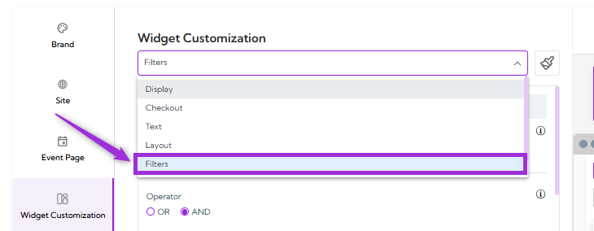
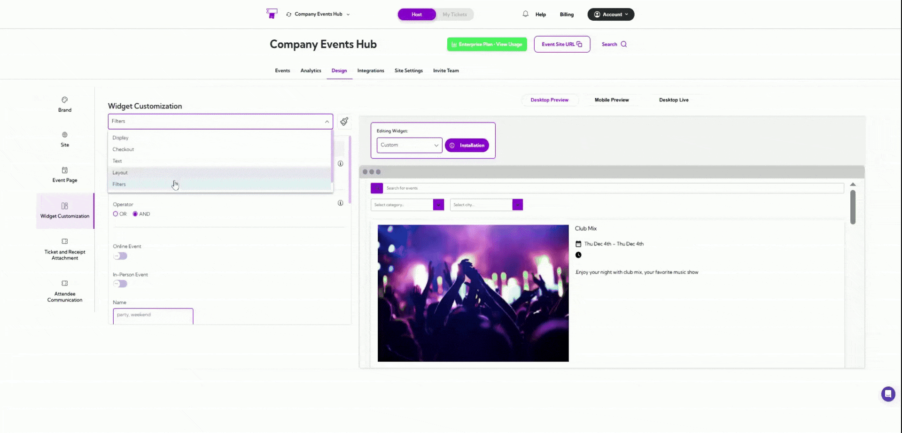
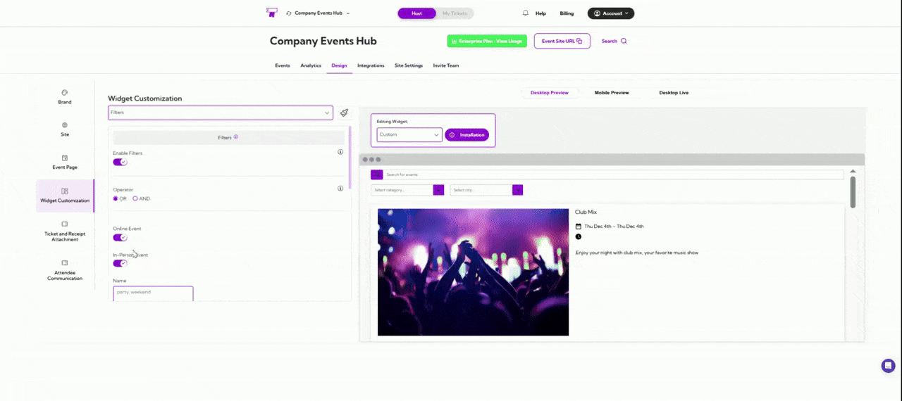

**Filter settings** allow you to control which events appear in your widget. By setting filters such
as event type, keywords, city, tags, or language, you can ensure only the most relevant events
are shown to your users.

This helps keep the widget clean and focused, especially when you have many events.

Let’s get started 🚀

Click on the **dropdown menu** and select **Filters**. You will be navigated to the Filters settings,
where you can enable filtering and configure which events should appear in your widget.

## Enable Filters & Match Rules

Toggle **Enable Filters** ON to start using filtering options.

Once enabled, you can choose how filters are applied using the Operator:

- **AND** — All selected conditions must match for an event to be displayed.
- **OR** — Any one matching condition will display the event.

Example: If you select **Online Event + City: San Diego**

- With **AND**, only events that are online AND in San Diego will show.  
- With **OR**, events that are online OR in San Diego will show.

## Filter Fields

Below is a table of all available fields you can configure when filters are enabled:

| Field        | Description                                                                                     |
| ------------ | ----------------------------------------------------------------------------------------------- |
| Online Event | Shows only events marked as online.                                                             |
| In-Person Event | Shows only events taking place at a physical location.                                       |
| Name         | Displays events whose title contains the keywords entered (e.g., “party”, “weekend”).           |
| Summary      | Filters events by text in the event’s summary field.                                            |
| Tags         | Shows events that match the tags you enter (e.g., “promotion”, “free event”).                  |
| Description  | Filters events based on matching keywords in the full description.                              |
| Venue Name   | Shows events hosted at venues matching the text you provide (e.g., “Walmart”, “Club Fun”).      |
| Address      | Filters events based on text appearing in their address.                                        |
| City         | Shows events located in the cities you enter.                                                   |
| Region       | Filters events by regions or states (e.g., “CA”, “MA”, “NV”).                                   |
| Language     | Displays events available in the languages you list (e.g., “en”, “fr”, “it”).                   |

A live preview of each setting appears in the right panel, allowing you to confirm the design
before applying it.
