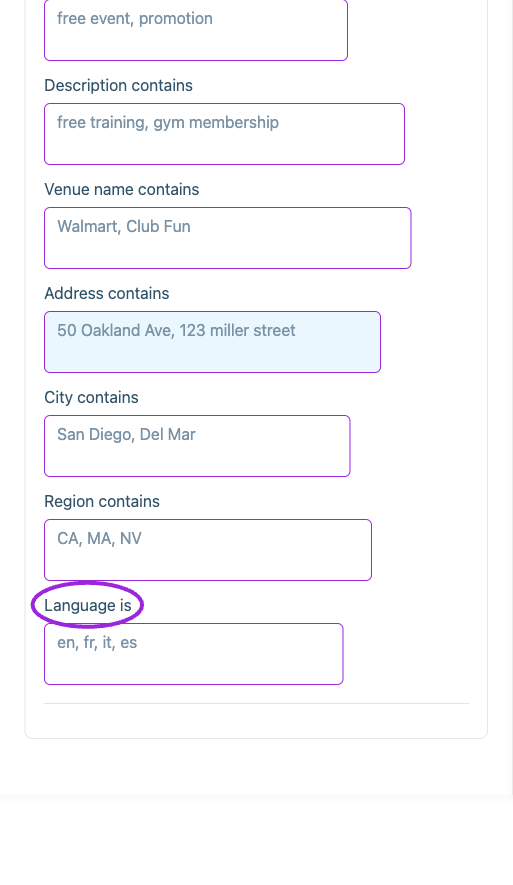

Open **Design → Widget → All Settings → Event Filters**. These settings choose the organizer's event list; [Visitor search & filters](./user-search-filter) lets customers narrow that list.

## Which events appear

<Frame caption="Which events appear controls the statuses included by this widget. Draft preview visibility does not publish drafts, and private-event visibility does not remove access restrictions.">
  
</Frame>

Choose whether to show **live**, **past**, **sold out**, and **private** events. **Show draft events in preview only** includes drafts while designing; it never publishes drafts to the live widget. Showing private events does not remove their access restrictions.

## Advanced filter rules

<Frame caption="Enable advanced filtering and choose Any rule or All rules. Text matches are case-insensitive; separate several terms with commas and leave unused rules blank.">
  
</Frame>

1. Turn on **Enable advanced filtering**.
2. Under **An event must match**, select **All rules** or **Any rule**.
3. Fill the rules you want to apply: **Event is online**, **Event is in person**, **Title contains**, **Summary contains**, **Tags contain**, **Description contains**, **Venue name contains**, **Address contains**, **City contains**, **Region contains**, or **Language is**.
4. Wait for saving and check both an expected match and an excluded event.

Text matches anywhere in the field and ignores capitalization. Separate several terms with commas to match any of them. Leave unused rules blank.

For example, **All rules** with tag “music” and city “San Diego” shows events matching both. **Any rule** accepts either match. Turning advanced filtering off ignores those rules while preserving the choices in Which events appear.

See the [full event-filter reference](./widget-event-filters-reference). If events are missing, also check their publish status, the widget's maximum count, the plan limit, and any visitor-selected filters.

<Accordion title="More advanced rule fields">

<Frame caption="Advanced rules cover event format, title, summary, tags, description, venue, address, city, region, and language. Only filled rules participate in matching.">
  
</Frame>

</Accordion>
